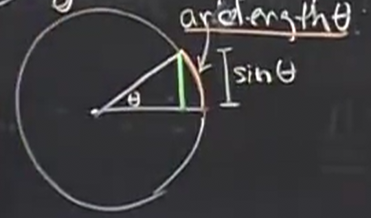
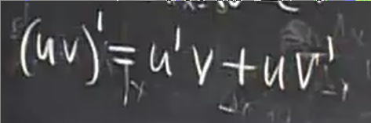

# 常用求导公式_常用极限_常用法则
 
* [三角函数求导公式](#三角函数求导公式)
* [两个常用极限](#两个常用极限)
  * [常用极限的证明_其一](#常用极限的证明_其一)
  * [常用极限的证明_其二](#常用极限的证明_其二)
  * [对于正弦函数导数的几何证明](#对于正弦函数导数的几何证明)
* [求导的一些通用规则](#求导的一些通用规则)
 
---

* 针对特定函数的如 `x^n` `1/x`
* 一些通用公式 *一些规则* 
    * `(u+v)' = u' + v'`
    * `(cu)'` = `cu'`

这两种类型都很重要，比如处理多项式的导数两种都会用到

## 三角函数求导公式

* sinx

这是我们首先想到的化简思路

接下来我们将分子分组，分组的依据可以从`Δx -> 0`入手

这样代入时`sinxcosΔx`可以和`-sinx`抵消，因此这两个可以归为一组

根据我们之前介绍的两个常用极限

最终的极限为`cosx`

* `cosx`

几乎相似的步骤

我们得到`cosx`的导数是`-sinx`

## 两个常用极限

 

事实上这两个极限分别是`cosx`和`sinx`在`x=0`处的导数值

有趣的是如果知道`sinx`和`cosx`的两个特殊导数值，就能求出其所有导数值（我们在上述导数推导中唯一依赖这两个还未证明的极限）

### 常用极限的证明_其一

几何证明

对于单位圆

首先由于半径r为1

其正弦值`sinθ`等于如图的垂直距离

而绕过弧长由于`L=rθ`等于`θ`

并且我们可以对称另一边，使得图形更清晰

在`θ -> 0`时，**弧长**越来越趋近于直线，越与**垂直距离**重合，因此

### 常用极限的证明_其二

同样是对于单位圆,我们截取其中的部分扇形

这里的放大也可以验证我们刚才的观点：缩小`θ`不仅有单单缩小角度和弧长一种方式，使得圆越来越大，这样更可看出当很小的θ时，弧长接近于直线，也就是垂直距离

我们在单位圆中找到`1 - cosθ`的位置

而随着`θ -> 0`弧和弦不断重合，沟壑也就趋向0，虽然分母θ也趋近于0,但是我们知道θ为弧长，在通过放大圆保证弧长相对比例不变时，沟壑仍不断减小，因此整体是趋于0

### 对于正弦函数导数的几何证明

*忽略掉之前的代数证明* 根据我们刚刚证明的两个极限我们有了`θ = 0`的情况

将`y=sinθ`描述为圆周运动的某种垂直距离

同样是单位圆，在转过Δθ时，其垂直距离(sinθ)的变化量即为Δy

当Δθ非常小的时候，短曲线和弦几乎重合,其长度都几乎是Δθ

我们企图求出角度 QPR

由于极限的缘故，OP几乎垂直于PQ

另一方面 RP 垂直于 QR

延长RP，我们发现角QPR就是θ

所以Δy = PR 约等于 Δθ cos θ

## 求导的一些通用规则

* 乘积法则 *两个函数乘积的导数*

*这样可以一次改变其中的一个 这也是依赖于多个函数时常用的思考微分方式*

* 做商法则 *两个函数商的导数*

只有`v != 0`时成立
