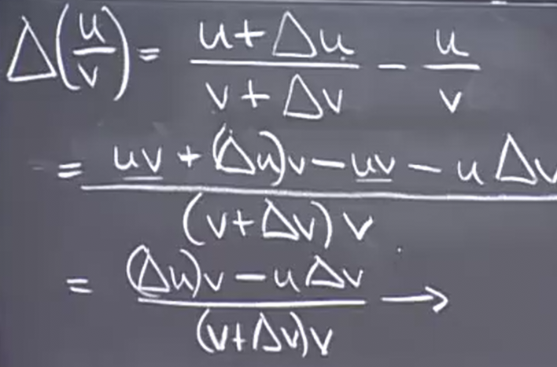
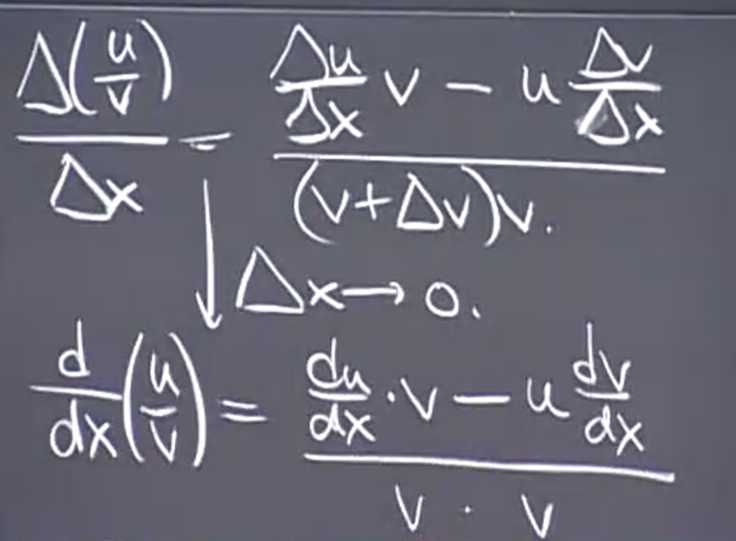
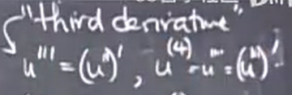

# 求导规则 高阶导数
 
* [求导规则](#求导规则)
  * [乘积法则](#乘积法则)
  * [求商法则](#求商法则)
  * [复合函数求导_链式法则](#复合函数求导_链式法则)
    * [例子](#例子)
* [高阶导数](#高阶导数)
  * [例子](#例子)
  * [符号](#符号)
  * [练习](#练习)
## 求导规则

### 乘积法则

`(uv)' = u'v + uv'`

通过一次一个地微分来区分更长的乘积

证明：

根据导数的极限定义，尝试凑出我们想要的两个单独导数

之后除以Δx，取极限

### 求商法则

通分再化简

再除以Δx，取极限

### 复合函数求导_链式法则

对于这种复合函数，我们通过**引入新变量名**来分为两步处理

1. `x = sin(t)`
2. `y = x^10`

推导步骤

`Δy / Δx`最终可以化为`dy / dx`的原因是 随着Δt趋近于0，Δx也趋近于0 

这个法则称为**链式法则**

在最初的例子中

之后我们消除引入的新变量名

#### 例子

当熟练后可以不写出中间变量，只是思考

如果困惑就引入新变量，慢慢做

## 高阶导数

`u = u(x)`

而我们对其求导得到`u'`是一个函数，而再次对这个导函数求导得到另一个导数`u''`，这是u的二阶导数，继续求导，我们可以得到更高阶导数

### 例子

### 符号

我们知道导数有如下一些表示

我们可以把`d/dx`当成一种算子，使得其应用于一个函数，来得到另一个函数，因此其也写作`D`

那么高阶导数可以写作这种形式

乃至于引申至这两种奇怪的写法

但是分母并不表示对 x^2 求导

### 练习

(这个例子中n是正整数)

`D X^n` = `nx^(n-1)`

再试几个

我们总结规律

最后得到 `D^nx^n`

这是一种数学归纳法

而从`D^(n+1) x^n`其更高阶导数，都为0
