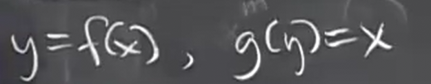
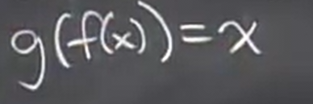
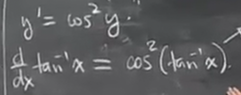
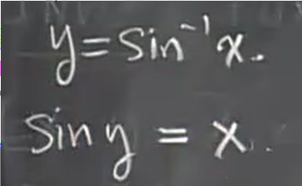

# 隐式求导
 
* [例子](#例子)
  * [1](#1)
  * [2](#2)
  * [3](#3)
* [求反函数的导数](#求反函数的导数)
  * [例子](#例子)
    * [1](#1)
    * [2](#2)
    * [3](#3)
 
一种对以前不知道如何求导的函数进行求导的方法

## 例子

### 1

比如我们尝试将这个公式的适用范围推广至n为有理数

其中m、n都是整数

我们在未知中进行变换，找到更多的可以求导的量

其中`y`是`x`的函数

因此左侧可以根据链式法则求解

故

而唯一未知的部分就是我们最后要求的结果，化简可得

完成证明

### 2

对其求导

这是应用链式法则对其显式求导的步骤

而我们可以**对隐式的函数求导**，比如化简前的`x^2 + y^2 = 1`

再次带入求解y’就很简单了

### 3

如果用显式求导可以用求根公式解出y^2

而y则是更复杂的分支问题

而隐式求导总是把方程维持在最简单的形式

而经过化简，提取出y'即可

在隐式求解中我们不需要考虑分支问题，截止到此处，`y'`的结果包含所有分支

但是我们想获得具体点的分支，我们只需要对`y'`的公式中代入具体xy即可

但是当y不是那么容易求的时候，只能把x代入显式的`y`公式来求

## 求反函数的导数

### 例子

#### 1

`g(y) = x = y^2`

更一般地

对这样一对反函数 `f g` 满足

记作 `g = f ^ -1, f = g ^ -1`

`f(x) g(x)` 的图像关于`y = x`对称

当我们知道原函数的导数，就可以应用隐式求导求出其反函数的导数

#### 2

`tan^-1(x) 不是 1/tanx，而是arctanx`

顺便，`tanx`的导数是`1/cos^2(x) = sec^2(x)`，可以使用求商法则

因此，我们对**等价**转为原函数的反函数进行隐式求导

我们得到结果

对其应用三角函数公式

而对于三角函数的变换，我们可以采用将已知绘图，用几何求解

我们把`tany = x`编码为这样一个三角形

我们只需要求出`cosy`,应用勾股定理

因此

#### 3

但是要绘图注意适用范围
