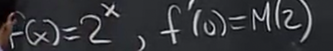
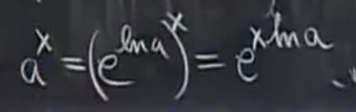
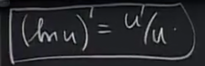

# 指数和对数
 
* [指数](#指数)
  * [介绍](#介绍)
  * [求导](#求导)
    * [e](#e)
    * [为什么e会存在](#为什么e会存在)
    * [自然对数](#自然对数)
      * [性质](#性质)
    * [转换为以e为底的指数](#转换为以e为底的指数)
    * [对数微分法](#对数微分法)
      * [例1](#例1)
      * [例2](#例2)

## 指数

### 介绍

首先有一个**底数** `a` 满足 `a > 0`

有`a^0 = 1` `a^1 = a` `a^2 = a * a`

指数的基本规则是 `a^(x1+x2) = a^x1 * a^x2`

并且可以推导出 `(a^x1)^x2 = a^(x1x2)`

并且对于指数为有理数，我们有

a^x 对于所有的x，我们通过拟合的方式获取其大概值，因为有一些x比如`1/2`通常结果是无理数，没有确切值

### 求导

我们尝试用导数的定义

对于这个极限，其变量应是Δx而不是x，x是固定的，而Δx在变化，因此可以将x视为常数提取出来

这就是我们暂时求得的`a^x`的导数

我们将这个未知的极限记作`M(a)`

`M(a)`具有几何意义

当`x=0`时，`a^x`的导数就是`M(a)`

**因此，`M(a)`就是`x=0`时`y=a^x`的切线斜率**

因此，和正弦、余弦函数的情形相同，只要我们知道这个特殊点的导数，那么`a^x`的所有导数就能求出

那么`M(a)`到底是多少？我们暂时回避掉这个问题

#### e

我们定义一个数字`e`，使得`M(e)=1`唯一成立

因此，关于`e^x`的导数很好求出

我们通过刚刚对`M(a)`的斜率解释推断处`x=0`时`e^x`的斜率

#### 为什么e会存在

也就是为什么M(e)=1一定存在

首先我们考虑以2为底数

之后我们对其**水平拉伸**，通过一个任意比例系数k

其中`b=2^k`

当拉伸图像时，相当于*x轴压缩而图像不变*，斜率会变陡

所以M(b)何时为1呢？也就是b^x 在x=0的时候斜率为1之时 所以此时k = 1/M(2)

因此存在这个b，记作`e`

#### 自然对数

`w = lnx` 其被定义为 `y = e^x`的反函数

==> `lny = x`

##### 性质

源于指数的性质

此外由于e^x在0处斜率为1，所以lnx在1处斜率也为1

使用隐式求导计算反函数的导数

回到我们之前的M(a)问题 

我们希望求出这个M(a) 也就是可以对任何指数函数求导

两种重要的方法：

#### 转换为以e为底的指数

之后对其链式法则求导

a在此时仅仅是一个常数

下面的式子方便理解此处运用链式法则

因此

故`M(a) = lna`

自然对数不随着我们使用2或者10为底数的指数求导而消失，其自然而然出现

#### 对数微分法

有时会遇到对函数难以微分，但是对其对数容易微分的情况

可以使用这个公式

所以我们想求u的导数就可以转化为求其对数的导数乘以原函数

##### 例1

其对数为 xlnx 

对数导数即是 根据乘法法则 (1 + lnx)

因此 原函数的导数为 x^x(1 + lnx) 

**当指数变化时，这种方法很好用**

##### 例2

因为其指数变化，所以我们最好用对数跟踪

去对数 之后我们尝试往导数上靠 令

之后减去ln1 = 0，得到熟悉的导数模式

dlnx/dx(x = 1) = 1

因此取对数之前趋近`e`

我们得到了一个可靠的方案计算e!
