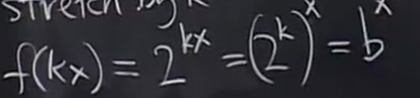

# 指数和对数

## 指数

### 介绍

首先有一个**底数** `a` 满足 `a > 0`

有`a^0 = 1` `a^1 = a` `a^2 = a * a`

指数的基本规则是 `a^(x1+x2) = a^x1 * a^x2`

并且可以推导出 `(a^x1)^x2 = a^(x1x2)`

并且对于指数为有理数，我们有

a^x 对于所有的x，我们通过拟合的方式获取其大概值，因为有一些x比如`1/2`通常结果是无理数，没有确切值

### 求导

我们尝试用导数的定义

对于这个极限，其变量应是Δx而不是x，x是固定的，而Δx在变化，因此可以将x视为常数提取出来

这就是我们暂时求得的`a^x`的导数

我们将这个未知的极限记作`M(a)`

`M(a)`具有几何意义

当`x=0`时，`a^x`的导数就是`M(a)`

**因此，`M(a)`就是`x=0`时`y=a^x`的切线斜率**

因此，和正弦、余弦函数的情形相同，只要我们知道这个特殊点的导数，那么`a^x`的所有导数就能求出

那么`M(a)`到底是多少？我们暂时回避掉这个问题

#### e

我们定义一个数字`e`，使得`M(e)=1`唯一成立

因此，关于`e^x`的导数很好求出

我们通过刚刚对`M(a)`的斜率解释推断处`x=0`时`e^x`的斜率

#### 为什么e会存在

也就是为什么M(e)=1一定存在

首先我们考虑以2为底数

之后我们对其**水平拉伸**，通过一个任意比例系数k

其中`b=2^k`

当拉伸图像时，相当于*x轴压缩而图像不变*，斜率会变陡

