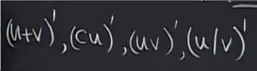

# 指数剩余内容_第一单元总结
 
* [幂函数的导数](#幂函数的导数)
* [自然对数是自然的](#自然对数是自然的)
  * [例子_经济学](#例子_经济学)
* [复习](#复习)
  * [导数的通用计算公式](#导数的通用计算公式)
    * [计算法则](#计算法则)
    * [链式法则](#链式法则)
      * [直观性理解](#直观性理解)
      * [推论](#推论)
    * [隐函数微分](#隐函数微分)
  * [导数的一些具体公式](#导数的一些具体公式)
  * [练习](#练习)
    * [1](#1)
    * [2](#2)
    * [3](#3)
    * [4](#4)
  * [导数的定义_理解导数的含义](#导数的定义_理解导数的含义)
  * [隐函数和反函数求导](#隐函数和反函数求导)
  * [切线_](#切线_)

这是上节课我们最后求解的极限

求解过程则是 

1. 取对数 得到对数后的极限为1

2. 而将其以e为低后，趋向e

等同于a^k

## 幂函数的导数

之前我们只讨论了指数为有理数的情况

现在我们拓展到指数为全体实数

方法1：**转换为以e为底**

方法2： **对数微分法**

两种方法本质上是一样的

## 自然对数是自然的

### 例子_经济学

如果持有的股票价格下跌 27.9点 （要知道这个数字的原价格 才有意义 比如 6432点）

价格变化ΔP/P = 27.9/6432 = .43%才是有意义的

而取其无穷小量（在投资时人们通常认为天数是一个相对较小的增量）

p'/p = (lnp)' 正是对数微分的公式 因此 自然对数具有实际意义

## 复习

### 导数的通用计算公式

#### 计算法则

#### 链式法则

##### 直观性理解

y的变化显然是x变化的10倍 而x变化是t变化的5倍

自然地 y的变化就是t变化的50倍

##### 推论

可以规避掉一些难以记忆的比如商法则

倒数的导数，可以看作-1为指数的幂函数求导

而据此 我们可以推出商法则

#### 隐函数微分

化简方程，对两侧分别求导 **应用于反函数求导 对数微分**

### 导数的一些具体公式

* 幂函数
* sin, cos, tanx, secx
* e^x lnx
* tan^-1 x sin^-1 x

### 练习

#### 1

正割函数求导

可以使用上述的倒数求导

#### 2

正割函数对数求导

链式法则

这个函数和航海有关 对数函数正是由于形如此的函数发明的

#### 3

方法一：直接使用链式法则
方法二：化简（不可取）

#### 4

### 导数的定义_理解导数的含义

我们据此计算了很多函数的导数

1/x x^n sinx cosx a^x (uv) (u/v)

对于sinx 和 cosx 此外我们利用了两个常用极限（其在x=0的导数值）

而a^x也需要其在x=0的导数值

这个公式也可以反向利用 来 求极限 转化为导数

等于 (e^u)' | u = 0

### 隐函数和反函数求导

与其坚持不懈解出y，不如化简方程，两边求导

### 切线_

* 计算切线 
* 绘制切线导数的图像
* 识别可微函数 （检查左切线和右切线必须相等）

在原图像上绘制切线 识别正负 趋势

