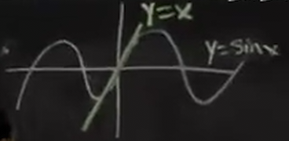
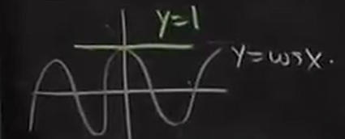

# 微分的应用
 
* [线性近似](#线性近似)
  * [例1](#例1)
  * [另一种描述形式](#另一种描述形式)
  * [讨论x0=0时的一些公式](#讨论x0=0时的一些公式)
  * [应用_例3](#应用_例3)
  * [另一个应用_例4](#另一个应用_例4)
  * [例4](#例4)
* [二次近似](#二次近似)
  * [几何意义](#几何意义)

## 线性近似

意思是 曲线y=f(x) 近似等于 其切线 右侧是切线的方程

### 例1

当x0 = 1时

带入得

f(1) = 0 f'(1) = 1

带入公式

lnx 约等于 0 + 1(x - 1)

并不是所有地方都很接近 只有 x接近1时，才是成立的

### 另一种描述形式

导数的定义

我们之前也把等式左右交换以求出一些极限

我们可以这样理解 当Δx非常接近0时 左右是接近的

这和之前线性近似的公式等价

（两侧同时乘以Δx)

### 讨论x0=0时的一些公式

计算得到

在几何上

我们再考虑这两个例子

因此

### 应用_例3

计算ln1.1

根据我们刚刚推出的公式 x = 0.1，因此 其大概为0,1

将难以计算的事情（非线性）转换为简单的（切线）

### 另一个应用_例4

对于f(x)找到x=0附近的线性近似

我们可以利用我们已经推导出的线性近似！只需要将他们代数组合

注意代入的时候要直接替换

而再次之后，我们**扔掉最后一项** 

原因在于 我们只想要线性的部分，对于之前指数、正弦、余弦 我们也是仅仅用线性替代曲线，而不是多次曲线

（当x很小 这些高阶项会更小）

### 例4

现实中的例子

卫星具有速度V 时间T 而观测者的时间T'

T和T'之间具有**时间碰撞** *狭义相对论*

我们想要近似计算时间差别多大

因此

而

因此比值约为10^-10

在GPS大概误差1mm

## 二次近似

是对线性近似的进一步阐述

对于例2 ln(1.1)

小了一点

而例3

填表时还需要计算二阶导数

### 几何意义

对于线性来说，近似没有提供太多信息，比如在1的哪侧 

而对于二次近似

**更加贴合曲线**，是最吻合的抛物线
