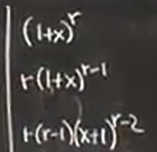
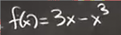

# 近似 曲线草图
 
* [近似](#近似)
* [二次近似](#二次近似)
  * [例1](#例1)
  * [基本公式](#基本公式)
  * [意义](#意义)
  * [例2](#例2)
  * [例3](#例3)
* [曲线草图](#曲线草图)
  * [基本原则](#基本原则)
  * [例子](#例子)

## 近似

上一次狭义相对论的例子

地球上手表相对于卫星上时间变化和右侧比率正比 两边都是无量纲量

*误差分数* 正比于 v^2 / c^2 系数是 1/2

我们常会求这样的比例系数

## 二次近似

更加精确地近似

当基准点设置为0时

这个公式是如何得来的？

### 例1

我们知道二次近似是最逼近的抛物线

那么**抛物线的二次近似就一定是它自身**

带入0

因此，这对应公式中的ABC，也就是二次近似公式的常数

### 基本公式

适用于x=0的情况

### 意义

我们之前求过这个表达式在趋近无穷时 极限是e

采用取对数

之后转化为导数

现在我们用线性极限来做

取对数后，其约等于k * 1 / k = 1 （只是代入ln的线性近似）（1/k -> 0)

所以两侧取e后，接近于e

但是如果我们想求得**收敛速度** 即接近1有多快 则要采用二次近似

比线性近似更多的近似 得到表达式和其极限之间的差距有多大

### 例2

找到0处的二次近似

代入基本公式

我们总是可以忽略高阶项 因为x总是接近0 而更高项的误差只会更小

### 例3

推导两个基本公式

带入 0 分别是 0 1 -1 分别作为系数 但是二次项还有系数1/2

带入0

得到基本公式 

## 曲线草图

目标 使用f'和f''绘制f

忘记以前学习微积分的一些直觉：**不要丢掉初等数学的技能和直觉**

微积分仅仅是弥补以前没有接触的一些空白

### 基本原则

* 如果f'(x) > 0 那么f(x) 递增 反之递减
* 如果f''是正数 那么f'(x) 递增 反之递减

整个函数递减，因此f'(x)小于0，而越来越缓，说明斜率不断增加 因此f'(x)递增，故f''(x)大于0

* f''(x) > 0 等同于f(x)凸（图中） *注意国内凹凸性和国外相反 这里是国外的叫法*

### 例子

导数

因此在 -1 到 1 f'(x) 正 其余 负

f(x) -1 到 1 增加 其余减小 

其中有两个关键转折点（导数改变符号的点）

**定义** 将f'(x0) = 0的点称为**临界点**

而这点的函数值f(x0) 称为**临界值**（极值）

我们能得到的信息是这两点处（切线）是水平的

又根据之前导数的正负得到函数是降升降的规律 大致知道函数在这两点的趋势

根据常识，这是一个奇函数

函数可能是这样

但是也可能是趋近于0

如何确定呢？

当x非常大时，项3x几乎可以忽略不计

因此接近 -x^3 趋近于 -无穷

另一边自然趋近于正无穷

我们再检查二阶导数 

x小于0 二阶导大于0 x大于0 二阶导小于0

因此 小于0 凸 大于0 凹

凹凸性发生变化的点二阶导等于0 称为**拐点**
