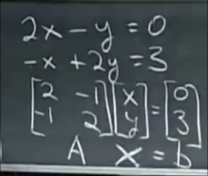

# 线性方程组和向量的线性组合
 
* [矩阵形式](#矩阵形式)
* [行图像形式](#行图像形式)
* [列图像形式](#列图像形式)
* [矩阵和向量相乘](#矩阵和向量相乘)
* [脉络](#脉络)
* [总而言之](#总而言之)

对于n个未知数 n个方程的线性方程组

## 矩阵形式

我们可以将其写作 系数矩阵A 和 未知数向量X的乘积等于 向量b的形式

这是对于3个方程 3个未知数的 矩阵形式方程

## 行图像形式

我们分别描点做出两个方程的图像

之后发现两个直线交与方程的解 (1, 2)

对于三个未知数三个方程的情况 每一个方程表示一个平面 其中两个平面交于一条直线

而这条直线又和第三个平面交与一点

然而在3维及以上行图像的形式不太容易看出来了

## 列图像形式

一列一列观察 将 x 和 y 分别提取出来 得到向量的线性组合方程

其为我们描绘了这样一个图像

当我们代入正确的组合 1 和 2后

在图像上可以运用向量的三角形法则 得到向量b `[0 3]`

*代入所有可能的组合后 我们能得到任何平面向量*

对于3方程3未知数

可以清晰看出一种有效组合是[0, 0, 1]

这也是难以理解的行图像中的交点

*对于所有不同的右侧变量 都存在解吗* -> *这些列向量的线性组合是否填满三维空间* **对于这个系数矩阵 可以 原因在于其是一个好矩阵 *非奇异矩阵* *可逆矩阵***

* 有一些情况: **一些不是线性无关的向量** 这些列向量在同一平面 那么其所有组合也在同一平面 那么无法得到全部的右侧变量b **奇异** **矩阵不可逆**

## 矩阵和向量相乘

我们可以采用列图像的形式展开 *讲师喜欢的方式*

用向量的每一个元素乘上矩阵的每一列

**列的线性组合**

而另一种方式是我们常用的点积

## 脉络

本节课从两个方程两个未知数的线性方程组出发 首先给出其系数矩阵*未知数向量=右侧向量 `Ax=b` 的形式

之后绘制我们通常理解的行图像：两条直线的交点即为解

又扩展到列图像: 解实际是两个列向量组合出右侧向量的正确方式

然后从三个方程三个未知数 又一次验证了这三种表示

并且提出问题 给定的系数矩阵A （列向量一定）是否其各种组合一定能填满右侧向量 -> 对于任意b 是否x一定有解 讲师给出的结论是需要系数矩阵非奇异/可逆/列向量线性无关

最后给出一种讲师喜欢的矩阵乘向量的线性组合计算方式

## 总而言之

对于线性方程组 我们尽量从列图像的角度 转换为列向量的线性组合来思考
