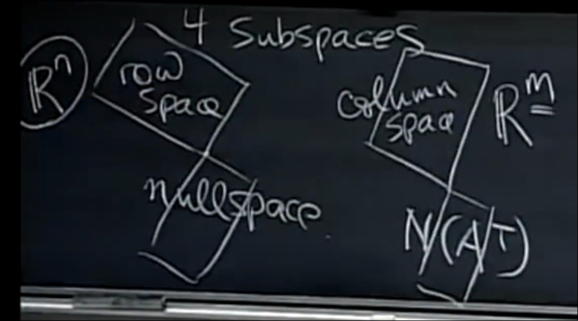
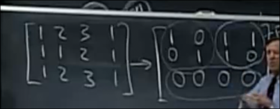
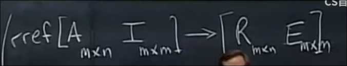
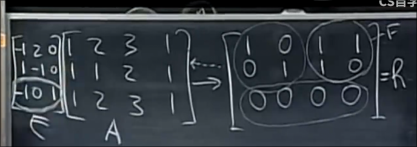
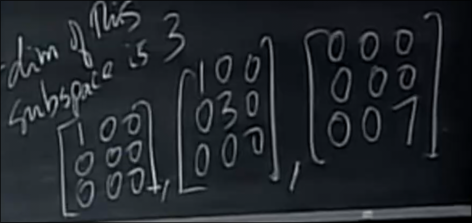

# 矩阵的四个子空间
 
* [行空间的基](#行空间的基)
* [左零空间的基](#左零空间的基)
* [矩阵向量空间](#矩阵向量空间)

* 列空间C(A) 在 R^M 中 
* 零空间N(A) 在 R^N 中
* 行空间 C(AT) *所有行的线性组合*  *A^T 的所有列的线性组合* 在 R^N 中
* A^T的零空间 N(AT) **左零空间** 在 R^M 中

我们通过研究这些空间的基、维数来了解这些空间

* 列空间的维数是`r`
    * 其一组基是主元列
* 零空间的维数是`n - r`
* 行空间的维数也是`r`
* 左零空间的维数是`m - r` *从A^T的角度考虑*

## 行空间的基

一方面 我们可以通过A^T 化为阶梯形矩阵 来得到其主元列 得到其基

对于A的化为行简化阶梯形R 我们仅仅做了行变换 R和A的行空间相同 而列空间不同

而我们知道0行的产生是由于其是其他行组合得来的 而非零行 线性无关 那么**一组基就是R中的非零行向量** R中的前R行

## 左零空间的基

其是AT的零空间 

因此是ATx=0 的解 也就是 AT中列向量的线性组合出0 的全部组合

那么也就是A中行向量线性组合出0的全部组合

自然就是xA = 0的解

* 一个隐约的想法是左零空间的基自然地包含在从A到R的过程当中
* 我们希望得到从A到R的变换矩阵

我们自然地联想到逆矩阵 逆矩阵是从A到I的变换矩阵

而其方法是对[A, I] 执行行变化 化为 [I, A^-1]

而对 我们的非满秩方阵 [A, I] 行变化会化为 [R, E] E就是A到R的变化矩阵 EA=R

于是我们得到了变换矩阵E

之后 **E中对应R的0行的行即为左零向量的基**

原因是行角度的矩阵相乘：左侧对应行向量与右矩阵的乘积构成结果矩阵的行

## 矩阵向量空间

对于全部的3*3矩阵 我们说其处于一个向量空间M

原因是对于矩阵 A+B 和CA依旧全部在3*3矩阵的范围内 向量空间的定义很容易被满足

其子空间有很多

* 所有上三角矩阵
* 所有对称矩阵
* 上述二者的交集 对角矩阵

直观上后者更小 **维度的概念**

对角矩阵维数是3

这是其中的一组基

