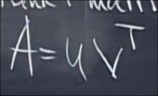
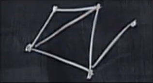

# 矩阵向量空间的维数和基
 
* [微分方程的向量空间](#微分方程的向量空间)
* [秩1矩阵](#秩1矩阵)
* [图](#图)

对于整个3*3矩阵向量空间

维数是9 一组基是

对于对称矩阵和上三角矩阵 容易看出 其维数都是6

然而在整个3*3矩阵的这一组基中 只有3个为对称矩阵

另一方面 对角矩阵和上三角矩阵向量空间的交集为对角向量空间 其维度是3

而对角矩阵和上三角矩阵向量空间的并集并不构成向量空间 是 9维空间的两个方向不同的两个6维向量 

因此我们不关心并 而是关心 `+`

其代表S中任意元素 加上U中任意元素 得到的新向量空间

可以得到 **任何3*3矩阵** 9维

这里隐藏了一个公式 

## 微分方程的向量空间

其解如上

维度是2 一组基是`cosx`和`sinx` 其可以线性组合出全部解

微分方程的任务就是找到解空间的一组基

## 秩1矩阵

我们研究这个秩为1 的矩阵

其可以写为

我们的结论是 每个秩1矩阵都可以写为这种形式

`u`是列向量 `v^T`是行向量

原因在于我们只需要将第一行作为行向量 剩下的行都是第一行自己的倍数 因此列向量负责线性组合

而秩1矩阵可以作为构建块 4个秩1矩阵可以构建秩4矩阵

对于秩4矩阵 其构成一个向量空间吗 并非 一般的结论是`r(a+b) <= r(a) + r(b)`

## 图

在线性代数中 图是一组节点和边的集合

如上的图有5个顶点 6条边

5*6的矩阵会告诉我们图的全部信息

问题是节点到另一个节点最短需要几条边 最长可以需要几步
