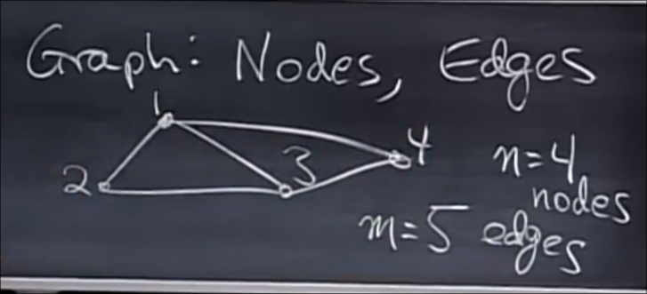
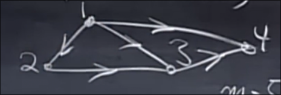
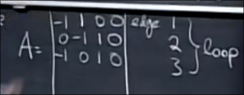
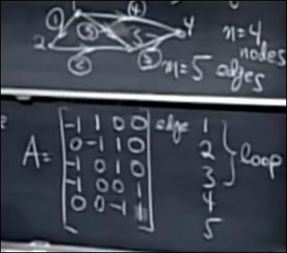

# 线性代数与现实_图和矩阵
 
* [关联矩阵](#关联矩阵)

`n=4` `m=5`

我们需要将其设置为有向图

## 关联矩阵

每一行对应一条边

表示边1从节点1出发 流入节点2

这是前3行 一个重要的性质是 回路对应线性相关的行

我们可以求解矩阵的零空间、秩 其具有物理意义 *具体怎么回事 我没怎么听懂*

* 图中线性无关的几行表示 其中没有环 **树**
* 左零空间的维数 `m - r` 表示 最小环的个数
    * 其为边数`m` - 秩
    * 经证明 图中的秩等于节点数-1 

于是推得

**欧拉公式** 一个关于图的拓扑学事实
