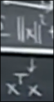

# 向量正交_子空间正交_基正交
 
* [向量正交](#向量正交)
* [子空间正交](#子空间正交)
* [ax=b没有解时的最佳解](#ax=b没有解时的最佳解)

容易想到 行空间和零空间之间的角度为90度 列空间和左零空间正交

## 向量正交

正交性的检验方式 是 点积为0

为什么正交性可以因此验证呢 

对于正交性的另一种表述 **毕达哥拉斯**

平方等同于

验证一下

因此化简一下即为点积为0

**零向量**和任意向量正交

## 子空间正交

两个子空间其中的每一组向量都正交 则这两个子空间正交

如R^2空间中 两条垂直的经过原点的一维直线

* 行空间和零空间正交 其维度加起来就是整个R^n 如同n=3时二者不会是垂直的两条直线 而是一个直线和垂直于这个直线的平面 **正交补** *某空间的正交补包含所有与之正交的向量*
* 列空间和左零空间正交 

## ax=b没有解时的最佳解

一种方式是扔掉一些异常的方程 使得方程可解

但是我们并不想丢掉任何方程

一个重要矩阵 `A^TA`

* `n*n`大小 对称
* 零空间 是 A的零空间
* 秩是A的秩
* 当A列满秩时ATA才可逆 *列向量线性无关时*

对于上面的Ax=b 两边左乘A^T
 

我们期望 下面的 x有解

