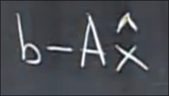
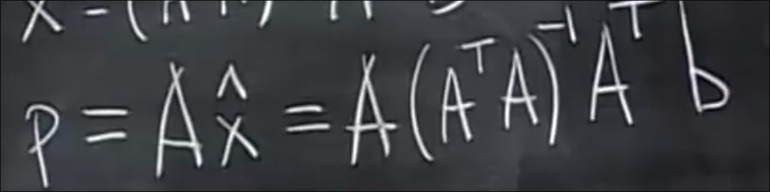

# 投影
 
* [投影矩阵](#投影矩阵)
* [投影和方程无解的关联](#投影和方程无解的关联)
* [应用_线性拟合](#应用_线性拟合)

## 投影矩阵

a是R^2的一个向量

p是另一个向量 也是b在a上的**投影**

b是R^2内的另一个向量

e 是 b 和 p 的*距离*

则满足这个式子

因此

自然

最后我们推得

另一个角度 我们可以将除去b的项 作为一个矩阵P=aaT/aTa b的投影就是矩阵对其转换

* 上方`aaT`是一个矩阵 下方 `aTa`是一个数字
    * `aaT` 是一个对称方阵 行空间、列空间与a的列空间相同*经过a的直线* 秩1 零空间、左零空间和a的左零空间相同

投影两次会发生什么 关于 P^2的一些分析

* 仍然是一个对称方阵 行空间、列空间与a的列空间相同 秩1 零空间、左零空间和a的左零空间相同
* 其等于 (aaT)aaT/(aTa)(aTa) = aTa * aaT/... = p

## 投影和方程无解的关联

我们想要尽可能解决 Ax=b 无解的情况

而`Ax` 永远在 `A` 的列空间 而`b`可能不在 此时无解

我们希望将`b`改为 列空间中最接近的向量 `Ax'=p` p是b在列空间上的投影

当我们拥有平面的基 我们就确定了这个列空间平面

p是基的某个线性组合 x'

我们的目标是找到这个x'

拥有的条件是

这个东西`e`和列空间正交 等同于 与基正交

故

* e在A的左零空间 *左零空间和列向量正交补*

这就回到我们向量投影的问题 只是向量a 变为矩阵A

得到

如果ATA可逆 那么x'很好求

投影p是什么呢 p=Ax' 

投影矩阵 P 就是b前乱乱的一堆A

* 中间的逆不展开的原因是A不一定可逆 甚至不一定是方阵
* 如果可以展开 则变为单位矩阵 原因在于 如果A可逆 那么 其满秩 一定有解b b本身就在列空间中

P存在一些性质

* 对称方阵
* P^2 = P

## 应用_线性拟合

对于三个不在一条直线上的点

(1, 1) (2, 2) (3, 2)

我们希望尽量找到同一个C和D 使得方程成立

然而我们不能解出 但是我们可以找到最近的C' D' 使得p尽量接近b
