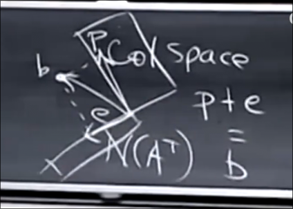
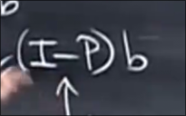
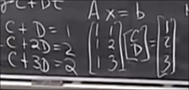
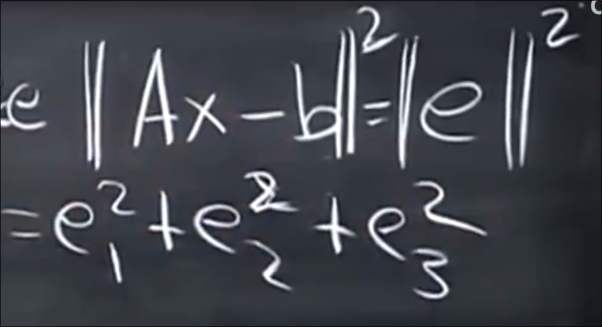
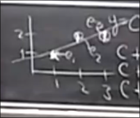
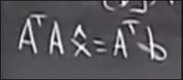
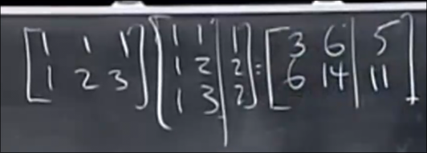
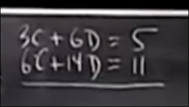
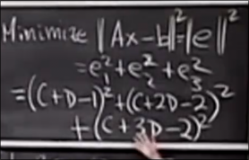
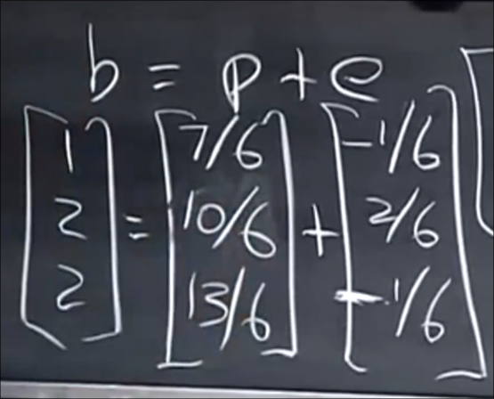

# 投影的误差
 
* [误差](#误差)
* [线性拟合中的误差](#线性拟合中的误差)

## 误差

我们又完善了这个图

这是求在左零空间的投影e的公式

I-P 有大部分和 P一致的性质

## 线性拟合中的误差

线性拟合是在这个无解的方程组中找到最近似的解 （这里b向量 写错了）

但是会对b向量产生一个误差e = p - b = Ax' - b

平方其是一个好的选择

其中e1 e2 e3对应

在求x'和 p时 我们遇到了这个公式

我们期望ATA是个可逆的

等式的右侧是个ATb 我们可以把b附加在A的右侧

所以我们的方程组 变成这个可解的尽力方程组

另一方面 误差等于

我们想另一种最小化误差的方式 **偏导** 会给出一样的结果

p和e是正交的 
