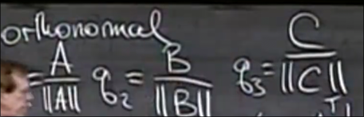

# 正交基_正交矩阵
 
* [标准正交_正交矩阵](#标准正交_正交矩阵)
* [投影到Q的列空间](#投影到Q的列空间)
* [gram-schmidt_向量正交化](#gram-schmidt_向量正交化)

## 标准正交_正交矩阵

其是一组满足特定条件的正交向量

对于其列组合而形成的矩阵 有如下事实

自然得出QTQ是单位矩阵

此外根据之前ATA的性质 我们知道 Q是列满秩的 这符合一组q的定义 

特别地 当Q为方阵时 Q可逆 QT = Q^-1

## 投影到Q的列空间

对于向量b 其投影到Q的列空间的 投影矩阵P 满足 Pb = p p处于列空间

P = A(ATA)^-1AT = QQT

对于这个QQT 

* 对称的方阵 P^2 = P *投影矩阵的公共性质*
* 列空间和左零空间与Q一致 
    * 当Q为方阵时 Q满秩 因此 QQT满秩 其可逆 P^-1 = (QQT)^-1 = (Q^-1)TQ^-1 = QQT = P
    * P 为单位矩阵

之前我们提到的一个投影的方程变为

新的x前系数可以去掉

>x'=QTb => x'_i = qT_i * b

* 我们要寻找的尽力解x 在分量上只是一个点积

## gram-schmidt_向量正交化

将向量正交化的一种计算

现在有两个线性无关的向量 我们希望从中得到两个标准正交的向量q1 q2

我们希望保持a不动 而将b转换为垂直的部分

通过b向a投影 取e获得 e = b - p = b - Pb =  b - A(ATA)^-1ATb

之后标准化我们只需要执行

那么如果有第三个向量C呢 其需要同时与二者垂直

其减去在a和b方向上的分量（投影）

c = c - p_a - p_b = c - P_Ac -P_Bc = c - A(ATA)^-1ATc - B(BTB)^-1BTc

经过这种方法 我们将原矩阵 标准正交化 而其列空间不变*只是选择了一些垂直的基*

类比消元法 标准正交也有其矩阵公式意义

* R是一个上三角矩阵

