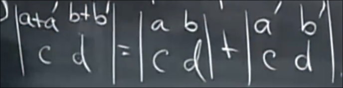
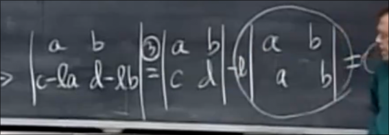
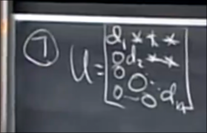

# 行列式
 
* [定义行列式的三个性质](#定义行列式的三个性质)
* [行列式推得的一些式子](#行列式推得的一些式子)

行列式是和方阵相关的数字 `det A |A|`

行列式不为0时 方阵才可逆

## 定义行列式的三个性质

* 1. 单位矩阵的行列式为1 
* 2. 交换方阵的两行 行列式符号翻转
    * 据此我们得到 **置换矩阵** 的行列式 是1 交换偶数次 或 -1 交换奇数次
* 3. a 如果将方阵的某一行乘以t 那么行列式变为t倍
* 3. b 如果保持其他行不变 第一行每个元素加上什么 那么可以拆开

## 行列式推得的一些式子

* 4. 如果方阵两行相同 那么行列式为0
    * 根据性质2 交换这两行 那么符号应相反 然而方阵没有改变
* 5. 我们的消元步骤 中 从**一行减去另一行**的倍数 不改变行列式
    * 根据性质3b 可以将减去时的行列式分解 分为原行列式 和 减去另一行倍数行列式 
    * 根据性质3a 提出这个倍数 
    * 根据性质4 两行完全相同 行列式为0 那么就剩下原行列式

* 6. 有全零行的方阵为0 
    * 根据性质 3a 对于这行乘以任意 系数k 变为原来k倍 但是方阵不变
* 7. 上三角方阵的行列式为 `d1*d2...*dn`
    * 首先对于对角线为全1 的上三角方阵 我们总可以化为单位矩阵 而根据性质5 不改变其行列式 为1 
    * 而对于普通上三角方阵 每行提出对角线元素倍 化为对角线全1 的上三角方阵 行列式则为对角线元素之积

* 8. 当且仅当A为奇异矩阵时 *不可逆* 行列式才为0 A可逆时 行列式不为0
    * 当A不可逆时 消元法会得到0行
    * 当A可逆 最终会得到上三角矩阵

二阶方阵的行列式为 `ad - bc`

* 9. 方阵相乘得到的方阵行列式 等于 两个矩阵行列式的乘积
    * 对于对角方阵 我们很容易证明

A^-1的行列式为 1/|A|

|A^2| =  |A|^2

|2A| = 2^n |A| *性质3a*

* 10. A转置的行列式和A相同

一列0 的方阵 行列式为0

交换两列 行列式变号 *行列式中列和行地位等同*
