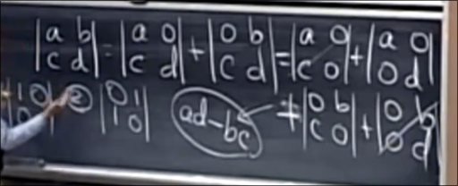
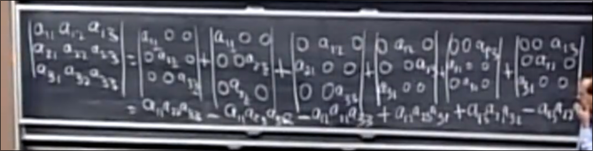
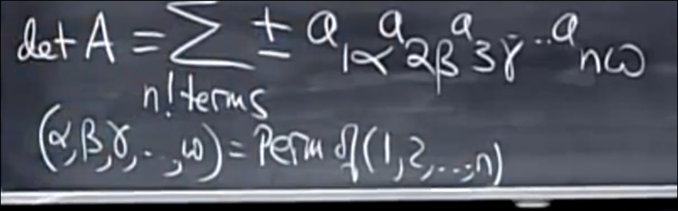
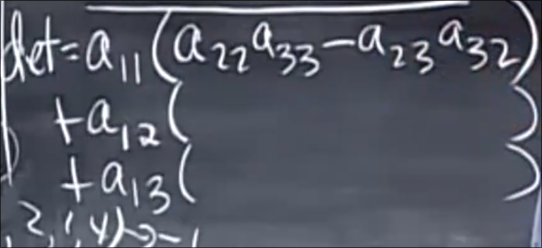
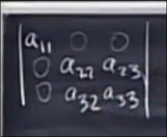
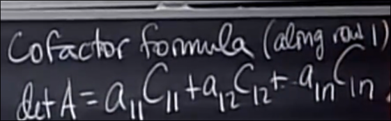

# 行列式的公式_余子式
 
* [n阶行列式公式推导](#n阶行列式公式推导)
* [余子式](#余子式)

## n阶行列式公式推导

对于2*2的矩阵 我们的解决方法

对于更高阶 如3阶 我们将第一行分为三份

之后将三份化为9份 再化为27份 得到很多0

当每一行每一列都有一个元素时 才会不为0

对于n阶方阵 

* 有一半的项是正
* 具有n!项 第一行n种选择 第二行n-1种选择...

a到w是1到n的某个排列 对应不同的列

## 余子式

对于三阶方阵 其行列式的公式还可以写成

括号中的称为余子式 *更小部分的行列式*

* 用掉某个数后a_ij 其行或列剩下的元素不能再用 剩下的形成的方阵 其+/-行列式为余子式C_ij
* 正负号取决于 `i+j` 的奇偶性 如果是偶数 那么+ 如果为奇数 则为-

因此行列式大公式可以写为

*沿第一行展开*

