# 行列式的应用
 
* [求逆矩阵](#求逆矩阵)
* [求解_满秩n方程n未知数方程组_克拉默法则](#求解_满秩n方程n未知数方程组_克拉默法则)
* [行列式和体积](#行列式和体积)

## 求逆矩阵

这是二阶方阵的逆

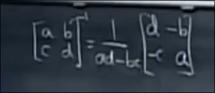

我们可以从其中察觉到这样的公式

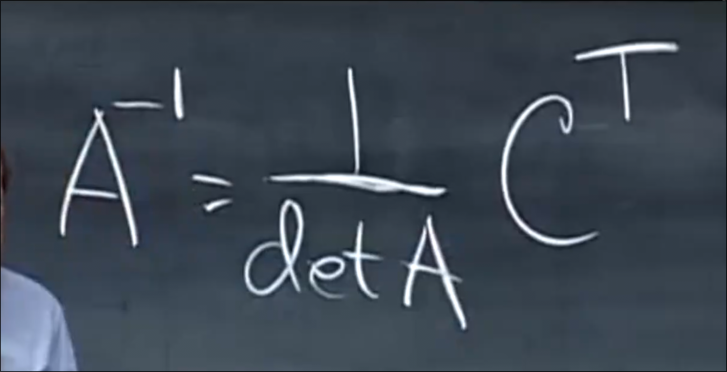

C被称为余因子矩阵 每个元素是A的对应元素**代数余子式**

证明我们只需要验证这个式

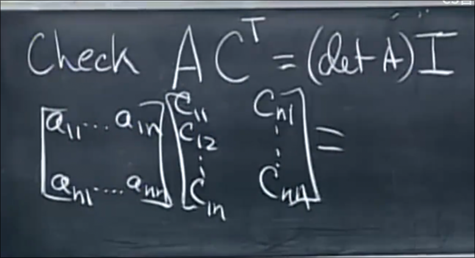

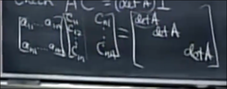

这里需要的一个结论是 取某一行的元素并和另外一行的代数余子式的乘积和为0 

* 其原因是这等同于 计算 两行相同 的方阵的行列式余子式公式

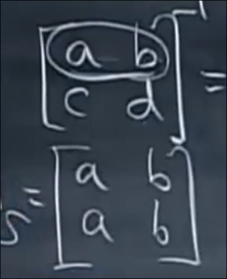

这个行列式的公式方便我们观察稍微改变原方阵A时逆矩阵的变化过程

## 求解_满秩n方程n未知数方程组_克拉默法则

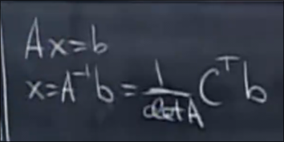

可以直接得到x

对于各个分量

* x1的上部分 = CT的第一行 乘以 向量 b 我们可以看作得到一个行列式dot B1 

那么B1即为

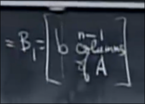

将A的第一列替换为B

B_j 即使 将A的第j列替换为b

x_j = dot Bj / dot A

然而行列式的计算耗费远超消元法

## 行列式和体积

方阵的行列式等于 一个盒子的体积 

对于3*3的矩阵 

对于其三个行向量

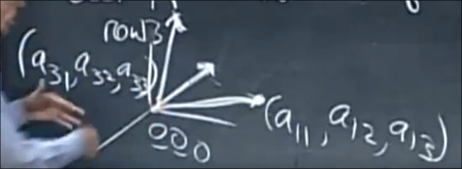

其作为盒子的3条边 确定一个平行六面体 其体积为行列式的绝对值 *符号告诉我们是左手系还是右手系盒子*

让A是单位矩阵时 盒子是单位立方体

当A是正交矩阵Q时 得到立方体 其体积是1

* 由QTQ=I 推导而来

这个结论也可以推广到二维的面积 为方阵行列式

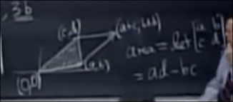

我们还可以推广至任意的三角形

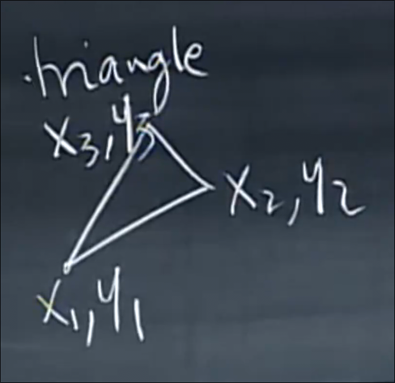

平移到原点 并为其构成平行四边形面积的一半

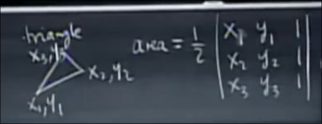
