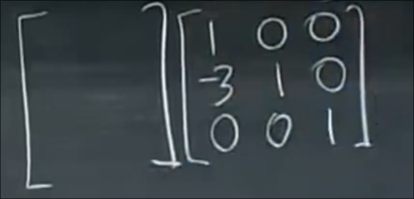

# 消元法与基本矩阵 
 
* [消元法和上三角矩阵](#消元法和上三角矩阵)
* [消元失败](#消元失败)
* [回代](#回代)
* [行向量和矩阵的乘法](#行向量和矩阵的乘法)
* [矩阵变换_](#矩阵变换_)
* [逆矩阵](#逆矩阵)
* [梳理](#梳理)
* [总而言之](#总而言之)

## 消元法和上三角矩阵

我们关注系数矩阵 但其背后代表了这个方程组

首先我们使用1式消去2、3式中的 x 

即以矩阵1-1(代表第一行第一列的元素)为主元 分别乘以一合适的系数得到一个虚拟行 让另外几列减去它 

现在我们得到了关于y和z的两个方程组

之后选取2-2为主元 我们用2式的y消去3式的y

这里的`(3, 2)`表示要让(3, 2)这个位置变为0

最后 3-3 为最后的主元

可以发现消元法就是从A矩阵变为U矩阵的过程 *上三角* 

我们得到3个主元 注意主元不能为0

## 消元失败

当我们遇到某个主元是0时 总是可以将其和下方的行互换 使得交换后主元不是0即可 *交换方程*

如果某个主元即下方都是0 那我们就遇到麻烦了 此时矩阵**不可逆**

## 回代

上面我们讨论的消元仅仅关注了系数矩阵 也就是 方程组的左侧 

在变化同时 右侧的b向量 也要做出同样变换

将`A` `b`放在一起的矩阵称为**增广矩阵** *附加了一些东西*

A经过变换得到矩阵U 而b经过同样变换得到的是向量c

于是我们得到了这样的新方程组 Ux=c 

只需要从下到上回溯 即可得到方程组的解

## 行向量和矩阵的乘法

上一次我们了解到矩阵和列向量的乘法是矩阵各列的线性组合

而行向量也有类似特点

行向量和矩阵的乘法是矩阵各行的线性组合

结果是一个行向量
 
## 矩阵变换_

我们希望 基于上述 行向量带来的列操作的启发 将转换为U矩阵的步骤写为矩阵乘积的形式

首先第一行和第三行不动 第二行=第二行-3*第一行

矩阵的乘法可以看作左矩阵的数个行向量乘以右矩阵 得到对应的新的行向量

* 第一行变换后不动 因此 行向量为 1, 0, 0 也就是 1 * row1 构成新的第一行向量
* 第二行变为 r2 - 3r1 行向量应为 -3, 1, 0
* 第三行不变 r3 0, 0, 1

得到了这个**基本矩阵** *消元矩阵* E 标记为 E_21 表示 目的是使2-1变为0

而消元的下一步 我们将第三行变为r3 - 2r2 因此基本矩阵的第三行向量应为 0, -2, 1

这就包含了我们全部的消元步骤

如果我们想一次性获得从A变换到U的矩阵 我们可以改变乘法的顺序 即E32*E21 **矩阵的乘法满足结合律**

根据上面的一些思想 跟容易想到使得两行交换的一些初等矩阵 被称为 **置换矩阵P** `0, 1, 0; 1, 0, 0; 0, 0, 1` 交换了1、2行

那么对于交换两列呢？根据上面的矩阵乘法与行向量矩阵乘法的关系 可以归纳出矩阵乘法等于 矩阵和若干右列向量的乘法 各结果列向量组成新矩阵

* 交换1，2列 即c1 = c2  那么基本矩阵的第一列向量应为 0, 1 第二列向量应为 1, 0 (c2 = c1)

*行操作左乘基本矩阵 列操作右乘基本矩阵*

## 逆矩阵

*撤销某一步骤的矩阵*

右侧矩阵是 使得 r2 = r2 - 3r1

我们希望回到原来的 r2 那么 需要一个 r2 = r2 + 3r1

`1, 0, 0; 3, 1, 0, 0, 0, 1`

记作E^(-1)

## 梳理

本节课从消元法出发 将系数矩阵变换为上三角矩阵 并回代以求解

之后推广上节课矩阵与列向量乘法的结果为矩阵中各列向量线性组合的想法 提出 行向量与矩阵乘法的结果为矩阵中各行向量的线性组合

之后将消元的每一步转换为一个基本矩阵: 其中一个讲师没有提及的思想是 矩阵相乘等于左侧各行向量分别与矩阵相乘 得到的各结果行向量构成新矩阵

那么要得到消元后的矩阵中第一行向量 则考虑基本矩阵的第一行向量 了解消元后矩阵的第一行向量为那些行的线性组合 对应基本矩阵第一行向量的各个元素取值

列变换有着类似的想法 但我们主要研究行变换

之后介绍逆矩阵的概念 

## 总而言之

基本矩阵的求解 依据目标矩阵的每一行是如何由原矩阵的每一行线性组合的 来 确定 基本矩阵的每一行元素取值
