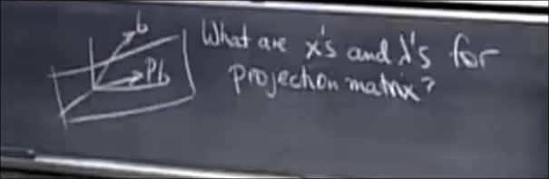
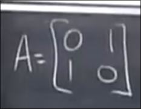
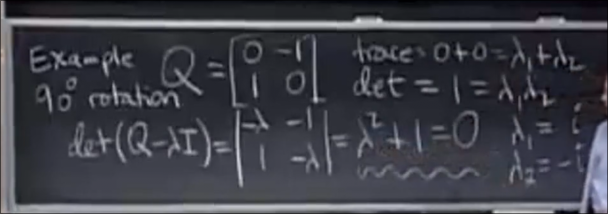
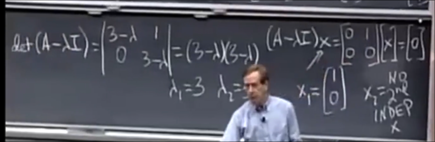

# 特征值_特征向量
 
* [定义](#定义)
* [投影矩阵的特征值和特征向量](#投影矩阵的特征值和特征向量)
* [置换矩阵的特征值和特征向量](#置换矩阵的特征值和特征向量)
* [一般矩阵的特征值和特征向量](#一般矩阵的特征值和特征向量)
* [复数特征值](#复数特征值)
* [特征向量不足](#特征向量不足)

## 定义

A是一个n*n的方阵

视矩阵和向量相乘的运算为一个函数 输入是非零向量x 输出为向量Ax

我们关注输出向量Ax和输入x方向相同的情况 这种情况下输出向量Ax就是特征向量

`Ax = lambda x`

* `lambda` 允许是正、负数或者零
* `lambda` 被称为特征值

如果A是奇异的 即不可逆 零空间不止0向量 那么存在非零向量x 使得Ax = 0 此时输出方向和x相同 *因为零向量方向任意* lambda = 0 是一个特征值

## 投影矩阵的特征值和特征向量

对于投影矩阵P来说 特征值和特征向量有哪些？

显然一般的b并不是投影矩阵的特征向量 *输入和输出方向不同*

但是在**本就在列空间**的b来说 投影矩阵不会改变其方向 因此这是P的特征向量 且lambda = 1为特征值

而对于垂直于投影平面的x Px=0 也是P的特征向量 特征值为0

因此 投影矩阵有两个特征值 1 0

## 置换矩阵的特征值和特征向量

其会交换两行 因此(1, 1) 在交换前后不会改变 特征值是1 

而(1, -1) 在交换后变为 (-1, 1) 特征值是-1

* **n*n的方阵存在n个特征值**
* **特征值的和等于对角线元素的和** **迹**
* **特征值的积等于行列式**

## 一般矩阵的特征值和特征向量

不妨写在同一侧

(A-lambda I)x = 0

那么矩阵 (A - lambda I) 的零空间即是特征向量 其必须是**奇异的**

因此 |A - lambda I| 需要为0

首先我们找到n个`lambda` 之后求`x`只是求零空间的问题

如果在矩阵中加上kI 那么特征值加k 而特征向量不变

## 复数特征值

有时候即使是真实的实数矩阵 也会遇到复数特征值

## 特征向量不足

有时在特征值相同时会遇到 不再有n个线性无关的特征向量

