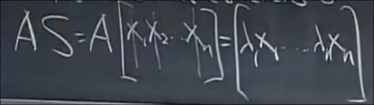
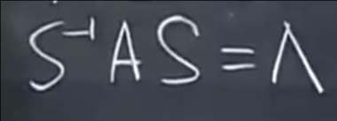
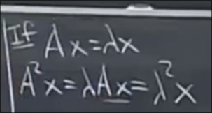

# 特征向量矩阵和应用
 
* [特征向量矩阵_特征值对角矩阵](#特征向量矩阵_特征值对角矩阵)
* [应用](#应用)
  * [矩阵的幂](#矩阵的幂)
  * [矩阵的幂趋于0](#矩阵的幂趋于0)
* [可对角化的前提](#可对角化的前提)
* [解决递推](#解决递推)

## 特征向量矩阵_特征值对角矩阵

假设矩阵A有n个线性无关的特征向量 其构成特征向量矩阵S的列

接下来我们可以得到

于是 `AS=SΛ`

由于S的列向量线性无关 且为方阵 所以S可逆

我们得到

**对角化**

或者是

## 应用

### 矩阵的幂

**结论** 如果A的特征值是lambda 则A^2的特征是 lambda^2 而特征向量不变 

另一种证明方式是

更广泛地

### 矩阵的幂趋于0

根据上面的表达式 特征值对角矩阵需要随着幂的增加越来越小

那么全部特征值需要小于1

这些结论的前提都是 具有n个线性无关的特征向量

## 可对角化的前提

当**A的所有特征值不同**时 *大多数方阵* 则具有n个线性无关的特征向量 并且可对角化

当lambda 重复 则需要检查 比如单位矩阵 虽然所有特征值都是1 但是仍具有n个线性无关的特征向量

## 解决递推

如果

那么

我们不妨将n维空间向量u0 作为n个线性无关的特征向量 也是这个空间的一组基 x1..xn 的线性组合

那么对于A^100 仅仅是 lambda 变为 lambda^100

这等同于

其中`u0 = Sc`

例如斐波那契数列可以转化为这样的一个递推系统

这是递推矩阵的特征值

第一个特征值控制了斐波那契数列的增长 F100大约等于 

其原因是

这一项占了主导地位 因为只有这一项的lambda绝对值大于1
