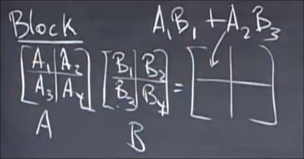
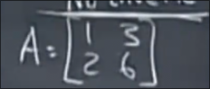

# 矩阵乘法_逆矩阵
 
* [元素角度的矩阵相乘](#元素角度的矩阵相乘)
* [整列角度的矩阵相乘](#整列角度的矩阵相乘)
* [整行角度的矩阵相乘](#整行角度的矩阵相乘)
* [列乘以行角度的矩阵相乘](#列乘以行角度的矩阵相乘)
* [行空间_列空间](#行空间_列空间)
* [分块矩阵](#分块矩阵)
* [逆矩阵](#逆矩阵)
  * [矩阵的可逆性](#矩阵的可逆性)
  * [求逆矩阵](#求逆矩阵)
* [梳理](#梳理)

## 元素角度的矩阵相乘

## 整列角度的矩阵相乘

矩阵乘以右矩阵的第一列向量得到新矩阵的第一列

**所有C中的列向量都是 A的某些列的线性组合** 原因是 都是由A和一个列向量相乘得来的

## 整行角度的矩阵相乘

同样地 所有C中的行向量都是 B中某些行的线性组合

## 列乘以行角度的矩阵相乘

取出左矩阵的每一列 乘以 右矩阵的某一行 得到的是 和结果矩阵形状相同的矩阵

实际上结果矩阵等于所有这些矩阵之和

## 行空间_列空间

行空间是右矩阵的所有行的线性组合 

列空间是左矩阵的所有列的线性组合

对于这个例子 行空间是经过 向量(1, 6)的直线

而列空间是经过向量(2, 3, 4)的直线

## 分块矩阵

类似于元素角度的矩阵相乘

## 逆矩阵

对于方阵 如果可逆 那么其左逆矩阵也是右逆矩阵

存在逆矩阵的矩阵称为可逆矩阵或非奇异矩阵 

存在不可逆的矩阵 

### 矩阵的可逆性

如果这个矩阵可逆 那么单位矩阵的每一列应为其所有列的线性组合 但是 由于这个矩阵两列是成倍数的 也就是只从 1, 2组合出 1, 0 或者 0, 1 是不可能的

另一个判断矩阵A是否可逆是 检验是否存在列向量x 使得 Ax=0向量 如果存在x 那么假设A^-1存在 会得到 x = 0 冲突

也就是说奇异矩阵的某些列的线性组合（不包含全0系数）会出现0向量

### 求逆矩阵

这个未知方程等价于

回到了我们第二节课的Ax=b的消元法求解

我们当时采用将A和b写为增广矩阵 将A化为上三角

类似地 我们直接将单位矩阵增广在右侧 当左侧变为**单位矩阵** 右侧即化为了逆矩阵

这样做有效的另一解释是

## 梳理

本节课首先介绍矩阵乘法的四种角度 之后介绍矩阵的可逆性 和 逆矩阵的求解方法
