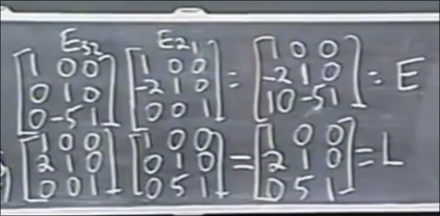

# a=lu 置换矩阵 
 
* [逆矩阵的有关计算](#逆矩阵的有关计算)
  * [乘积的逆矩阵](#乘积的逆矩阵)
  * [转置的逆矩阵](#转置的逆矩阵)
* [a=lu](#a=lu)
* [关于消元的计算量](#关于消元的计算量)
* [置换矩阵](#行交换矩阵)

## 逆矩阵的有关计算

### 乘积的逆矩阵

### 转置的逆矩阵

对于上面的两边分别取转置 

会得到乘积的转置需要将内部每个矩阵颠倒顺序 我们也得到A^T的逆 可以观察出先逆再转置等同于先转置再逆

## a=lu

我们知道如何将A矩阵通过消元矩阵变换为U矩阵

而反过来将U矩阵变为A矩阵即求E的逆

求消元矩阵的逆 即撤销其操作 比较简单

得到的是一个**下三角矩阵**L

有时也可以写作

其中左右的上下三角矩阵对角线都是1 并且中间是都是主元的对角线矩阵

我们再以3*3的矩阵为例

从A变换到U 要依次左乘E21 E31 E32

而想让这些消元矩阵出现在右侧 分别求这些的逆

以这样的变换为例

首先E应都为下三角矩阵 原因是在进行某行的变换时 *我们永远都不会用到本行更下面的行* 因此对角线以上都为0

倾向于使用L而不是E的一个原因是 **如果不发生行交换 行相减的系数会直接进入L而不是E**

E中的这个10 的由来是 首先`r2 = r2 - 2r1` 然后又 `r3 = r3 - 5r2` 叠加间接得到 r3和r1的10倍关系

然而在L中 首先`r3 = r3 + 5r2` 然后 `r2 = r2 + 2r1` 新的`r3`和旧的`r1` 并没有关系

## 关于消元的计算量

对于从A转化为U的过程

从左到右的计算规模累积为 (n = 100) `100^2 + 99^2 + .. + 1^2` 这个式子可以用积分的思想来求解 大概是`n^3/3` 

而对于每一个右侧的b矩阵 其计算规模 `100 + 99 + .. + 1` 为 `n^2` 级别

## 行交换矩阵

交换一行有三种可能 而所有的行都变动有两种可能 此外什么都不变算一种

将其中任何两个相乘得到的矩阵仍在这六个中

两行交换的逆矩阵还是其本身 而两个交换三行的置换矩阵互为逆矩阵

有一个性质**置换矩阵的逆矩阵是其转置**

对于n*n的矩阵 其转置矩阵个数 即为n的全排列 n!

## 总结

对于不需要行交换的消元 系数矩阵A通过消元变换可以转换为一个下三角（对角线全1的矩阵L）和一个上三角矩阵U A=LU 
