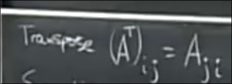

# 向量和子空间
 
* [pa=lu](#pa=lu)
* [转置](#转置)
* [向量空间和子空间](#向量空间和子空间)
  * [向量空间](#向量空间)
  * [子空间](#子空间)
  * [矩阵中获得子空间_列空间](#矩阵中获得子空间_列空间)

## pa=lu

对于需要行交换后才能消元的系数矩阵 我们可以写作 PA=LU 其中P为置换矩阵

先将A转变为可消元的矩阵 之后分解为LU

在实际的软件如MATLAB中 在主元过小时 也会进行行交换 以保持精度

这个公式使用于所有可逆的A *可以用消元法求解*

## 转置

有一类特殊的**对称矩阵** `A^T = A`

一个矩阵和其转置的乘积永远是对称矩阵 `(A^T*A)^T = A^T*A`

## 向量空间和子空间

### 向量空间

向量空间是一个具有很多向量的集合 这些向量必须可以运算**加减和实数乘** *线性运算*

R^2 表示 所有二维的实向量 (3, 2) (0, 0) (p1, e) ...

可以表示为这样

而R^2则是 整个x-y 平面

但是如果去掉其中的一个向量如 (0, 0) 那么有一些运算我们无法完成 如 数乘 0 在空间内找不到结果 那么就不会构成完整的向量空间

对向量做的线性运算结果必须还在这个线性空间 并且这些运算满足一定的运算规则

### 子空间

取某向量空间如R^2的内部一部分 **仍构成完整向量空间** 的空间 称为R^2的子空间

比如这条线

我们可以任意地进行数乘 并且其上向量加减后还在线上 这就是R^2的一个子空间 *过原点的直线*

| R^2 的全部子空间 |
| - |
| R^2本身 |
| 所有穿过原点的直线 L |
| (0, 0)自身 Z |

对于R3 还多一个经过零点的平面

### 矩阵中获得子空间_列空间

对于这样一个矩阵

其列向量处于R^3空间

我们希望找到其包含这些列向量的子空间 必须能让这些列可以执行任意的数乘 加减 线性组合

**所有列的全部线性组合**构成子空间 **列空间** 记作`C(A)`

如果我们画出这些向量 可以发现 其列空间是 经过原点的平面
