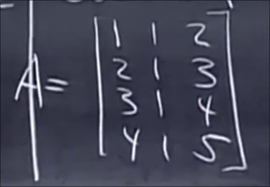
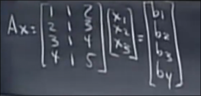
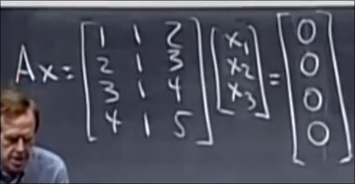
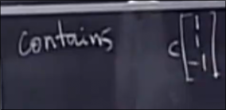
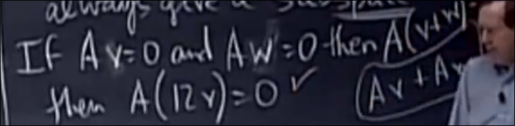

# 子空间
 
* [子空间的性质](#子空间的性质)
* [列空间](#列空间)
* [零空间](#零空间)

## 子空间的性质

子空间的并集不构成子空间 

而**子空间的交集构成子空间**

## 列空间

这个矩阵的列空间是R^4的子空间 记作C(A)

这个子空间有这些列向量以及其线性组合

显然**这三个向量及其线性组合并不会填充整个四维线性空间**

我们回到Ax=b的问题 提出这个问题 *对于任意的四维向量b 是否都存在解x呢？*

* 这个问题等同于对于全部的向量x 是否可以给出全部思维向量b 
* 基于矩阵乘向量 等同于 列向量的线性组合 那么问题又可以转化 是否全部的列向量线性组合 会填充四维线性空间呢？
* 我们刚刚回答过这个问题  不会
* 另一种考虑这个问题的方式是 我们有4个方程 但是仅仅包含3个未知数 往往我们不能解决这样的方程
    * 但是通过下一个问题 证明我们可以解出这样的方程

*那么那些向量b 一定存在解x呢？* 基于刚刚的分析 应为 **对于位于列空间C(A)的向量b 存在解x**

我们关注A的列空间 所有的列向量都对向量空间有贡献吗？ 不是列3是列1、2的线性组合 我们可以去掉其而对列空间无影响 **其不是主列**

这个矩阵的列空间是R^4的二维子空间

## 零空间

仍然是这个矩阵A 

零空间是满足Ax=0的所有x向量构成的子空间

在这里零空间位于R^3中

我们可以尝试找到几个向量 (0, 0, 0) (1, 1, -1) ... (c, c, -c)

R^3中的一个一维子空间

为什么Ax=0 的解一定构成完整的子空间？也就是其中两个解总可以线性组合得到另一个解

