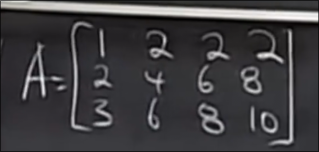
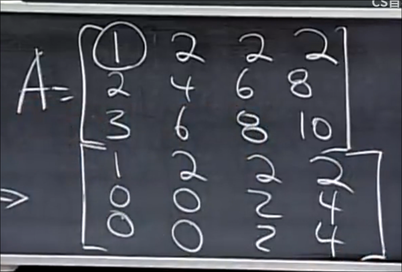
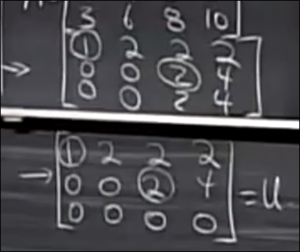
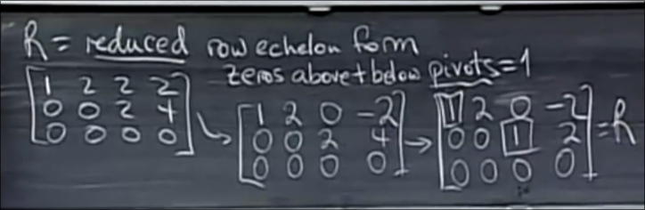
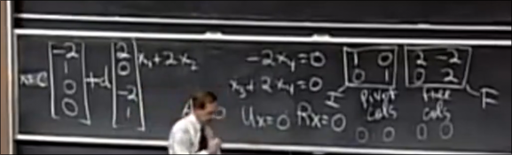
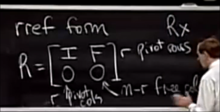
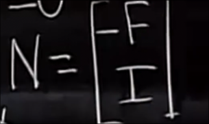

# 空间相关的计算

## 阶梯形矩阵和行简化阶梯形

我们希望对于 Ax=0 运用消元法以求解零空间

消元法不会改变零空间 *对方程组消元 解不变* 但是会改变列空间

然而处理第一列后 尝试处理第二列时会发现主元 以及其下的元素都是0 *实际告诉我们这一列是前面几列的组合*

我们跳过 接着处理第三列 主元应选为 第二行的2

 

得到一个阶梯型的东西`U` 我们获得了两个主元 **矩阵的秩为2** `RANK`

我们可以进行回代以解决 `Ux=0`

* 称主元所在列 为 **主列**
* 其余列为 **自由列** x2 x4
    * 可以分配任何数字给 x2 x4 从而解出 x1 x3
    * 代入`x2 = 1` `x4 = 0` 得 `x1 = -2` `x3 = 0` 这就是 Ax=0的一个解 (-2, 1, 0, 0)
* 任何这个向量的倍数也是解 但是如何得到全部的零空间呢？ 刚刚我们为自由变量选择了1 0 我们再选择 0 1
    * 得到 (2, 0, -2, 1)
* 整个的零空间就是 这两个**特解**向量和其线性组合

如果矩阵的秩为r 那么其为主元的个数 自由变量的个数为 n - r  

进一步地我们将阶梯形矩阵U化为简化行阶梯形矩阵R

向上消元 并将主元化为1

* 在主元的上下都是0
* 全零行在矩阵下方

## 零空间矩阵

我们可以从其中读出特解

分别对应矩阵R的单位矩阵部分和自由部分

可以发现R的自由部分矩阵F以及单位矩阵I和左侧解基本一致（只是F的符号反了过来）

我们详细说明 特解和R的关系

对于这种行简化阶梯形 我们想求其特解

不妨找到一个矩阵N 其列空间是矩阵R的零空间 其每一列向量都是R的一个特解

那么由于RN向量相乘 为R和N中的每一个列向量相乘 得到新的列

而R和N的每一个列向量相乘的结果是零向量 那么RN即是零矩阵

利用**分块矩阵相乘** N应为

从这个矩阵就可以读出特解
