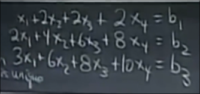
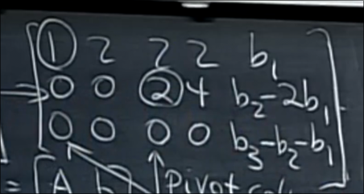
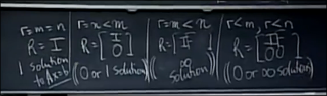

# 方程的可解性和解

## 方程有解的条件

对于这个方程 我们可以发现 左侧前两行之和为第三行 

那么 右侧则要满足同样的规律 方程组才会有解

换句话说 左侧行的线性组合得到0 那么右侧也需要 才会有解

两侧相同的行变换 只需要右侧附加上 b 得到**增广矩阵**

对其执行消元法

最终得到这样的式子 当左侧组合出0行时右侧为`b3 - b2 - b1` 需要让其也为0 才有解

在列向量 我们分析得到 方程有解的条件是 **b处于A的列向量空间**

另一种回答时 如果A的行线性组合得到零行 那么b的同样的行线性组合也要得到0 

## 方程的解

在回答是否有解后 我们还要解出方程

1. 我们先找到一个特解 

在阶梯形矩阵的方程组中 将所有自由变量设为0

求解 Ax=b 得到主元变量

2. 找到零空间的全部向量

3. 特解和零空间的全部向量相加 得到 **完整解**

## 满秩

对于 `m*n` 的矩阵 秩为`r` 

* 首先一定满足`r <= m` `r <= n`

对于列满秩 `n = r` 如果有解 那么解唯一 而零空间为零向量 *现实的一种常见情况*

对于行满秩 `m = r` 那么一定有解 *阶梯形没有0行* 有`n - m` 个自由变量

对于满秩的方阵 `m = n = r` 则有解且唯一 其行简化阶梯形是单位矩阵 因此不存在自由变量 Ax=0 除零向量不成立 因此可逆

## 总而言之

秩和m n的关系告诉我们解的信息

