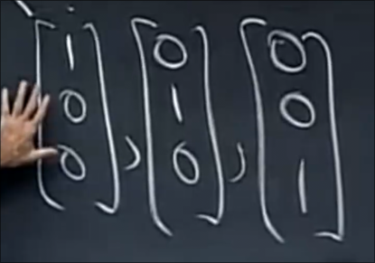
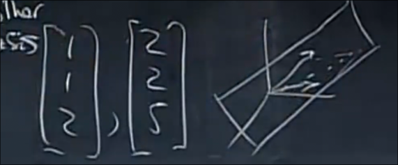
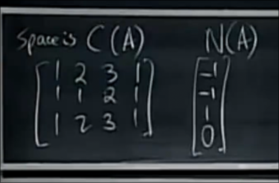

# 线性无关和线性相关
 
* [线性无关](#线性无关)
* [向量生成空间](#向量生成空间)
* [基](#基)
* [维数](#维数)

对于一个`m < n`的矩阵 *即一个未知数比方程数多的方程组* 其若存在解一定不唯一 *行满秩或者更少的秩占用更少列 一定存在自由变量* 

## 线性无关

n个向量何时线性无关？

当不存在某种线性组合 使得其为0时 那么线性无关

也就是 其组合构成向量A 不存在非0向量x 使得Ax=0

也就是 A的零空间为零向量 

也就是 对A行简化阶梯形后 不存在自由变量

也就是 **列满秩** `r = n`

## 向量生成空间

一个例子是 若干向量 作为列向量组合成矩阵 其线性组合生成了列空间

生成空间是 v1...vn 的所有线性组合

## 基

然而其不一定线性无关 我们更关心生成空间的一组线性无关地向量 这组向量称为**基** 如果生成这个空间的向量更多 那么必然不线性无关 如果更少 那么不能生成这个空间

对于三维向量的一组基是

但是远远不止这一组基

对于R^n 如果n个向量 构成满秩或者说是可逆的方阵 那么其为R^n的一组基

然而对于其中两个向量

这仍然是某空间中的一组基 为其生成空间

## 维数

对于R^n来说 其基需要n个向量 而对于其他空间 比如列空间 零空间 其有很多组基 但是构成每组基的向量数量相同

这个数字称为**空间的维数**

对于这样的列向量构成的矩阵

虽然这些向量生成了列空间 但是其并非列空间的一组基 

一个自然的想法是其中一组基为 第一列和第二列 这两列是**主元列** 矩阵的秩为2

**A的秩是列空间的维数也是列向量基的个数**

零空间的维数是多少？是自由列的个数 *其构成F* 也就是`n - r`
