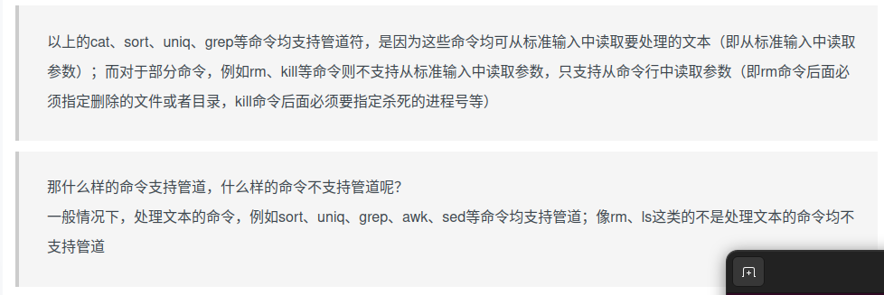
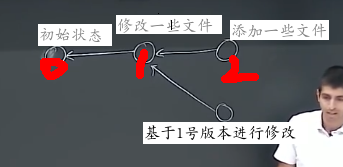

# 一些工具

## Shell

Linux: Bash 

### 一般的语法

通过程序加传参 传参通过空格分隔

```bash
date
echo hello
echo "Hello world" //  传参由多个单词组成可以用""或''分隔以不引起歧义
echo Hello\ World // 转义空格
cd ~ // /home/robot 自身主目录
cd - // 上一次所在目录
ls --help
ls -l // 查看文件的更多信息
ls *.sh // 通配符
ls hello?.sh // 将列出 hello1.sh hello2.sh等
man 程序(如ls) // 查看程序的手册
cat hello.txt // 输出文件的内容 // cat <  hello.txt
cat a.txt b.txt // 连接多个文件并输出到终端
tail -n3 hello.txt // 打印最后三行
echo hello | tee hello.txt // tee 程序同时打印在屏幕和文件
grep a "1.txt" // 查看文件中是否有某一字符串，并高亮输出位置
convert image.{png,jpg} // 用于图像的转换 新增的形式
diff file1 file2 // 逐行比较各文件的不同
tldr ls // 列出程序的实例
find . -name '*.txt' // 查找文件指定字符串的路径
find /path/to/start/search -type d -name "folder_name" // 查找目录
find ~ -type d -name 'code' -exec ls {} \; // 查找路径并运行 输入到命令（命令在-exec 和 {}中）
locate tmp // 查找系统中包含指定字符串的路径
history // 命令历史
```

### 环境变量 encironment varible

用于寻找某些程序

* 路径变量 *path varible* `$PATH` Shell 在其中搜索程序

```bash
echo $PATH
```

```
/opt/ros/humble/bin:/home/robot/anaconda3/bin:/home/robot/.local/bin:/home/robot/.local/bin:/usr/local/sbin:/usr/local/bin:/usr/sbin:/usr/bin:/sbin:/bin:/usr/games:/usr/local/games:/snap/bin:/snap/bin // linux 中路径使用 / 和 windows 不同
```

```bash
which echo
```

```
/usr/bin/echo
```

### 文件/目录的权限

```bash
ls -l 
```

```
lrwxrwxrwx   1 root root     7  9月 14  2022 bin -> usr/bin
drwxr-xr-x   4 root root  4096 12月  5  2022 boot 
drwxrwxr-x   2 root root  4096  9月 14  2022 cdrom
drwxr-xr-x  19 root root  4540  6月 28 17:50 dev
drwxr-xr-x 141 root root 12288  6月 28 17:55 etc
drwxr-xr-x   5 root root  4096 11月 30  2022 home
lrwxrwxrwx   1 root root     7  9月 14  2022 lib -> usr/lib
lrwxrwxrwx   1 root root     9  9月 14  2022 lib32 -> usr/lib32
lrwxrwxrwx   1 root root     9  9月 14  2022 lib64 -> usr/lib64
lrwxrwxrwx   1 root root    10  9月 14  2022 libx32 -> usr/libx32
drwx------   2 root root 16384  9月 14  2022 lost+found
drwxr-xr-x   3 root root  4096  9月 17  2022 media
drwxr-xr-x   2 root root  4096  8月  9  2022 mnt
drwxr-xr-x   4 root root  4096  3月  4  2023 opt
dr-xr-xr-x 371 root root     0  6月 29  2024 proc
drwx------   8 root root  4096  3月  4  2023 root
drwxr-xr-x  36 root root   940  6月 28 17:51 run
lrwxrwxrwx   1 root root     8  9月 14  2022 sbin -> usr/sbin
drwxr-xr-x  11 root root  4096  8月  9  2022 snap
drwxr-xr-x   2 root root  4096  8月  9  2022 srv
dr-xr-xr-x  13 root root     0  6月 29  2024 sys
drwxrwxrwt  25 root root 20480  6月 28 18:45 tmp
drwxr-xr-x  14 root root  4096  8月  9  2022 usr
```

* 最开头的 **d/l 表示目录 （）-表示文件**
* （不包括最前d或l或-）共有9个字符 分为三组 分别为 **拥有者自身权限 -- 所在组权限 -- 其余用户权限**
* 每组的三个位置的字符依次为  **r 读入（目录为是否允许重命名，添加删除新文件）w 写入（目录而言是是否允许被列出） x 执行（目录而言是否允许进入）**

* 如果某一位为 - ，则无此组本权限

### 文件操作 重命名/移动/复制/删除/新建

* 重命名/移动 *可以对目录进行*

```bash
mv 原路径 新路径 
mv image.png image.jpg
mv image.{png,jpg} //上面的简写
```

* 复制 *复制目录使用 -r 递归*

```bash
cp 原路径 新路径
```

* 删除 *删除目录使用 -r 递归*

```bash
rm 文件
rm -r 目录
rmdir 空目录
```

* 新建文件 

```bash
touch a.txt 
```

### 流 重定向 管道符

* `<` 输入重定向    ` >`输出重定向 >> 追加的形式输出重定向

```bash
grep foobar "$file" > /dev/null 2> /dev/null // /dev/null表示将输出丢弃 2>表示错误流重定向
```


* `|` 左侧程序的输出作为右侧程序的输入

```bash
 ls -l / | tail -n1
```



### root 用户

* 拥有全部权限 读写执行
* 可以用`sudo`程序以root用户的身份执行程序

### 打开文件 xdg-open

* `xdg-open` 会以合适方式打开文件 浏览器等等


## bash脚本

### 变量 

```bash
foo=bar // 没有空格
echo $foo
```

### 字符串 '' ""

```bash
echo 'hello'
echo "hello"
echo 'Value is $foo' // Value is $foo
echo "Value is $foo" // Value is bar
```

### `.sh`脚本

#### 常见参数

* `$0` 脚本名称

* `$1 - $9` bash脚本接收的参数
* `$?` 上一个命令的错误代码 *在shell中也可以直接使用*
* `$_` 上一个命令的最后一个参数 *在shell中也可以使用*
* `!!`会替换为上一个命令 *在shell中也可以使用*
* `$#` 脚本接收参数的数量
* `$$` 正在运行的此命令的进程PID *在shell中也可以使用*
* `$@`会展开为所有的传入参数，可供遍历使用

#### 错误代码 $?

通过`$?`获取上一个命令的错误代码

* `true`的错误代码为0, `false`的错误代码为1

```bash
false || echo "Oops"! // || 的作用 在前一个错误代码不为0(false)的前提下继续向后执行，如果为0停止
false && echo "OK" // && 的作用 在前一个错误代码为0(true)的情况下继续向后执行，如果为1停止
echo hello; echo world // ; 可以分隔多条命令，依次执行
```

#### 将命令的输出存储变量/字符串中 $()

```bash
foo=$(ls /)
echo "We are in $(pwd)"
```

#### 临时文件 <()

* 在命令中使用`<()`创建将内部命令的输出保存至临时文件，

* 对于一些从文件中获取输入的命令很有用

```bash
cat <(ls) <(ls ..)
```

####  测试返回bool值 test

* test 1 -ne 2 比较两个数字（可以是字符串格式）不等为 `true` 等为 `false`（实则`$?`0或1） 
* `test -f file`  文件是否存在 存在为`true`

#### 选择结构 if then elif else fi

```bash
if [ 条件表达式（不包含test，注意[]附近空格） ]
then
  ...
elif [ ... ]
  ...
else
  ...
fi
```

#### 循环结构 for do done

```bash
for var in $(ls)
do 
  echo "$var"
done
```

## 编辑器 Vim

### 不同的操作模式 mode

* `norlal`正常情况，通过一些键进入其他模式 *此模式按下的多数键不会进入文本缓冲buffer
  * `i`进入**插入**insert模式 `ESC`返回到`normal`模式 *此模式按下的多数键会进入文本缓冲*
  * `r`进入**覆盖**`replace`模式
  * `v`进入**可视**`visual模式` 此模式中可以使用普通模式的移动命令选中文本块之后可以复制
  * `Shift-V`进入**可视行**`visual-line` 此模式可以使用移动命令，但是整行选中
  * `Ctrl-v`进入**可视块**`visual-block` 此模式可以使用移动命令，但是成块选中
  * `:`进入`命令行`模式
    * `q`关闭当前`window`直到退出vim
    * `qa`关闭所有窗口并退出vim
    * `w`保存（写入）
    * `help :w`查询某个命令的文档
  * 均通过`ESC`返回`normal`	
  * `/range`搜索最近`range`的位置

### Vim 的组成

* 包含若干 tab 标签页

* 一个`tab`包含多个`window`

* 每个`window`对应一个缓冲区`buffer`,但是一个`buffer`可以隶属于零个，一个(:sp)或多个`window`

### Vim 的移动命令

普通模式下normal

* h左
* l右
* j下
* k上
* `w`向后移动一个单词 （落在开头）*word*
* `b`移动到单词的开头，如果已经在开头，移动到下一个单词开头 *begin of word*
* `e`移动到单词的结尾，如果已经在结尾，移动到下一个单词结尾 *end of word*
* `0`移动到本行开头 *正则*

* `$`移动到本行结尾 *正则*
* `^`移动到本行第一个非空字符 *正则*
* `Ctrl-u`向上滚动
* `ctrl-d`向下滚动

* `G`移动到文档底部
* `gg`移动到文档顶部
* `L`移动到显示的最底行 *Low*
* `M`移动到显示的中间 *Middle*
* `H`移动到显示的底部 *High*
* `fc`找到本行光标右侧的第一个`c` *find c*
* `Fc`找到本行光标左侧的第一个`c *Find c*`
* `tc`找到本行光标右侧的第一个`c`光标位于其前一个字符 *to c*
* `Tc`找到本行光标左侧的第一个`c`光标位于其后一个字符 *To c*

### Vim 的编辑命令

* `i`
* `o`在下一行新开一行并进入`insert`

* `O`在上一行新开一行并进入`insert`

* `u`撤销 *undo*
* `ctrl - r`重做 *redo*

* `d + 编辑命令如w`删除光标移动前后其中的内容

* `c + 编辑命令如w`删除光标移动前后其中的内容并进入`insert`

* `dd`  删除当前行
* `cc` 删除当前行并进入`insert`
* `x`删除当前字符
* `r + 某字符`替换当前字符
* `y`复制 *yank*
* `p`粘贴 *pasting*
* `yy` 复制本行
* `y + 移动命令`复制光标移动前后其中内容
* `~`翻转大小写
* `.`重复前一个编辑命令

### Vim 的计数count

* `4j`等同于`jjjj`向下移动四行

* `数字 + 命令`

### vim 的修饰符

*稍微改变移动命令的含义*

* `a` *around*
  * `da(`删除光标所在的()中的内容 包含`()`
* `i` *inside*
  * `di[`删除光标所在的[]中内容 不包含`[]`

## 数据处理

* `| grep ..` 过滤
* `sed` 过滤

### sed 配合正则表达式 过滤

#### 正则表达式

* 用于匹配文本
* `.`任意单个字符
* `*`加在字符后，表示该字符匹配0次或多次
* `+`加在字符后，表示该字符匹配1次或多次
* `?`加在字符后，表示该字符匹配0次或一次
* `[abc]`a或b或c
* `(ab)`ab看作一个字符，通常和`*` `+`配合
* `ab|bc`ab或bc
* `^$`匹配整行

#### sed

* 在文件中的每一行匹配正则表达式并替换
* `sed  -E 's/正则表达式/替换字符/' 文件`
* 默认情况下每一行只从头到尾和正则表达式比较一次，直到一行的某个地方和完全符合正则表达式或本行无符合处(`*`或者`+`总是匹配尽可能多的内容,可以在后面加`?`使得其变成非贪婪)
* 通过结尾加g`s/正则表达式/替换/g`表示本行的所有地方只要符合正则表达式从左到右依次替换

* **替换时可以以`\1 \2`的方式选用正则表达式中`()`的内容作为捕获组**

### sort 排序

接受很多行输出，字典序排序后输出

* `-nk1,1` 按数字排序 空格分割的第一列 第一列开始 第一列结束

### uniq 去重

接收一个排序后的很多行输入，去掉重复行

* -c 参数 显示重复个数

### awk 处理以空格分割的列数据

*一种语言，能做很多事*

* | `awk {print $1}`

### paste 分行数据粘合

* `| paste -sd,`以`,`分割并粘合每行

### bc 计算数学表达式

*  `echo '1 + 2' | bc -l`==> `3`

### xargs 多次执行命令

* `outputs | xargs 命令`

* 会逐行取出输入给命令执行

## 命令行环境

### 信号

*命令行和正在运行的进程交互的方式，比如^c发送了SIGINT信号给进程*

* `SIGINT` `^c`发送
* `SIGQUIT` `^\`发送
* `SIGKILL`不会被程序捕获
* `SIGSTOP` `^z`发送， 暂停进程 
  * `jobs`查看进程 
  * `bg %序号` 恢复暂停的进程 至后台
  * `fg %序号`恢复暂停的进程（或者正在运行的后台进程） 至前台
  * `kill %序号`  杀死进程
    * 此为 `kill`允许发送任何unix信号
    * `kill -STOP %1` 发送`SIGSTOP`
    * `kill -HUP %1`发送`SIGHUP`
    * `kill -KILL %1`发送`SIGKILL`
* `SIGHUP`挂起信号 在关闭终端时发送

*捕获信号*

```python
#!/usr/bin/env python3
import signal, time

def handler(signum, time):
    print("\nI got a SIGINT, but I am not stopping")

signal.signal(signal.SIGINT, handler)
i = 0
while True:
    time.sleep(.1)
    print("\r{}".format(i), end="")
    i += 1
```

#### &  后台运行进程

* `sleep 20000 &` 任务期间当前命令行仍然可以正常使用

#### nohup 保活进程免被挂起

* 其守护的进程在收到`SIGHUP`信号（如终端关闭）后不会终止

`nohup sleep 20000 &`后台运行进程，同时终端关闭后不停止

### 终端复用器 tmux

* `Sessions`会话
  * `Windows`窗口 *浏览器或者编辑器中的标签页tabs*
    * `Panes`面板

#### Session会话

* 命令`tmux`启用一个`session` *进入到了一个新的shell* 新的 tmux进程和原本的shell进程分开

* 前缀`ctrl + b`（已重映射到`ctrl + a`）松开后`d`**分离会话 ****绘画中进入命令模式或者快捷键都需要先按下前缀**
* 会话中使用`^d`**结束会话返回终端**，**无需前缀**
* 进入原本的shell 使用`tmux a`**重新连接会话**
  * `tmux a -t name`**重新连接指定名字的会话**

* `tmux new -t name`**新建会话并命名**
* `tmux ls`**查看目前的会话**

#### Window 窗口

* 会话中使用前缀通过`c`*create* **新建窗口 **  tmux新建了一个shell
* 前缀`p`**切换窗口** 也可以 前缀`1`跳转到编号为1的窗口 从0起：
* 可以给各个`window`**重命名**， 前缀`,`，以`:`结尾并回车

#### Pane 面板

*在终端中同时显示两个栏目*

* **纵向分裂出新面板** 前缀`"`

* **横向分裂出新面板** 前缀`%   `
* 前缀`space`将现有面板**切换分布方式**

* 前缀`方向键`**切换到相应方向的面板**
* 前缀`z`把**当前面板最大化**（挤占其余面板的位置）,**再次执行恢复**

### 别名

需要多次输入的长命令可以映射为短命令

* `alias 替换命令="长命令"`

* `alias mv="mv -l"`
* `alias xopen="xdg-open"`
* `alias sl="ls"`

需要永久性改变则要到`~/.bashrc`中配置shell环境

### 配置bash shell等 dotfile文件

* 更改`~/.bashrc`配置

* `$PS1`提示符的提示字符串 `PS1="\w >" 显示路径 >`

#### 配置终端

* `~/.config/alacritty`

### 符号链接

* `ln -s 真实路径 指针路径`
* 每当需要访问或修改指针路径，都会重新定向到真实路径
* 可以使得**一些特定目的的文件存**放在一起，比如dotfiles

* 指针路径是虚拟的，实际上没有这个文件

### 与远程服务器交互

* ssh 用户名@地址

* 类似一个安全的shell，送我们到想要到达的地方
* **显示服务器终端所能显示的**
* `logout`登出

* 也可以执行命令后仍处于本地终端 `ssh 用户名@地址 命令`

#### SSH密钥

* 免输入密码，当访问服务器时，通过私钥和服务器的公钥对比，完成验证
* 非对称加密

* `ssh-keygen -o -a 100 -t ed25519`创建ssh公钥和私钥，
  * 需要密码来保护私钥（可以在会话中保存）
  * 保存于`~/.ssh/id_ed25519(.pub)? pub为公钥，另一个是私钥
* 公钥复制于服务器用户的`~/.ssh/authorized_keys`
  * 可以采用 `ssh-copt-id -i ~/.ssh/id_rsa.pub root@192.168.0.3`这种命令实现自动复制
  * 注意`.ssh`权限应为700 `ak`文件应为600
* 再次登陆后只需要输入一次私钥密码即可

#### scp 和服务器文件传输 

* `scp notes.md jjgo@galaxies.top:foobar.md`

#### rsync 和服务器文件传输

* 当连接不稳定，会继续传输，而scp会从头传输，因此文件较多时，可以使用`rsync`

* `rsync -avP ~/code jjgo@galaxies.top:code`

#### .ssh/config 配置文件

```ssh
Host server
	User jjgo
	HostName galaxies.top
	IdentityFile ~/.ssh/id_ed25519
	RemoteForward 9999 localhost:8888
```

* 只需要`ssh server`即可连接

* 如果服务器有tmux可以在ssh连接结束后仍然保留窗口

## 版本控制 git

* 版本控制，多人协作

### git的文件，文件夹模型

*包含tree, blob，tree可以包含tree和blob*

* root <== 'tree' 正在被跟踪的目录
  * foo  <== 'tree' (folder) 文件夹
    * bar.txt <== 'blob"(file) 文件
      * hello world"
  * baz.txt <== 'blob'
    * "git hi"

### git的快照 历史记录模型

* git中每个快照存在一些父节点



* 可以就对两种特性进行合并，合并后新节点以两种特性作为父节点，在合并时，尝试将更改合并在一起，但可能发生合并冲突，会让程序员自行决定


### git的底层结构 伪代码

*git 建立的模型*

```
type blob = array <byte>
type tree = map <string, tree | blob> // 从目录名到tree或blob的映射
type Commit = struct {
	parents array <Commits>, // 实际上存储的是指针（sha1摘要）
	// 其余元数据
	author String,
	message String,
	// 快照
	Snapshot: tree
}
```

*git真实的磁盘存储和寻址*

```
type object = blob | tree | commit
objects = map <String, object> // 存储上述三种对象的哈希表
def Store(o): // 存储对象o的过程
	id = sha1(o)
	objects[id] = o // 放入哈希表
def load(id): // 通过摘要id加载存储对象
	return objects[id]
// 因此通过这个存储模型每一个commit节点都有了一个人类难以理解的摘要id名字
```

*id*的磁盘存储

```
references = map<String, String>
... "fix eccoding bug": "15a2f1d..18a"
// 至此对象有了自定义的名字，通过名字映射到id，再通过id寻址到对象
// 当有了commit后，可以使得自定义名字指定新commit的哈希值
```

### git命令

*所有的git命令是对引用（人类可读名称）对象的操作*

* 将**项目目录转换为git仓库**使用`git init`
* `git help init`**查看git命令的帮助**

* `git status`**查看仓库状况**
* 给当前的目录选取需要内容创建快照
  * git存在`staging area` 暂存区 在创建快照时告诉git应将哪些更改创建快照
  * `git add hello.txt`将hello.txt**加入暂存区**，之后创建快照会包含hello.txt
    * `git add -p ..`交互式加入暂存区，可以保留部分更改（s）
* `git commit` 创建新快照，进行commit
* `git log`可视化输出历史记录 
  * `git log --all --graph --decorate`**显示为图结构**
  * `git log --all --graph --oneline`更紧凑
* `git checkout 4353...` 可以通过哈希值的前几位或者引用名如`master`**切换当前的commit  **
  * `git checkout -f ..`舍弃掉目录新的改变切换版本
  * `git checkout hello.txt`回退hello.txt到head
  * 如果`get checkout 分支名`，同时会使得head和分支关联，当新commit后，head和关联的分支都会到新commit
* `git diff`**当前目录自上次快照以来的变化**
  * `git diff 4353.. nowfile` 查看nowfile相对于4353时的变化
  * `git diff nowfile`查看nowfile相对于head的变化
  * `git diff 43232 head nowfile` 查看从43232到head，nowfile的变化
  * `git diff --cashed`显示缓存区相对head的变化
* `git branch` 列出所有分支
  * `git branch -vv`打印详细信息
  * `git branch cat`创建分支在当前位置head
* `git merge cat`
  * 合并分支cat，如果其来自当前分支的修改（当前分支是其父节点），会直接把当前分支合并到cat
  * 出现合并冲突后
    * 手动编辑冲突内容， 后重新`git add`，再`git merge --continue`
    * 或者终止合并`git merge --abort`

#### 创建出的一些引用

* `master`仓库默认创建的引用，通常代表项目的最新版本
* `HEAD`引用指向仓库的当前commit

### git远程仓库

* `git remote`**列出当前仓库的所有已知远程仓库**
* `git remote add  <name>  <url>`**让本地仓库知道远程仓库的存在**
  * name通常为`origin`

* `git push 远程仓库名 <local brance>:<remote branch（远程分支）>`>**从本地发送到远程仓库 会更新或者创建远程仓库的对应分支**
  * 可以设置`git branch --set-upstream-to=origin/master`**设置当前分支到对应远程分支**
  * 之后使用`git push`更新当前当前分支到对应的远程分支
* `git clone <url> <folder name>`**克隆仓库到本地**
  * `git clone --shallow`**只克隆最新的快照，而不是整个历史记录**
* `git fetch`**更新远程仓库的差异到本地副本**

* `git pull`**更新远程仓库的差异到本地副本，并将分支指向远程所指向内容**

### git配置

* 修改`~/.gitconfig`或者使用`git config`

## Debug

### 调试的不同方式

* `printf`调试
* `logging` 日志输出
  * 可以设置级别
  * 可以设置只输出相应级别的详细
  * 可以设置不同级别日志的颜色
  * `Unix`的日志通常在`/var/log`
  * 目前的新做法是把应用程序的输出放入系统日志`syslog`

### 终端的颜色显示

通过转义字符

```bash
echo "\e[38;2;255;0;0m This is red \e[0m"
```

### 调试器 debuger

* 设置断点执行代码

#### python的调试器ipbd

* `py -m ipdb logger.py `开始逐行执行文件，从第一行开始
* `l`将运行代码显示完整 *list*
* `s`逐个、行执行代码 *step*
* `restart`重新执行代码
* `c`继续执行代码，直到完毕或报错 *continue*或遇到断点
* `p arr`打印arr的值 
  * `p len(arr)`打印`len(arr)`的值 *print*
  * `p locals()`打印包含所有变量值的字典
* `b 6` 在某行打印断点 *breakpoint*
* `q`退出调试器

#### 其余二进制文件，C语言等调试器 GDB

### 调试黑盒程序

* 查看程序的系统调用 `sudo strace 程序`

### 静态分析程序 

类似编译器的功能，在程序运行前，指出明显错误

* python的`pyflakes`
  * `py -m pyflakes code/tmp/logger.py` 

### 性能分析

* `printf`如`time.time()`获取执行前后时间
* `time 命令`查看**系统时间，用户时间，实际时间（耗时）**
  * `Unix`可以运行内核代码和用户级代码
  * 系统时间`system`程序在cpu执行内核级别指令所花费时间
  * 用户时间`user`cpu执行用户级别代码所花费时间
  * 实际时间 `total` 程序开始到结束执行时间
  * 
  * 例如网络请求程序实际耗费的时间其实是**系统时间+用户时间**，而剩余的部分用于等待响应

#### 分析器

cpu分析器（时间）

* 跟踪分析器
  * 在代码中插入一些东西，和代码一起执行，在程序调用这些东西时，记录
  * 会增加很多开销，影响性能
  
* 采样分析器
  * 执行程序，在每一小段时间暂停程序（10ms,100ms），查看堆栈情况，告诉程序员现在的位置
  
  * 当执行很长的程序时，可以很好的得知哪部分耗时长
  
  * python: `cprofile`
    * `py -m cProfile -s tottime logger.py 1000 '^(import|\s*def)[^,]$' *.py  ` -
      * `-s tottime`表示总时间
      * 1000 表示程序执行次数
      * `'^(import|\s*def)[^,]$' *.py`表示一种匹配模式
      * 缺点是会显示很多内置函数的调用时间
    
  * 可视化分析器
  

内存分析器

可视化工具

* htop 实时交互式显示CPU，内存，进程等情况
* `du -h 路径`查看子项大小
  * `ncdu 路径`交互式查看大小


* `lsof`
  * 想找到具体哪个进程在使用文件
  * 或者哪个进程在占用端口

## 元编程 make

构建工具

* 将构建目标需要执行的命令按序写入工具以自动执行指令
* 要让其了解到不同构建产物之间的依赖关系
* 已知一些**规则**可以从**拥有的依赖项**中获取**目标文件**

### make的使用和Makefile

* `make`会在向前目录寻找`Makefile`
* 在`Makefile`中定义目标，依赖项和规则

```makefile
paper.pdf: paper.tex plotdata.png # 构建目标: 依赖
	pdflatex paper.tex # 构建命令 pdflatex 将文档转换为pdf
# 另一个构建目标	
plot-%.png: %.dat plot.py # %表示任意字符串
	./plot.py -i $*.dat -o $@ 
	# -i 标记输入 $* 不管 % 是什么，都可以成功匹配 $@ 输出文件名
```

* 当依赖项被改动后，重新make很轻松生成了新的pdf

### 依赖管理

* 存在一些隐性依赖比如一些库如`matplotlib`，一些环境`python`，一些工具`pdflatex`

* 仓库`pypi, npm, apt`..
  * 可以上传共享代码

### 版本号

作用

* 提示是否会出现bug
* 比如在新版本中修改了函数名，那么就不能像在老版本中调用

规则

* 浏览器常见`64.0.20190324`发布版本.增量数.日期
* 语义化`8.1.7`主要版本.次要版本.补丁版本 *Python3 Python2*
  * 完全向前兼容，没有添加，删除，重命名 增加补丁号
  * 增加库中内容 增加次要版本号，补丁版本号置零 新版本会兼容老版本
  * 如果向前不兼容 如删除或重命名 增加主要版本号，其余清零
* 如果依赖某一版本的库，则是次要版本相同（最基本要保证主要版本相同），可以不管补丁号

### 锁定文件

* 防止意外的更新

* 一个列表，记录了项目依赖的库
* 如果每次构建都下载最新的版本，会有很长的等待时间， 锁定文件避免了这种情况
* 更加安全

### 持续集成

云构建系统，项目存储于网上，使用某项服务为项目运行持续集成

用途

* 自动发布
* 自动提交到特定分支
* 有人提交p r时运行测试
* 提交时对代码风格检查

类似事件触发

* `github-actions` 常用的CI

* `github-pages`把仓库（`.md`）构建成网页

### 测试

#### 测试套件

程序中所有测试的简称，一组测试，通常作为一个整体运行

通常由不同类型测试组成：

* **单元测试** 
  * 小型的子包含的测试，用于测试单一功能
  * 只测试某一功能
* **集成测试**
  * 尝试测试程序不同子系统之间的交互
* **回归测试**
  * 测试过去出现过问题的东西

* **模拟**
  * 一种虚拟的方式替换掉系统的某些部分

## 安全和密码学

