# 尺寸精度设计
 
* [基本术语和定义](#基本术语和定义)
  * [孔](#孔)
  * [轴](#轴)
  * [尺寸](#尺寸)
  * [偏差](#偏差)
  * [公差](#公差)
  * [极限偏差的标注](#极限偏差的标注)
  * [公差带图](#公差带图)
* [配合](#配合)
  * [定义_](#定义_)
  * [间隙和过盈](#间隙和过盈)
    * [间隙](#间隙)
    * [过盈](#过盈)
  * [配合的类别](#配合的类别)
    * [间隙配合](#间隙配合)
    * [过盈配合](#过盈配合)
    * [过渡配合](#过渡配合)
  * [配合公差](#配合公差)
  * [配合制_*基准制*](#配合制_*基准制*)
* [尺寸精度需要掌握的公式](#尺寸精度需要掌握的公式)
* [标准公差系列和基本偏差系列](#标准公差系列和基本偏差系列)
  * [公差带大小的标准化_标准公差系列](#公差带大小的标准化_标准公差系列)
  * [公差带位置的标准化_基本偏差系列](#公差带位置的标准化_基本偏差系列)
  * [孔轴的基本偏差规律](#孔轴的基本偏差规律)
* [配合的选用](#配合的选用)
  * [尺寸精度在总装图_零件图上的标注](#尺寸精度在总装图_零件图上的标注)
  * [配合的选用](#配合的选用)
    * [标准公差等级的选用](#标准公差等级的选用)
  * [配合制选用](#配合制选用)
  * [配合类别的选用](#配合类别的选用)
  * [线性尺寸未注公差的标注](#线性尺寸未注公差的标注)

孔和轴之间有一些需要有一定的间隙比如导轨和滑块

而另一些需要有一定的过盈 

还有一些过盈或间隙都不能太大  减速器的内孔和轴 方便拆卸和连接

## 基本术语和定义

### 孔

具有包容面，**使用大写字母表示** 如槽等也是

### 轴

具有被包容面 **使用小写字母表示**

### 尺寸

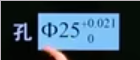

* **公称尺寸**  图中的`phi25`为公称尺寸 *设计给定的尺寸* 使用`D/d`表示

* 提取组成要素的**局部尺寸**  加工后得到的测量尺寸 `D_a/d_a`
* **极限尺寸** *允许尺寸变化的两个极限值* 分为**上极限尺寸和下极限尺寸** `D_max/d_min` `D_min/d_min` 图中的两个极限尺寸为25.021 25

### 偏差

允许偏离公称尺寸的多少

`偏差 = 某一尺寸 - 公称尺寸`

* 极限尺寸 - 公称尺寸 = 极限偏差 （上极限偏差/上偏差 ES(es) 下极限偏差/下偏差 EI(ei))
* 实际偏差 = 局部尺寸 - 公称尺寸 `E_a/e_a`

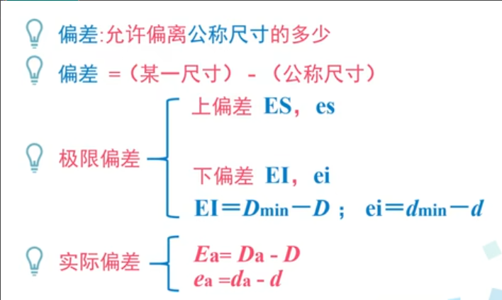

### 公差

允许尺寸的变动范围 `T_D/T_d`

`T_D = |D_max - D_min| = |ES - EI| > 0`

### 极限偏差的标注

1. 如果是0,则要和另外一个偏差的个位对其
2. 如果两个都是小数，位数统一
3. 如果上下偏差一样，合并写

### 公差带图

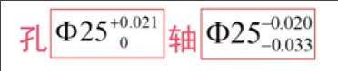

1. 先画零线，上为正，下为负

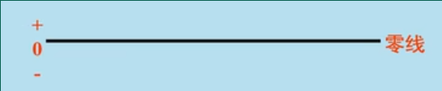

2. 零线下方画一个向上的箭头，左侧标注公称尺寸，箭头的长度也是公称尺寸

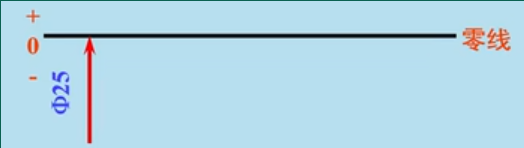

3. 零线对应位置，画出表示公差的块, 如果不为0的偏差，要标注

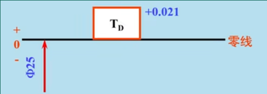

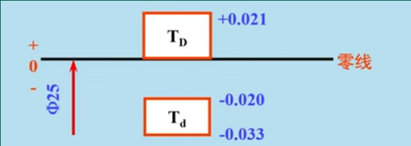

**注意**

* 单位默认为毫米 不需要写
* 比例协调 
* 严格区分孔和轴

## 配合

### 定义_

* D=d 公称尺寸相同
* 相互结合的孔和轴  

用公差带相互的位置关系来体现

### 间隙和过盈

孔的尺寸 - 轴的尺寸 

* `>= 0 ` 间隙 X
* `<= 0`  过盈 Y

#### 间隙

* 最大间隙 `X_max = D_max - d_min = ES - ei`
* 最小间隙 `X_min = D_min - d_min = EI - es`
* 平均间隙 `X_av = (X_max + X_min) / 2`

#### 过盈

* 最大过盈，最小过盈, 平均过盈
* 同样是`D - d` 为负值

### 配合的类别

#### 间隙配合

* 孔的公差带总在轴的公差带之上
* 用X_max 和 X_min 来描述

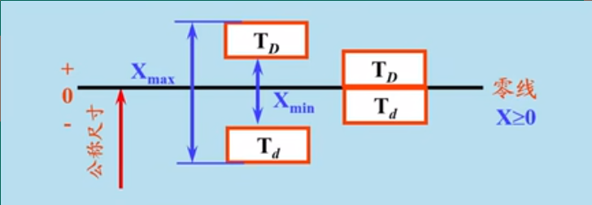

#### 过盈配合

* 孔的公差带在轴的下方
* 使用`Y_max`和`Y_min`来描述

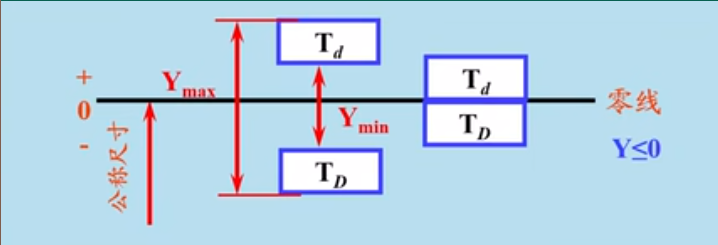

#### 过渡配合

* 孔的公差带和轴交叠
* 用最大间隙和最大过盈来描述

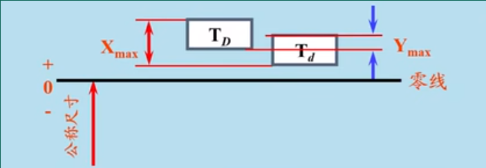

### 配合公差

允许间隙或过盈的变动量

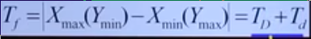

* 间隙：`X_max - X_max`
* 过盈: `Y_max - Y_min`
* 过渡: `X_max - Y_max`

**都等于 `T_D + T_d`**

故孔和轴的加工精度决定了配合质量

### 配合制_*基准制*

为了设计和制造方便，把其中孔或轴的公差带位置固定下来，改变另一配合件的公差带位置，形成所需要的配合

* 固定孔：基孔制 下偏差为0 EI = 0
* 固定轴：基轴制 上偏差为0 es = 0

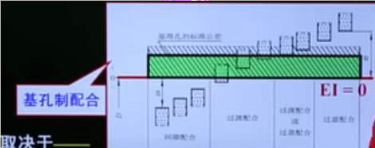

配合类别取决于公差带大小和位置

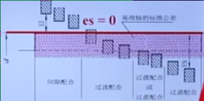

## 尺寸精度需要掌握的公式

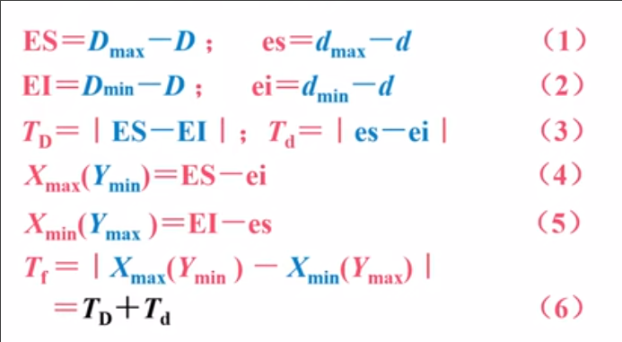

## 标准公差系列和基本偏差系列

由于配合是由**公差带位置**和**公差带大小**所决定的

因此对这两点进行标准化

### 公差带大小的标准化_标准公差系列

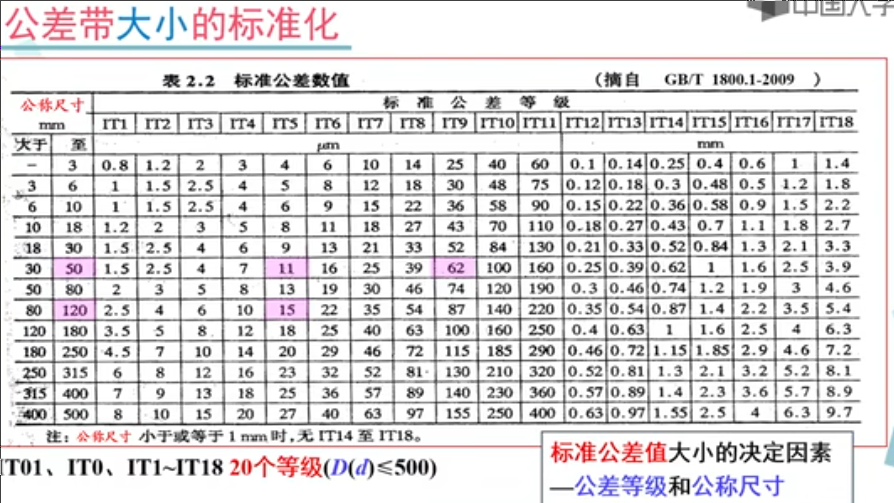

* 对于公称尺寸在0-500的分为IT01 IT0 IT1-IT18 共20等级
* 对于公称尺寸在500-3150的规定 IT1-IT18共18等级
* 随着等级的增高，或者公称尺寸的增大，精度逐渐降低

### 公差带位置的标准化_基本偏差系列

**基本偏差**是**离零线最近的极限偏差**

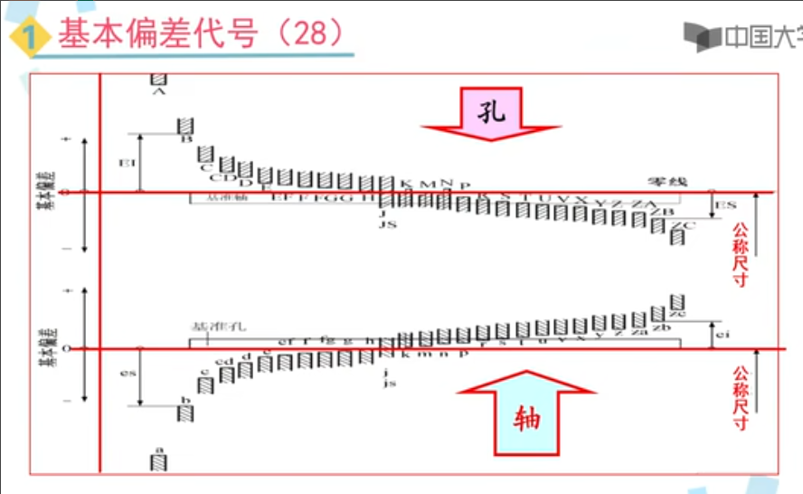

* 一个或两个字母表示，大写表示孔，小写表示轴
* 对于孔 A-H 的基本偏差为下偏差 而J及JS之后相反
* 对于轴 A-H 的基本偏差为上偏差 而J及JS之后相反
* 对于 H,基本偏差为 0 因此基孔制使用H 基轴制使用h
* J/j 上下偏差近似对称 JS/js 完全对称
    * 对J 仅保留 J6 J7 J8
    * 对j 仅保留 j5 j6 j7

基本偏差是**确定公差带位置的唯一参数**

### 孔轴的基本偏差规律

* 同一字母  如 E 和 e 是对称的
* 有一些特殊情况

## 配合的选用

### 尺寸精度在总装图_零件图上的标注

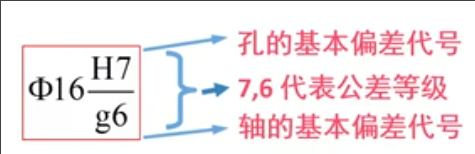

装配图上

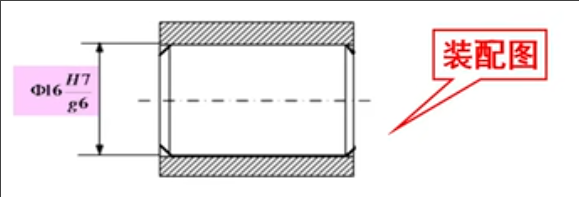

零件图上 

查表得出极限偏差 以及公差 得出上下极限，标注

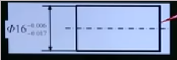

### 配合的选用

#### 标准公差等级的选用

* 在满足使用要求的前提下，精度越低愈好，也就是等级越右越好
* 公称尺寸低于500时，因为孔的制造更复杂，选用其等级比轴右一级
* 有一些8级同级，查表
* 当公称尺寸大于500或标准等级大于8,使用同级配合

### 配合制选用

* 优先选用**基孔制**
* 特殊情况选用基轴制
    * 精密小轴
    * 农业等
    * 结构上的需要：一轴与多孔配合，切配合性质不同
* 与标准件配合时，以标准件作为基准件
* 允许采用任意孔轴公差带组成配合

### 配合类别的选用

* 配合表面有相对运动 间隙配合
* 传递扭矩 过盈配合
* 经常拆卸 间隙配合或者过度配合

如何选用具体偏差代号

* 根据使用要求 *同心度* *传递扭矩*
* 工作条件 *冲击* *温度*
* 经济性

### 线性尺寸未注公差的标注

有一些只给了公称尺寸，而没有给精度

在技术要求标 f精密级 IT12 m中等级 IT14 c粗糙级 IT16 v最粗级 IT17
