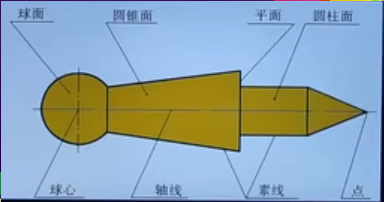
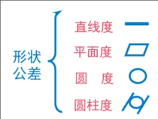
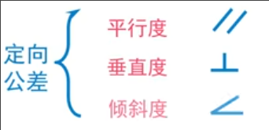
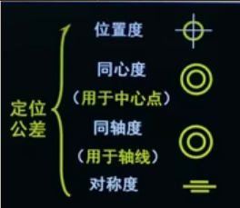
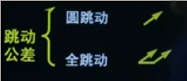
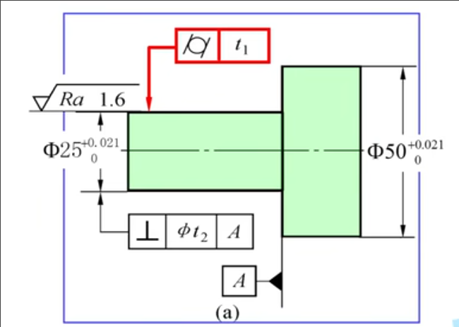
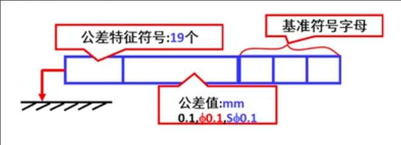
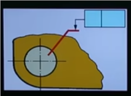
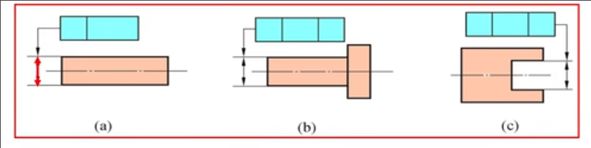
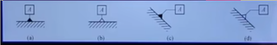

# 几何精度设计
 
* [评定几何公差特征项目和符号](#评定几何公差特征项目和符号)
* [几何公差的标注](#几何公差的标注)
  * [几何公差框格](#几何公差框格)
  * [基准要素](#基准要素)
  * [当被测要素为线时](#当被测要素为线时)
  * [附加符号的标注](#附加符号的标注)

研究对象：几何要素 构成零件集合特征的点线面

**按照结构特征分类**

* 组成要素 零件的表面或表面上的线
* 导出要素 由一个或几个组成要素得到的中心点，中心线或中心面

**按照检测关系分类**

* 被测要素 对某部分提出什么要求（圆柱度，垂直度..) 这部分就是
    * 按照功能关系分类
    * 单一要素 **没有基准** 圆柱度..
    * 关联要素 **需要基准** 垂直度..
* 基准要素 如检测某被测要素的垂直度，需要以某部分为基准，其为基准要素, **确定被测要素方向和位置**

## 评定几何公差特征项目和符号

* **形状公差**

无基准，为单一要素

* **形状或位置公差**

当无基准时,为形状公差，有基准时，为位置公差

* **定向公差**

有基准

* **定位公差**

有基准

* **跳动公差**

有基准

## 几何公差的标注

* 几何公差框格
* 指引箭头 **与被测要素垂直**
* 如果有基准，则还要有基准要素

### 几何公差框格

* 第一项为五种公差的19个项目的符号
* 第二项为公差值 mm
    * 是否有`phi`或`sphi`取决于几何公差带是否为圆或圆柱, 如果是球则为`sphi`
* 后面为一个或多个基准要素 最多不超过三个
    * 也可以为公共基准如 `A-B`

当被测要素是组成要素时，指引箭头要指向轮廓表面或其延长线

当无法接触到轮廓表面或延长线时，引出处理

为轴线中心线等导出要素时，指引箭头和尺寸线对齐

### 基准要素

* 使用大写的英文字母 不可以用`E I J M O P L R F`
* 可以加角标
* 字母必须水平
* 使用一条细实线和一个黑或白的三角形组成, 细实线要垂直基准要素

当基准要素为组成要素时，细实线直接指向轮廓表面或者其延长线

当基准要素为导出要素时，细实现与尺寸线对齐

### 当被测要素为线时

在几何公差框格下方加上`LE`

### 附加符号的标注

