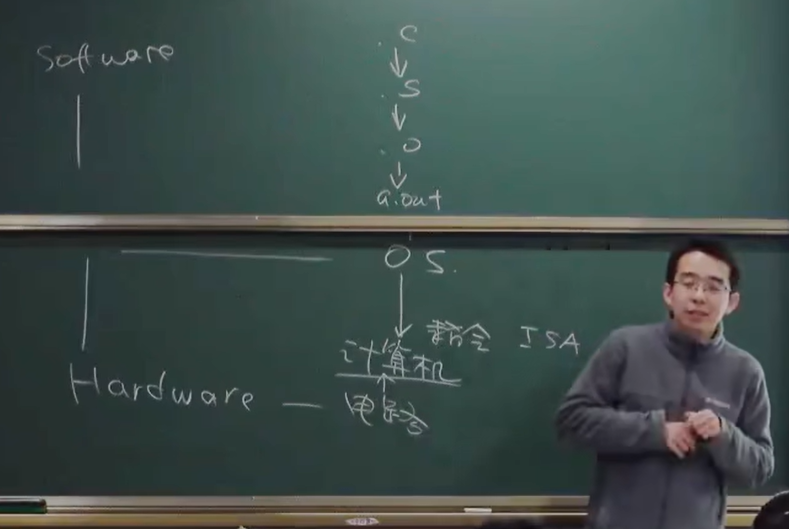

# 操作系统

 前导：可以根据需求实现数字系统 **数字电路**

## 介绍

* 硬件---操作系统---软件

* 软件使用高级语言逐步向下“翻译”，通过操作系统调用计算机的ISA指令集，完成对硬件电路的操作

  

### 背景

硬件和软件的发展史

* -> ENIAC 接线式编程

* -> 电子计算机（真空电子管，延迟线，打孔纸带/指示灯）硬件

  -> 打印平方数、素数表、计算弹道 软件

​		-> 无操作系统 能运行程序已经可以了

* -> 更快更小的逻辑门、更大的内存、丰富的IO设备 硬件

  -> IO设备已经低于处理器速度 纸带

  -> 纸带 软件

  -> 计算机昂贵，稀缺，需求高，需要调度

  -> 操作系统概念开始形成: 操作任务的系统 -- 批处理系统（程序的自动切换、库函数API）

​		-> 随着更多需求，如程序的暂存，开始出现 设备 文件 任务等对象和API

* -> 集成电路、总线

  -> 更快的处理器，更大更快的内存（程序可以同时放入内存里）

  ->进程的概念实现 多进程的实现，执行耗时程序的同时，操作系统花很短的时间切换其它任务

* 当今操作系统：把硬件虚拟化封装方便地提供给软件

### 两个视角

* 硬件底层视角：操作系统 = C程序
* 软件顶层视角：操作系统 = 库函数、API

## 程序和编译器

### 状态机和数字电路

**状态机**

* 状态=寄存器保存的值
* 初始状态=RESET
* 迁移=组合逻辑电路计算寄存器下一周期的值

### 什么是程序？

#### 源代码视角

程序就是状态机

**C程序的状态**

* 状态=堆+栈
    * 值的改变是一种状态
    * 从一个函数到另一个函数，本质上是“栈帧”的切换，也是一种状态
* 初始状态=main函数的第一条语句
* 迁移=执行一条简单命令

> layout sr # gdb 在源代码视角 调试二进制代码

#### 二进制代码视角

还是状态机

* 状态=内存+寄存器
* 初始状态=
* 迁移=执行一条指令

> layout asm # gdb 在汇编视角 调试二进制代码
