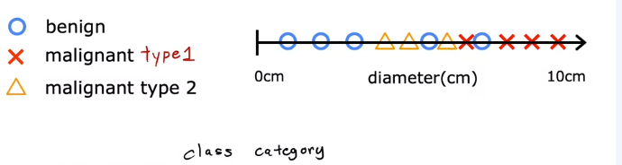
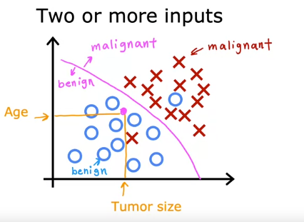

# 监督和非监督学习
 
* [什么是机器学习](#什么是机器学习)
* [监督学习](#监督学习)
  * [例子_回归](#例子_回归)
  * [分类](#分类)
* [无监督学习_](#无监督学习_)
  * [聚类](#聚类)
  * [异常检测](#异常检测)
  * [降维](#降维)
* [Jupyter_Notebooks](#Jupyter_Notebooks)

## 什么是机器学习

一个非正式的定义 **关于使计算机具有不在明确编程的情况下进行学习的能力的领域** *亚瑟-塞缪尔*

亚瑟-塞缪尔不是一个出色的棋手，但是她写了一个自动下棋的程序，程序自身进行了10000余盘游戏，并且观察其中好的情况和坏的情况，加以避免，最终这个程序成为一个好的骑手

通常训练越多越好

机器学习中的两种主要类型是**监督学习**和**非监督学习**

* 监督学习应用最广，其应用最广，进展最快，我们的前两门课集中于此
* 第三门课集中于非监督学习、强化学习和推荐系统

在本课程我们不仅学习算法，也学习进行机器学习的**技巧** *这非常重要*

## 监督学习

当今机器学习中99%的价值来源于监督学习

监督学习是指**学习从x到y映射**的算法

我们给出一些正确的答案 通过**学习正确的输入-输出对**

机器最终学会在没有已知答案的情况下，获取输入，并准确预测输出

* 输入 邮件 输出 是否为垃圾？ *垃圾分类*
* 输入 声音 输出 文字 *语音识别*
* 输入 英语 输出 中文 *机器翻译*
* 输入 广告以及用户信息 输出 是否会点击广告？ *在线广告*
* 输入 图像以及其他传感器信息 输出 其他汽车位置 *自动驾驶*
* 输入 刚生产的手机图像 输出 是否有划痕？ *生产线检测*

这些都可以给予机器正确的`输入-输出`实例供其学习，最终其获取一个全新输入，并尝试输出y

### 例子_回归

这是一个房屋 价格-面积 数据集 其可视化如下

我们想知道面积是`750`时的价格，但是我们并没有相关的数据，学习算法可能会将数据按照直线拟合，并找出`750`在直线上对应的`y`值

但是选择直线并不是唯一的学习算法，比如拟合曲线

我们在后面会学到如何选择用直线还是曲线亦或是更复杂的函数来拟合

这种房屋预测是一种特殊的监督学习，名为**回归**

* 其从**无限多数字**中选择一个

而另一种主要的监督学习名为**分类**

### 分类

以乳腺癌检测为例

根据患者的病例，我们的机器学习系统试图弄清肿块肿瘤是恶性肿瘤亦或是良性

我们的数据集有各种大小的肿瘤，会被标记为良性`0`，恶性`1`

我们可以绘制一个离散的图像，因为为二分类，我们同样可以在一个数轴上，用不同符号表示10

**和回归不同的是我们只有有限的输出**

而分类模型学会如何输入一个新的肿瘤大小，而预测其所属类别

分类不仅仅能二分，可能有多种恶性肿瘤类别

我们在上述中只有一个输入，而同样可以有多个输入来预测输出

比如我们的数据集还有患者的年龄

学习算法可能会寻找一个界限来将恶性肿瘤和良性区分，其要知道如何通过这些数据拟合边界线

## 无监督学习_

广泛程度仅次于监督学习的机器学习形式

还是上面**分类**的例子，在监督学习中，我们的训练集有*正确的输入-输出对*，但是在无监督学习，**数据集中只有一些输入，没有正确的输出，同样我们不要求输出正确的预测分类，而是找到数据的结构或者模式** *让机器自己弄清数据的有趣之处*

### 聚类

无监督学习可能会把数据集分成两个组 这是一种特殊的无监督学习，名为**聚类**

* 把新闻分成各个组别，以完成推荐相关内容
* 根据一群人的DNA数据集(其中每个人有若干基因的活性程度)，进行聚类，对人群进行分类
* 根据客户数据库 把客户分成不同类别

### 异常检测

检测异常数据

* 检测金融系统中的异常事件、异常交易以预警欺诈

### 降维

将庞大的数据集压缩为一个小的数据集，同时尽可能少丢失信息

## Jupyter_Notebooks

是机器学习和数据科学人员最广泛使用的工具

本课程有一些`lab`使用其查看

* 可选`lab` 通常不需要编写代码，只需要点一点以查看 *理解机器学习代码真实的运行*
* 联系 `lab` 自己编写代码

在本单元的可选`lab`中，随便点一点查看`jupyter`的功能

`jupyter`主体部分有两种单元格

* `Markdown`单元格 只是一堆文本，可以随意更改，通常描述代码
* 代码单元格 选中后 `Shift Enter`以运行
