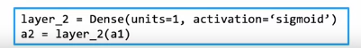

# TensorFlow
 
* [使用TensorFlow实现推导](#使用TensorFlow实现推导)
  * [烘焙咖啡](#烘焙咖啡)
  * [手写数字](#手写数字)
* [TensorFlow中的数据](#TensorFlow中的数据)
* [构建神经网络](#构建神经网络)

是实现深度学习算法的领先框架之一

另一个是`pytorch`

## 使用TensorFlow实现推导

神经网络的特点之一是相同的算法应用于很多不同的应用程序

### 烘焙咖啡

在烘焙咖啡时，我们要控制的两个参数是加热的**温度**，以及要烘焙多长时间

这是训练集，其输出表明咖啡是否美味

我们希望在这样的神经网络中推断

我们使用这样的代码构建

* 用于预测的`X`是个矩阵 `m - 样本数` `n - 特征数`
* `activation` 指定了激活函数
* `units` 指定了本层中使用三个单元
* `Dense` 我们目前学习的一种神经网络层的名字

这样得到了激活矢量，其也是一个二维矩阵

我们构建输出层

`a2`也是二维矩阵

### 手写数字

x是表示一张图片的长矢量

第一层如下

接下来两层也同理

## TensorFlow中的数据

在`Numpy`和`TensorFlow`中的数据表示有些不一致

这是`numpy`表示矩阵的方式

而我们同样可以创建**一行或一列的矩阵**

而在上一门课我们通常做的是创建一个**一维的向量**

其不是矩阵

而`TensorFlow`中，通常用**矩阵表示数据**，因为其旨在处理非常大的数据集，使用矩阵以提高效率

## 构建神经网络

这是我们想进行训练的一些数据

在`TensorFlow`中有一种构建网络的不同方式

不需要手动一层层传递数据，而是告诉`TensorFlow`采取第一层的输出作为下一层的输入

也可以写成

 

* **顺序框架**

可以发现，训练集中的`X`是二维矩阵，而`y`**是一维向量**

而推理过程如下

这是数字分类模型

