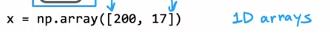
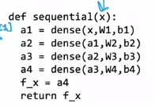

# 手写向前传播_AGI
 
* [我们的实现](#我们的实现)
* [简化步骤](#简化步骤)
* [AGI](#AGI)

## 我们的实现

和`TensorFlow`不同，我们使用一维数组,也就是矢量用于推理，也就是前向传播

并且，我们使用`w2_1`表示第二层的第一个神经元的参数`w`向量

尽管`b1_1`只是一个数，我们仍然用矢量表示

这是第一层的完整过程

同理，这是第二层

## 简化步骤

实现一个代表单层的`dense`函数

* 接受一个`a_in`表示上一层的激活矢量
* `W`矩阵 `shape(n, m)` 表示本层神经元的w参数，`m`神经元个数 `n`特征数(也就是上一层的神经元个数, 同时也是激活向量的元素个数)
* `b`向量 本层神经元的b参数 `shape(m, )`
* 输出当前层的激活向量`a`

而整个模型如下

## AGI

和人类一样智能的AI

* AI
    * ANI `narrow` 用途单一，一项狭窄的任何，有时可能完成的非常好，并可能非常有价值
        * 智能音响，智能汽车，网络搜索，工厂农场中的AI
        * 过去多年快速发展的实际就是`ANI`
    * AGI `general`
        * 做任何人类能做的事
        * 并没有多少进展

之前有人认为随着GPU等硬件或技术快速发展，我们能构建的**神经网络单元**越来越多，最终神经网络足够智能，可以完整模拟人脑

但是事实并非如此简单，可能的原因之一是**我们构建的逻辑回归单元与任何生物的神经元的行为都不同**，它太简单了

*大脑到底是如何运作的？* *神经元如何把输入映射到输出？*

仅仅模仿已知的人脑对于AGI的道路来说非常艰难

*AGI何时会有进展？*

Roe等人的实验

* 大脑的**听觉皮层**，连接来自耳朵的信号，如果切断耳朵和听觉皮层的连接，但是将**图像信息传送到听觉皮层**，那么**听觉皮层会学会看见**
* 切断大脑的**体感皮层**和触摸传感器的连接，而**输入图像**，那么**体感皮层也将学会看见**

此外还有种种实验证明人类的大脑适应性、可塑性极高

*那么学习算法是什么？*

如果大脑的一部分可以同时学会多种事情，那么我们是否探索其学习算法以在计算机中实现？
