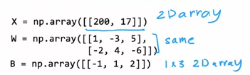

# 前向传播矢量化
 
* [矢量化实现](#矢量化实现)
* [矩阵乘法](#矩阵乘法)
  * [向量的点积](#向量的点积)
  * [_向量和矩阵相乘](#_向量和矩阵相乘)
  * [矩阵和矩阵](#矩阵和矩阵)
* [矩阵乘法规则](#矩阵乘法规则)
* [矢量化实现分析](#矢量化实现分析)

## 矢量化实现

通过矩阵乘法可以非常有效的完成

GPU和CPU都很擅长进行非常大的矩阵乘法

这是我们之前构建的前向传播

而为了矢量化，我们将`X` `W` `B`都写为**二维矩阵**

而这是新的`dense`

得到的A_out也是二维矩阵

## 矩阵乘法

### 向量的点积

向量的点积是如何实现的？

对应位置的元素相乘，总和相加

另一种写法是把第一项写为行向量

### _向量和矩阵相乘

后面的矩阵可以写为若干列向量并列

将`z`和`w`的各个列向量相乘，就是向量矩阵相乘的结果

### 矩阵和矩阵

前面的写为行向量 后面的写为列向量

**第i个行向量乘以第j个列向量，结果放在(i, j)**

## 矩阵乘法规则

* 前者通过行向量参与到矩阵的运算
    * 第一个行向量影响结果矩阵的第一行
    * 第二个行向量影响结果矩阵的第二行
    * ...
* 后者通过列向量参与运算
    * 第一个列向量影响矩阵的第一列
    * ...

交点处实际上展示了运算规则，即**对其所在行产生影响的行向量点乘对其所在列产生影响的列向量**

## 矢量化实现分析

这是`numpy`中对于我们刚刚分析的矩阵乘法的实现

也可以是

而在我们的前向传播中，`A^T`就是上游激活特征矩阵

