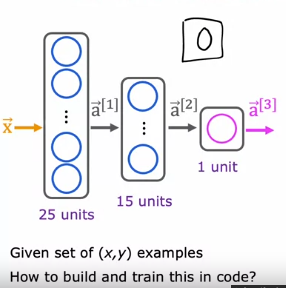
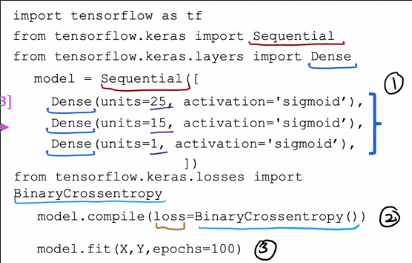
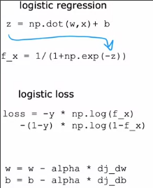
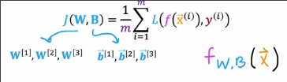
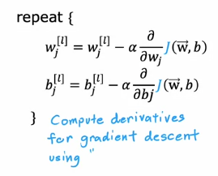
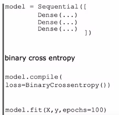

# 训练神经网络
 
* [TensorFlow实现](#TensorFlow实现)
* [神经网络训练的步骤](#神经网络训练的步骤)

## TensorFlow实现

还是我们识别手写数字的例子，我们如何训练以获得用于推理的合适参数？

* 调用`model.complite`，传入要使用的损失函数 *我们之后了解*
* 调用`model.fit`进行训练

* `epochs`对应我们梯度下降时，迭代多久

## 神经网络训练的步骤

回顾一下我们如何训练逻辑回归模型？

1. 定义模型 在已知`w`和`b`的前提下，我们如何根据输入得到输出
    * `f_w,b(x) = segma(z)` `z = wx + b`
2. 指定损失函数 *其对于单个样本而言* 和成本函数 *其对于整个训练集而言*
    * `L(f, y) = -ylogf - (1 - y)log(1 - f)`
    * `J(w, b) = avg(L)`
3. 对损失函数梯度下降，得到适宜的`w`和`b`

而我们训练神经网络也遵循同样的步骤

1. 指定模型 `model = Sequential([..])`
  * 指定了整个神经网络的架构
  * 初始化了参数
2. 指定损失函数，计算成本函数 `model.complile(loss=..)`
  * 对于大多二分类问题，和逻辑回归使用损失函数相同，代码中是`BinaryCrossentropy()`，也称为**二值交叉熵损失函数**
  * 对于回归问题，可以使用不同的损失函数，如想要**尽可能减少平方误差损失**，可以使用`MeanSquareError()`
  * 成本函数是一个网络中关于所有`w`和`b`，也就是所有参数的函数

3. 梯度下降 `model.fit(X, y, epochs=..)`
  * 根据`J`关于`w^[i]_j`的偏导，更新`w^[i]_j`，同理更新`b`
  * 而这些偏导数的计算采用名为**反向传播**的算法

