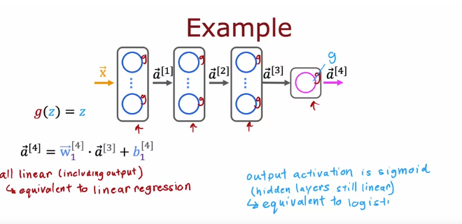

# 激活函数
 
* [其他的激活函数](#其他的激活函数)
* [激活函数的选择](#激活函数的选择)
  * [输出层](#输出层)
  * [隐藏层](#隐藏层)
* [为什么需要激活函数](#为什么需要激活函数)

## 其他的激活函数

我们之前一直在做的是采用逻辑回归来构建神经网络，因此我们创建很多**逻辑回归单元**

对于一些需求，我们可以使用另外的激活函数

这是之前预测是否畅销的例子

但是认知度大概不是只有0和1，而是一个任意的非负值，因此用一个线性的单元或许更好？

我们可以改用激活函数

右侧是一种常用的线性激活函数`g(z)=max(0, z)` *ReLU* *经过矫正的线性单元*

此外还有纯线性函数 `g(z) = z)` 也可以说没有用激活函数

## 激活函数的选择

### 输出层

根据目标标签的情况，输出层的激活函数选择很自然

* 如果我们研究y为0或1的**分类问题**，那么`sigmoid`函数就是最自然的选择
* 如果是**回归问题，结果有正有负**，比如股价相对今天，那么可以选择**线性回归函数**
* 如果是**结果非负的回归问题**，如房价预测,那么选择`ReLU`最好

### 隐藏层

* `ReLU`是最常见的选择
* 对比`sigmoid`和`ReLU`
    * 首先其计算更快，只需要`max(0, z)`，而`sigmoid`需要计算指数、加法、除法
    * 更重要的是`ReLU`仅仅在一侧平坦，而`sigmoid`两侧平坦，**当函数很多地方平坦时，梯度下降会慢，因为激活函数是梯度下降中计算的一部分**

## 为什么需要激活函数

如果我们对所有节点不用回归函数，或者也就是应用线性回归函数，会发生什么？

答案是，整个神经网络变得与线性回归完全一致,违背了神经网络的目的

我们查看这个模型

模拟向前传播的过程

输出只是输入的一个**线性函数**

* 如果我们对隐藏层都使用线性激活函数，而对输出层也使用线性激活，那么模型等同于线性回归
* 如果我们对隐藏层使用线性激活，而对输出层使用`segmoid`激活，模型等同于逻辑回归

因此，**不要在隐藏层中使用线性激活**
