# 多分类
 
* [介绍多分类问题](#介绍多分类问题)
* [softmax回归](#softmax回归)
  * [模型](#模型)
  * [损失和成本函数](#损失和成本函数)
* [神经网络中的softmax回归](#神经网络中的softmax回归)
  * [softmax层](#softmax层)
  * [TensorFlow中的softmax](#TensorFlow中的softmax)
* [改进softmax](#改进softmax)
* [多输出分类](#多输出分类)

## 介绍多分类问题

不止输出0或1

如识别手写0-9，识别肿瘤可能是哪一种？

仍是一类分类问题，因为`y`只是一些固定的离散值

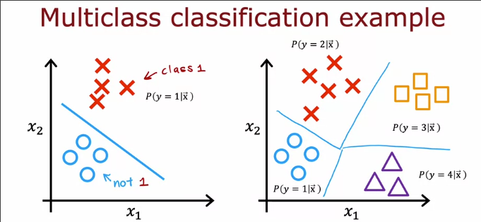

我们需要这样一个决策边界

## softmax回归

### 模型

当我们的目标只有0和1时，应用逻辑回归，把`z`带入`segma`函数中得到`a`，即`y==1`的概率

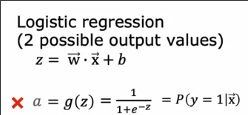

也可以视为，其先计算`a1 = g(z)`，然后计算`a2 = 1 - a1`，**y==0的概率**

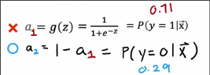

对于**softmax回归**

首先计算**每个类别**的`z`

* `z1 = w1x1 + b1`
* `z2 = x2x2 + b2`
* ...

分别带入公式得到对应的`a`

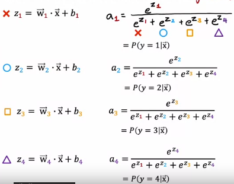

因此**softmax回归的算法如下**

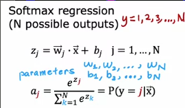

### 损失和成本函数

对比逻辑回归

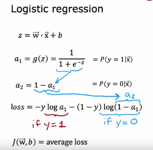

其损失可以写为

* 当`y==1`时是`-loga_1`
* 当`y==0`时是`-loga_0`

因此，`softmax`回归的损失定义如下

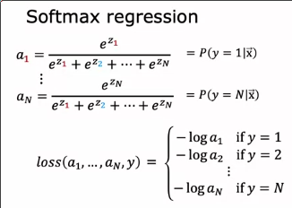

## 神经网络中的softmax回归

### softmax层

我们向完成10个类别的手写数字识别

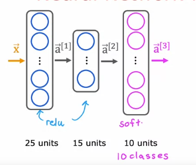

新的输出层是`softmax`输出层

在第三层中，我们做了这样的计算

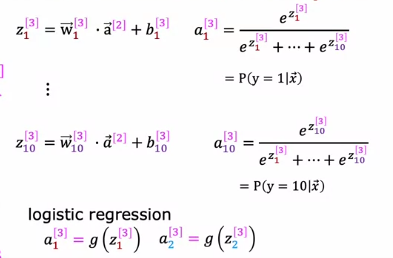

这一层的神经元和我们之前使用其他激活函数的神经元表现不同

它们在计算各自的`a_i`时会参考彼此的`z`，而不是彼此独立的过程

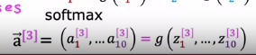

### TensorFlow中的softmax

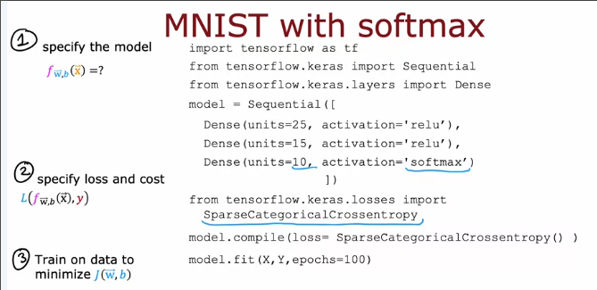

注意使用的激活函数和损失函数

相对于这里TensorFlow有更好的版本

## 改进softmax

计算机中浮点数精度问题

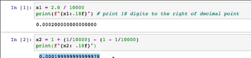

我们在计算`softmax`的成本函数时，也会遇到这个问题

首先我们回顾逻辑回归

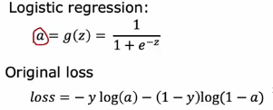

我们先计算了`a`之后算出其损失

我们可以让`tensorflow`不使用`a`作为中间项 而是重新计算结果，`tensorflow`会采用另一种更准确的方式完成损失函数的计算

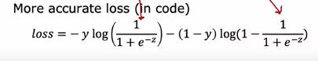

我们改进代码

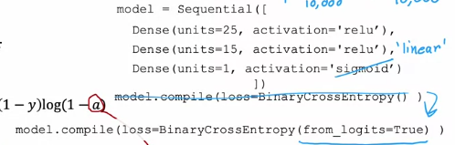

我们更改了输出层激活函数为`linear`，因此损失函数接受的是`z`，然后`from_logits`告诉损失函数，其输入的是`z`，从头开始计算

而最终我们的预测结果还需要再手动调用`sigmoid`

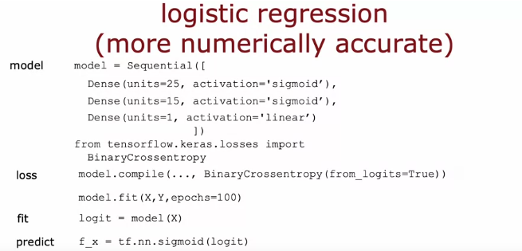

在`softmax`中，也是同理

我们告诉损失函数输入的是原始的`z1 - z10`来计算，而不是`a1 - a10`

因此输出层使用线性就好

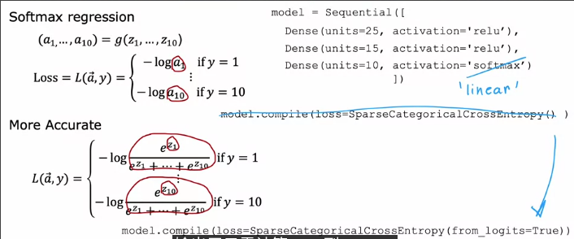

## 多输出分类

或许在一张图片中并不只有一个待识别的事物？我们想识别出其中汽车、公交车、行人

那么训练集中的每个样本的输出就不止一个

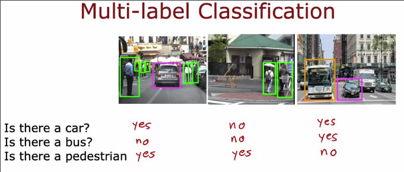

一种方式是把它分为三个机器学习任务

* 一个识别汽车 一个识别行人 一个识别公交车

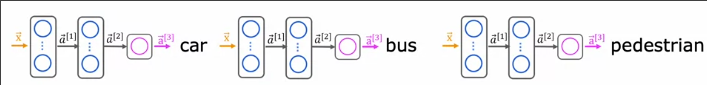

而也可以用一个神经网络同时检测三种事物

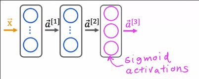

输出层每个单元输出是否有行人？公交车？小汽车 *sigmoid*
