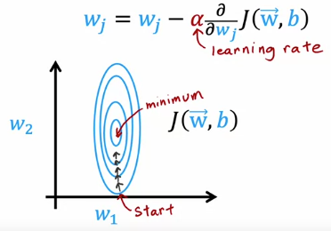
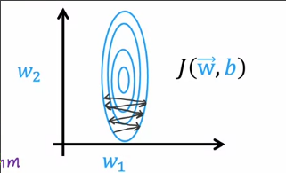
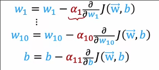
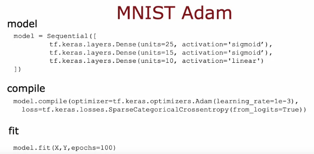
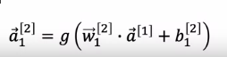
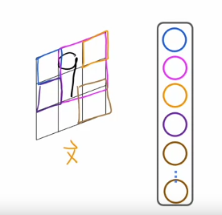
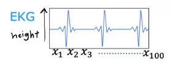
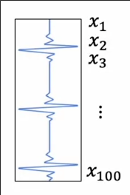
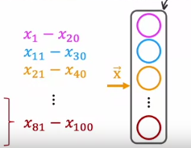
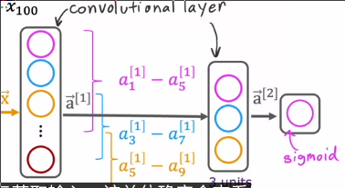

# 神经网络优化
 
* [Adam_自动调整学习率](#Adam_自动调整学习率)
  * [Adam的工作](#Adam的工作)
  * [TensorFlow实现](#TensorFlow实现)
* [更多类型的层](#更多类型的层)
  * [卷积层](#卷积层)
  * [卷积神经网络](#卷积神经网络)

## Adam_自动调整学习率

### Adam的工作

梯度下降广泛用于线性回归、逻辑回归、神经网络的早期实现

现在有一些更好的算法来最小化成本函数

在这个梯度下降的例子中，我们使用一个很小的学习率，成本函数每次训练都会下降

我们能否自动增加学习率来更快下降？

**Adam**算法 如果发现学习率太小，每次都向相同的方向迈出一小步，那么增加学习率

如果我们采取较大的学习率，那么可能会出现震荡现象，成本并不永远下降

此时我们应当减小学习率，**Adam**也能自动为我们做这件事

Adam并不使用全局的α，而是针**对每一个参数有独特的学习率**

### TensorFlow实现

在调用`model.compile`时传入参数`optimzer` 并把初始学习率设置给`Adam`

## 更多类型的层

我们到目前为止都是使用`Dense`密集层，其中**每个神经元都从前一层获得所有的输入**

密集层的表示如上，所有神经元都完整处理来自上一层的全部输出

### 卷积层

一层中的每个神经元可以关注前一层输出中的一部分

手写数字识别，第一层采用卷积层

每个神经元都只看到了图像的部分区域

为什么要这样做？

* 可以**加快计算速度**
* 可能**需要更少的训练数据**，**不太容易出现过拟合**

### 卷积神经网络

采用多个卷积层的网络

对EKG信号（心电）分类

一维数据 是关于**心电图高度随时间变化**的数据

预测是否可能患病

我们输入一段时间的数据到神经网络

* 而隐藏层的第一个神经元可能查看`1-20`
* 第二个神经元可能查看`11-30`
* ...

这是一个卷积层，每个神经元只关注输入的一部分

第二层同样可以是卷积层

* 第一个神经元查看前一个激活矢量中的`a1-a5`
* 第二个查看`a3-a7`
* ...

最终层需要查看前一个神经元的所有输出，进行sigmoid分类
