# 反向传播
 
* [导数](#导数)
  * [导数的认识](#导数的认识)
  * [python求导](#python求导)
* [神经网络中的导数_计算图](#神经网络中的导数_计算图)
* [更大神经网络中的反向传播](#更大神经网络中的反向传播)

调用`model.fit`后`TensorFlow`自动使用反向传播计算导数，以便梯度下降得到合适的参数

*导数是如何计算的？*

## 导数

### 导数的认识

这是一个简化的成本函数

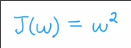

我们设置`w`为3，那么`J=9`

如果我们给`w`增加一个很小值`ε=0.001`，`J(w)`如何变化？

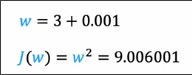

大约如下

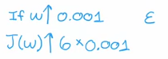

如果ε足够小，那么这个结论会愈发准确

实际上，**J(w)的导数为6**

* 通过导数的极限定义就可以解释这个现象

而回到梯度下降的例子

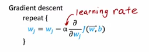

* 在学习率一定时，如果导数项很小，那么w不会更新很多，如果导数项很大，那么w更新一大截。
  * 结合我们上面的发现，如果导数很小，意味着更改`w`，不会太多影响`J`

这是更多**形象化导数定义的例子**

而我们还可以观察到

* **导数是原函数的切线斜率**
* J关于w导数的具体值取决于w

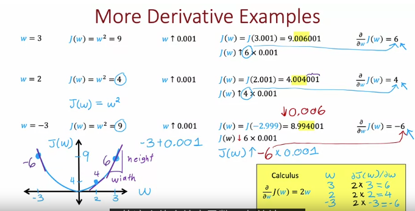

我们通过试验或者微积分的知识可以得到导函数

### python求导

python中的`symPy`可以计算导数

```py
>>> import sympy
>>> J, w = sympy.symbols('J, w')
>>> J
J
>>> J = w ** 2
>>> J
w**2
>>> sympy.diff(J, w) # 求 J 关于 w 的导数
2*w
>>> dJ_dw = sympy.diff(J, w)
>>> dJ_dw.subs([(w, 2)])# 根据导函数计算具体的导数值 实际是将w=2插入这个符号表达式
4
```

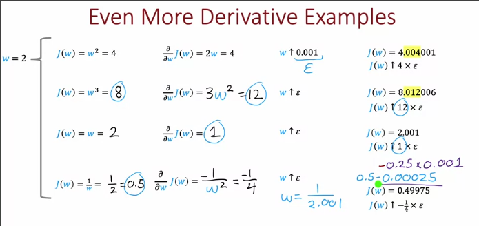

## 神经网络中的导数_计算图

**计算图**是计算神经网络的导数的关键，也是如`TensorFlow`这种框架自动计算导数的工具

对于一层神经网络（一个线性激活神经元） 输入矢量x,输出激活值a

`a=Wx+b=g(z)=z`

其成本函数即为`1/2 * (a-y)^2` (由于我们只用一个训练示例)

这是网络的训练集和当前参数

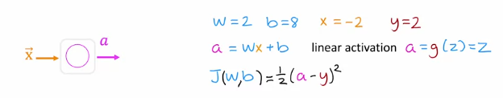

计算图计算成本函数

下面是`J(w, b)`的计算

1. 首先计算`c=wx=-4`
2. 计算 `a=c+b=4`
3. 计算 `d=a-y=2`
4. 计算 `j=1/2d^2=2`

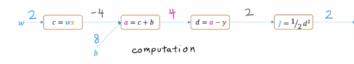

这就是一个**计算图**

* 其向我们描述了如何从输入的`x`前向回归得到`a`并更进一步，如何得到成本函数`j`
* 那么如何得到`j`的导数？

让我们从右向左计算 *这也是反向传播名称的来源*

1. 反向传播首先查询d的值，之后计算如果`d`改变一点点，j改变多少？**以求出j关于d的导数**
2. 之后查询`a`的值，如果`a`改变一点，`d`改变多少？根据**链式法则**间接**j关于a的导数**
3. **j关于c和关于b的导数** *c或b单独变化一点点时，a的变化*
4. **j关于w的导数**

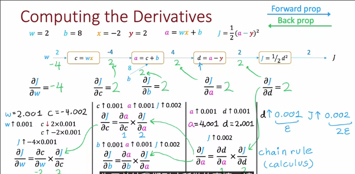

* 计算图的效率很高，在计算出**J关于一个节点的导数后**，我们不需要存储更右侧节点的导数，并且j关于每个节点的导数只会用很有限的次数
* 如果一个n个节点的计算图，其有p个参数，大约只需要n+p个步长就能计算所有参数的导数

## 更大神经网络中的反向传播

我们添加一个单神经元的隐藏层

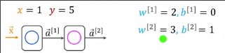

使用`ReLu`激活函数

这是一些前向传播以及成本函数的计算

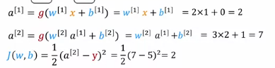

我们写成计算图

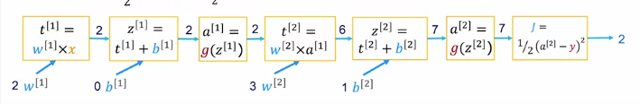

从右向左分别计算导数 完成**反向传播**

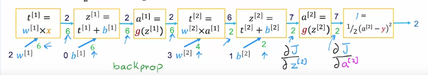
