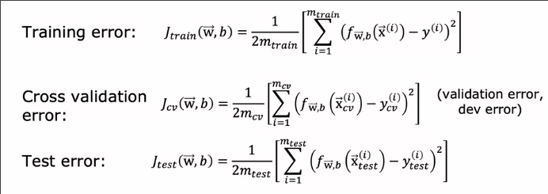

# 训练集_交叉验证_测试集
 
* [测试集评估模型的泛化能力](#测试集评估模型的泛化能力)
  * [一般步骤_回归](#一般步骤_回归)
  * [二分类中的测试集](#二分类中的测试集)
* [根据测试集成本选择模型_交叉验证](#根据测试集成本选择模型_交叉验证)

如果我们已经实现了**正则化线性回归**来预测房价，但是模型在预测时犯了不可接受的大错误，如何改进？

* 增加更多训练数据？
* 更少的特征？
* 更多的特征？
* 增加多项式特征？
* 减少正则化系数λ？
* 增加正则化系数λ？

本周我们对机器学习模型进行诊断（一系列测试），评估算法在哪些方面其作用或不起作用，并如何改进。

## 测试集评估模型的泛化能力

### 一般步骤_回归

这是训练后的房价预测模型

这个模型对于样本拟合很好，但是无法推广到训练集中没有的新示例

这样的只是关于一个特征（尽管其有多个多项式特征)的模型我们很容易通过绘制来了解其拟合性

但是如果我们有很多特征呢？

我们画不出4维或者更高维度的模型函数

* 我们将训练集拆分为两个子集，可以用`70%`的数据来训练模型
* 另一部分数据作为**测试集**，来测试

如果我们使用**平方误差成本函数**，其公式如下

而测试集的成本则是

测试集的成本**不包含正则项**

而我们还可以算出训练集的损失

我们只是单纯计算模型对于两种数据集的损失，因此也不包含正则项

对于我们最初的例子，`J_train`会很低，但是`J_test`会很高，表示**过拟合**

### 二分类中的测试集

首先我们投入**训练集**训练出模型

分别计算**测试损失**和**训练损失**

对于分类问题，可以不比较损失，而是查看比较**测试集和训练集的分类准确率**

这种方法可以为我们选择模型形式提供帮助，比如应该用线性拟合，还是各种多项式

## 根据测试集成本选择模型_交叉验证

* `J_train`无法呈现模型对新事例的成本
* 而`J_test`描述了新例子应用模型产生的成本

我们可以对一个特征`x`拟合不同的多项式

`d`表示多项式的次数，而参数的上标也是

一种查找合适模型的方法可能是

1. 我们尝试这些模型并得到不同的`J_test`
2. 会找到一个`J_test`最低的模型 比如`5次多项式`
3. 那么或许此时5次多项式模型最适合我们的目的

而我们在计算所选择模型的泛化能力时，还可以使用`J_test5`吗

这个评估过程有些问题

* 或许`J_test5`是我们**乐观估计出的泛化误差**，低于实际的泛化误差
* 原因是`J_test5`已经被我们应用于选择模型，*确定额外的参数`d`*

而合适的选择模型方法如下

* 将数据集分为**训练集** **交叉验证集** **测试集**
* 比如 6 - 2 - 2 的划分

交叉验证集使用`ce`表示

我们用交叉验证集来检验**不同模型的有效性或准确性**

这是三种数据集的成本 `error`

**选择出交叉验证成本最小的模型，并用测试集计算其泛化损失**

这个过程可以自动为我们选择线性回归使用哪个表达式？神经网络选择什么架构？（多少层？每层多少神经元？）

