# 偏差和方差
 
* [通过训练集和交叉训练集观察偏差和方差](#通过训练集和交叉训练集观察偏差和方差)
* [正则化](#正则化)
* [J_train_和_J_cv_的大小_建立基线](#J_train_和_J_cv_的大小_建立基线)
* [学习曲线](#学习曲线)
* [总结_诊断优化](#总结_诊断优化)
* [神经网络中的偏差和方差](#神经网络中的偏差和方差)

## 通过训练集和交叉训练集观察偏差和方差

在解决一个问题，我们有了思路，并构建出一个模型后，大多数时候模型不能工作得特别出色

接下来怎么做以提升表现？

偏差和方差可以指导我们

* 欠拟合 - 高偏差
* 过拟合 - 高方差

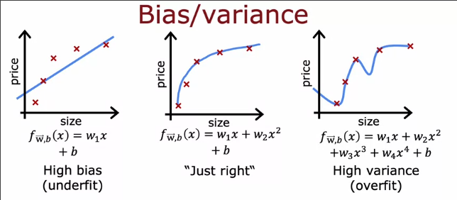

但是同样当我们有过多的特征后，可能并不能绘制直观的图像

可以查看算法在训练集和交叉验证集上的损失以诊断是否有高偏差或高偏差

* **高偏差** `J_train`高 `J_cv`高
* **高偏差** `J_train`低 `J_cv`高
* **适中** `J_train`低 `J_cv`低

我们绘制以下二者的图像

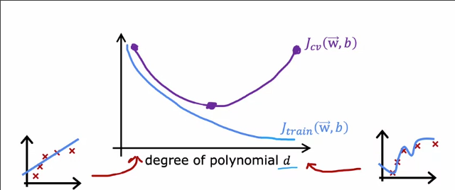

甚至在神经网络等复杂的模型中，可能同时出现**高方差**和**高偏差** 此时`J_train`很高，而同时`J_cv`又远大于`J_train`

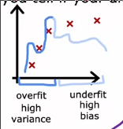

## 正则化

什么时候使用？使用多大的λ？

我们使用4次的模型函数

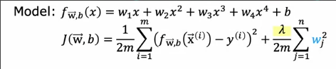

并用正则化成本函数

首先我们用巨大的λ，大概是这样的结果

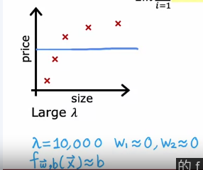

是一个高偏差的模型

我们尝试小的λ `0`，大概是这样

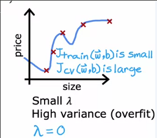

得到高偏差的模型

这是一个λ适中的模型

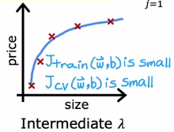

我们尝试一系列λ值，进行交叉验证

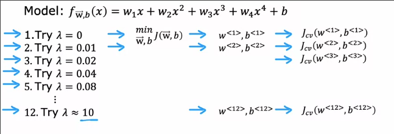

选择最合适的λ

这是训练成本和交叉验证成本关于λ的大致函数

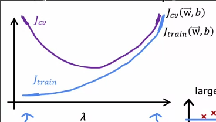

## J_train_和_J_cv_的大小_建立基线

什么时候“过大？” 或者“大得多？”

这是语言识别的例子

而其中`J`即是识别错误的音频片段占比

假设`J_train`值为10.8%，那么训练集中可以被正确识别的音频有89.2%

我们诊断模型的性能，计算交叉验证集的成本 14.8%

这看起来都很高，那么可以得出结论**具有高偏差吗**

但是我们需要考虑**人类在这项任务的表现会如何？**

可能在语音识别上为`10.6%`，这样高的原因是，或许音频本身有很多噪声

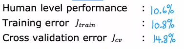

即便是人类也对此成本很高，因此，我们不能指望学习模型能做的更好

因此我们要对比模型的成本是否比人类表现成本高很多，在这里`J_train`只是差了0.2%，因此是完全可以接受的，但是`J_cost`却差了`4%`，因此可能具有**高方差**

因此**建立基线**对于我们判断`J_train`和`J_cv`的大小很有帮助

* 也就是我们希望学习算法最终达到的表现
* 一种有效的方式就是用人类的表现作为基线
* 也可以使用一些竞争算法，如**其他人之前实现的算法**来确定
* 根据经验来确定基线也很常见

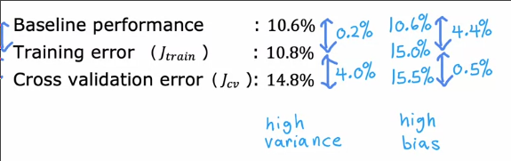

## 学习曲线

学习曲线是关于 性能-经验量（训练集大小） 的曲线

这是我们训练的模型

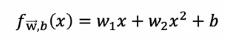

我们每次改变训练集大小，求出训练模型的J_train和J_cv，得到图像

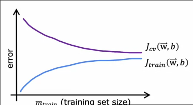

* 当训练集很小，模型很容易拟合训练数据 
* 当训练集很大，模型逐渐对拟合数据产生偏移，训练成本变大

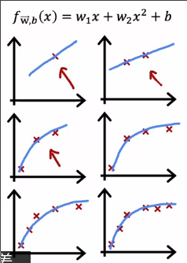

对于一个**高偏差**的模型，其成本-数据量曲线如下

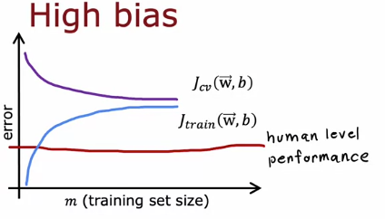

* `J_train`会**先上升，最终变平**，因为随着数据量越来越多，拟合用的简单函数几乎不会变化
* 交叉验证集也会**先下降，后变平**
* 而基线往往在他们之下，并且和`J_train`之间的间隔很大

高偏差情况**即便我们增加训练集数量，也不会优化模型**

对于**高方差**，大致如下

* `J_train`上升
* `J_cv`下降，并且远大于`J_train`
* 基线在`J_cv`之下，可能在`J_train`之上，也可能在其下

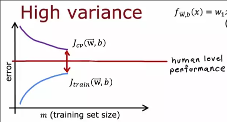

此时对高方差模型增加数据集就会有很好的效果

## 总结_诊断优化

通过J_train和J_cv来判断算法是否**高偏差**或**高方差**（有时也使用学习曲线）

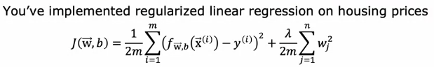

我们已经训练了一个**正则化线性回归**模型

但是它在预测时，遇到了很大的错误，下面要做什么？

1. 判断其是否高方差或高偏差
2. 如果高偏差 对训练集表现不好
    * 尝试获取更多特征
    * 尝试增加多项式特征
    * 尝试减少 λ
2. 如果高方差 对新数据表现不好
    * 可以获取更多训练数据
    * 尝试更少的特征,消去一些不重要的
    * 尝试增加 λ

## 神经网络中的偏差和方差

对于线性回归等，多项式的次数也决定了高偏差或者高方差

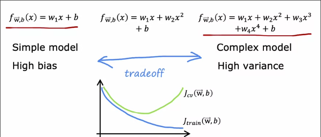

我们要自行权衡多项式次数，或者是正则化λ

而**在小训练集上训练的大型神经网络总是低偏差算法**

这使得我们不必权衡

1. 首先我们训练出神经网络，查看其是否训练的很好？也就是`J_train和基线`
    * 如果不是，那么就是高偏差，我们**使用更大的神经网络（更多神经元或更多隐藏层）** 回到步骤1
    * 如果训练的很好，那么交叉验证，如果j_cv较高，则高方差则获取**更多数据** 回到步骤1

过大的神经网络会导致高方差吗？

**经过正则化的大神经网络通常和小型神经网络表现一样好，或更好**

这是神经网络正则后的成本函数以及代码

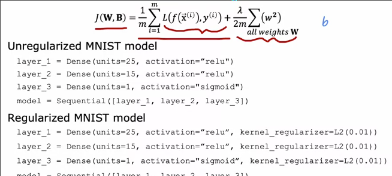
