# 回归模型
 
* [线性回归模型](#线性回归模型)
  * [一些术语](#一些术语)
  * [监督学习算法的输出](#监督学习算法的输出)
* [线性回归的成本函数](#线性回归的成本函数)
  * [成本函数的引入和公式](#成本函数的引入和公式)
  * [成本函数的直观感受](#成本函数的直观感受)
  * [可视化成本函数](#可视化成本函数)
* [梯度下降](#梯度下降)
  * [概述](#概述)
  * [梯度下降的算法实现](#梯度下降的算法实现)
  * [梯度下降导数项的意义](#梯度下降导数项的意义)
  * [如何选择学习率](#如何选择学习率)
  * [线性回归_平方误差损失函数的线性回归](#线性回归_平方误差损失函数的线性回归)

## 线性回归模型

**为数据拟合一条直线**

*可能是当今使用最广泛的学习算法*

这里的很多概念也适用其他机器学习模型

正如我们之前根据面积预测房价

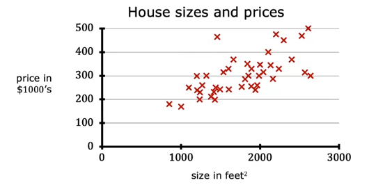

这是数据集的可视化

在这种算法中，根据输入的训练集，机器将从中拟合一条直线，根据这条直线，我们可以估计输入对应值

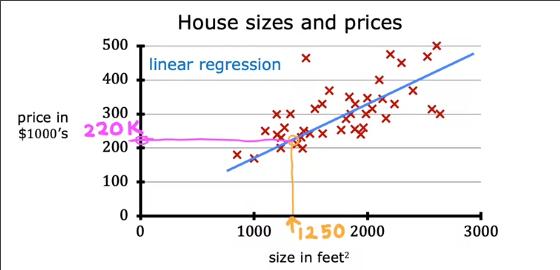

除了使用图像进行可视化，一种也很常见的方式是数据表

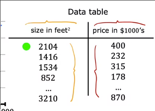

具有输入和输出两列，每一行对应图像中的一个点

### 一些术语

* **训练集**：上述用于训练的数据集
* 训练集中的输入部分记作`x`，为**输入变量**，也称**特征**、**输入特征**
* 训练集中我们学习以未来预测的部分记作`y`，为**输出变量**，也称**目标变量**
* 训练集中的实例**总数**记作`m`
* **单个**训练实例记作 `(x, y)`
* 而某个**特定**的训练实例表示为`(x^(i), y^(i))`

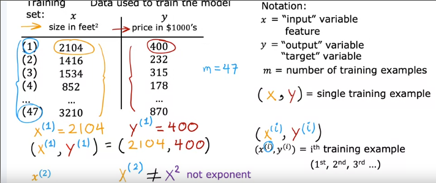

### 监督学习算法的输出

监督学习程序将**数据集作为输入**，它输出了什么？

1. 训练模型时，我们将**输入特征**和**输出目标**都投入程序
2. 监督学习算法，**最终产生一个函数**`f`
    * 这个函数`f`的作用是取一个新的输出`x`，并做出输出预测，最终输出`y-hat`(y尖)
    * 函数`f`就称之为模型
    * f的输入`x`称为特征，而其输出`y^`称为预测，其是目标`y`（训练集中的真实答案）的估计值

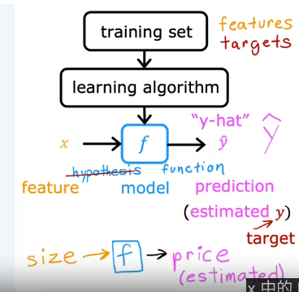

在**单元线性回归**(只有一个特征的线性回归)中，`f`的表示如下

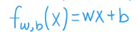

其中`w`和`b`是数字，为其选择的值将根据输入特征x来预测`y^`

表示`f`以x作为输入，其预测受到`w`和`b`常数的影响

也可以简写`f(x)`

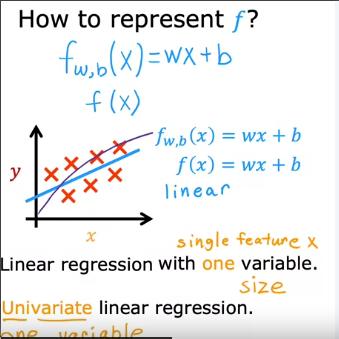

## 线性回归的成本函数

### 成本函数的引入和公式

为了实现线性回归，定义成本函数是其中的关键步骤

成本函数告诉我们**模型的表现如何**，以便对其改进

这是我们的训练集以及模型

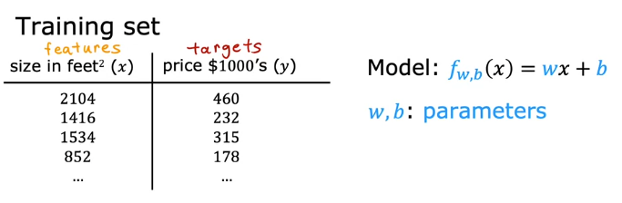

其中`w` `b`被称为**模型的参数** *系数* *权重*，在机器学习中，模型的参数可以在训练期间调整以改进模型

每次更改`w` 和 `b`的值，我们得到一条新的拟合直线

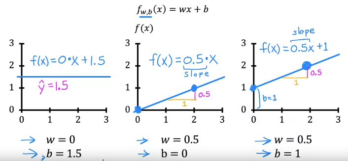

线性回归中，我们要做的就是为数据集选择合适的`b`和`w`以拟合

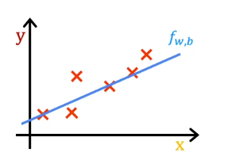

现在我们能做的是判断w和b确定的直线是否在视觉上大致拟合了训练集

而对于这个一个模型，给定一个训练集中的`x^(i)`我们在直线上有一个对应的`y^^(i)`

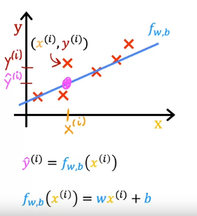

那么我们想得到的模型就是要找到这样一个`w`和`b`**对于所有`x^(i)`的预测值`y^^(i)`，都比较接近目标`y^(i)`**

因此我们构建一个**成本函数**

1. 成本函数预测`y^^(i)`，并用`y^^(i) - y^(i)`来比较预测与目标，*这个差称为误差 error*
2. 接下来计算**差的平方**以得到符号统一的值
3. 最后把所有**平方值加和**
4. 但是现在得到的损失随着样本数的增多而加大，我们再**除以一个`m`**
5. 按照惯例，机器学习使用的成本函数**再除以一个`2`**，以便后续的计算简洁

成本函数记作`J(w, b)`，也叫**平方误差成本函数**，其是目前为止最常用的损失函数

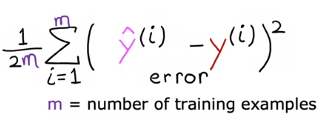

因为`y^^(i) = f_w,b(x^(i))`，成本函数也可以写作

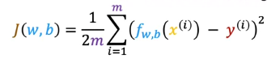

而我们最终的目标也转变为找到使得`J(w, b)`最小的`w`和`b`值

### 成本函数的直观感受

**成本函数的作用是测量模型预测值`y^^(i)`和目标`y^(i)`之间的差异**

我们考虑一个线性回归的简单版本，模型参数`b=0`

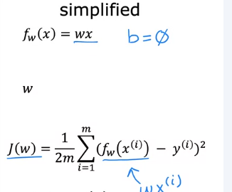

在这种该情况下，任务就变成找到使得`J(w)`最小的`w`值

我们绘制`J(w)`和`f_w(x)`随着不同w变化的值和图像

* 对于`f_w(x)`来说，其`w`值是确定的**常数**,其完全是一个关于x的函数
* 而对于`J(w)`来说，其`w`值是**自变量**，而`x^(0)-x^(m)`是一组确定的值，其完全是一个关于`w`的函数
* **对于每一个确定的`f(x)` 也就是一个确定的`w`值，都可以在`J(w)`上绘制一个具体的点**

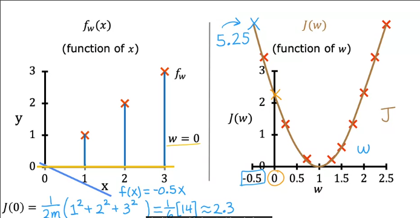

对于所有不同的`w`值，在我们画出无数不同的`f(x)`图像后，我们可以描出一个`J(w)`的图像

### 可视化成本函数

之前我们研究了单参数模型`f_w(x)`对应成本函数的图像 大致是一个抛物线的样子

而对于两个变量呢？

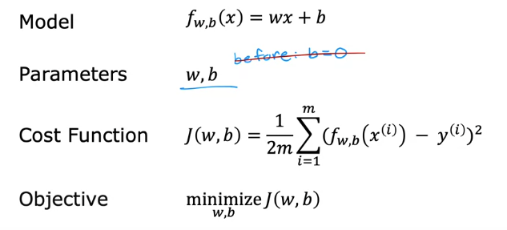

还是采用对于每个确定的`w`描点绘图

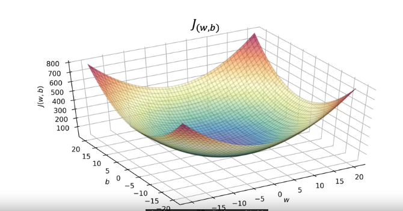

`J(w, b)`是这样一个**碗状图形**，对于每一个确定的`w-b`对都有一个唯一的函数值

另一种好用的绘制方式是**等高线**

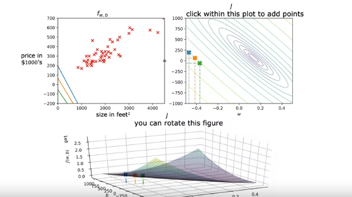

下方是成本函数的三维图像，右上角是与这个三维图像等价的等高线图，**其中每个椭圆显示三维图像上高度完全相同的中心点**

而**同心椭圆的中心**就是我们要找的成本函数的最小值位置

## 梯度下降

### 概述

我们需要一种系统的方法来找到使得成本函数最小的`w`和`b`

而**梯度下降**可以做到，是机器学习中最重要的算法之一，其不仅仅在回归中应用，还有一些最先进的神经网络模型（也被称为深度学习模型）也会使用 *深度学习模型在第二节课会学到*

我们已知成本函数`J(w, b)`，我们希望得到`J`取得最小值时的`w`和`b`

梯度下降可以**最小化任何函数**的算法，而不仅仅是成本函数

其同样适用于**多个模型参数的成本函数**

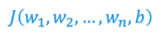

1. 首先，我们给予`w`和`b`初始值
    * 线性回归中，初始值是什么不重要，因此我们可以将其设为`0`
2. 每次稍微更改`w`和`b`以降低`J(w, b)`
3. 直到到达最小值
    * 对于一些`J`，可能不只有一个极小值

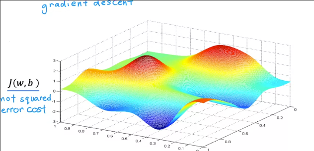

这个成本函数不是平方误差成本函数，**对于使用平方误差成本函数的线性回归，其成本函数总是弓形或者碗状**

而对于神经网络的成本函数，可能就会得到此类成本函数

梯度下降形象化来说，是当一个人站山坡上时，环顾四周，试图找到下坡的高效路径，从而迈出一步，高效路径也就是**最陡的**

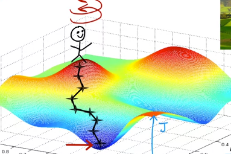

梯度下降有一个特性，我们可以选择`w`和`b`的起始值，**随着起始值的不同，最终可能到达不同的极小值**

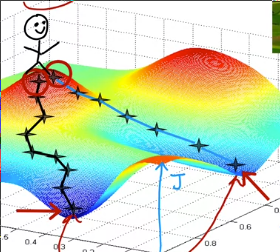

### 梯度下降的算法实现

* 在每次循环中，`w`都会更新为旧的`w`-一个导数相关项

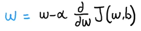

这个表达式的含义是对`w`少量调整

* `α`被称为**学习率**，通常是介于`0-1`之间的小正数
    * 反应了下坡的步伐有多大
    * 如果太大，则是一个非常激烈的梯度下降过程，尝试向判断的方向迈出一大步
    * 如果太小，则迈出一小步
* 后面的偏导数代表成本函数`J(w, b)对w的偏导数`
    * 负责告知向哪个方向迈步
    * 也与`α`结合，共同决定下坡步伐大小

b的更新也是类似的

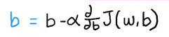

重复上述更新，直到`b`和`w`在某次更新后都不会有大的变化，我们获得了一个成本函数极小值对应的`w` `b`

我们需要**同时地更新两个参数**，也就是更新`w`后,更新`b`，其使用的`w`仍然是原来的值，`python`的特性可以做到

### 梯度下降导数项的意义

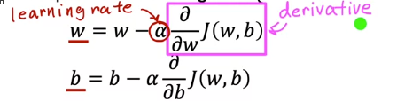

学习率和导数项在做什么？为什么乘起来会导致w和b的更新？

**以单参数模型的成本函数`J(w)`为例**

我们只需要每次更新`w`的值进行梯度下降

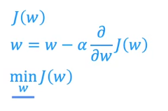

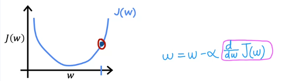

这里导数的意义是其**切线的斜率**

在这一点时，这个切线斜率也就是导数项是一个正值，因此更新后的`w`变小，新的点在左侧

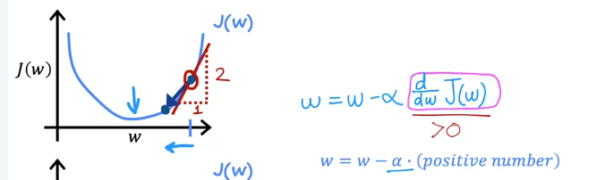

而当点在成本函数下降的区域时，导数项为负，更新后的`w`变大，因此新的点在右侧

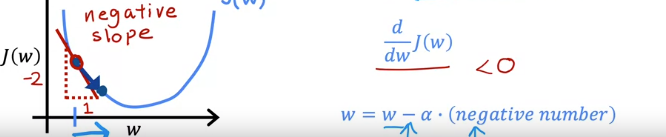

### 如何选择学习率

学习率的选择对实现梯度下降的效率有巨大影响

如何选择不佳可能会梯度下降可能不起作用

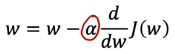

* 当`α` 太小时

每次都会迈出一个非常小的步伐，**我们最终确实降低了成本，但是耗费时间特别长**，迈出了很多步

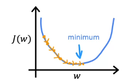

* 如果`α`过大

在接近底部时，迈出一个特别大的步伐，会直接迈过最低点，而走向另一个山坡，甚至可能因此成本增加

甚至由于步伐过大，而斜率增大，每一个循环导致成本不断增加

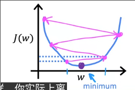

**可能出现训练后成本变大，并永远不会达到最低点**

当某次训练后，达到了损失最低点，之后呢？

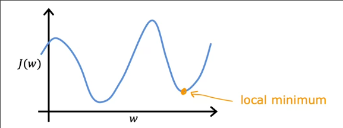

此时导数项为0，因此`w`不再更新为新值

这也是为什么固定学习率可以使得我们最终收敛到成本函数最小值的位置

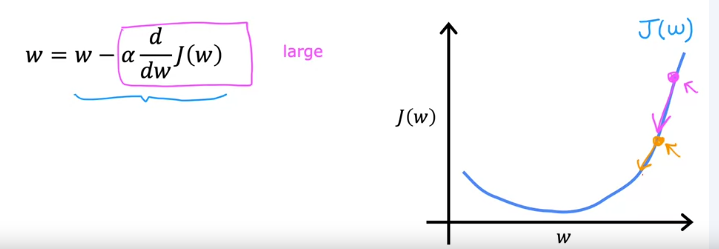

随着下降，所在点的切线斜率变小，因此导数项变小，每次迈的步伐也变小，最终接近最低点时，步伐已经变得非常小，越来越接近0

### 线性回归_平方误差损失函数的线性回归

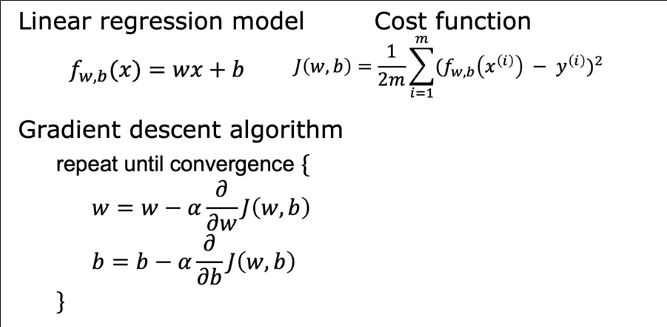

其中梯度下降总的导数项有通用的公式

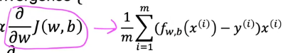

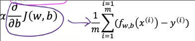

其是由微积分推导出来的

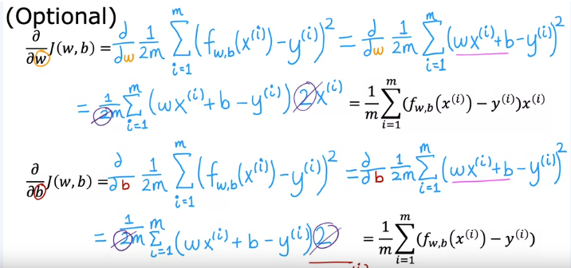

因此，我们有了新的梯度下降的公式

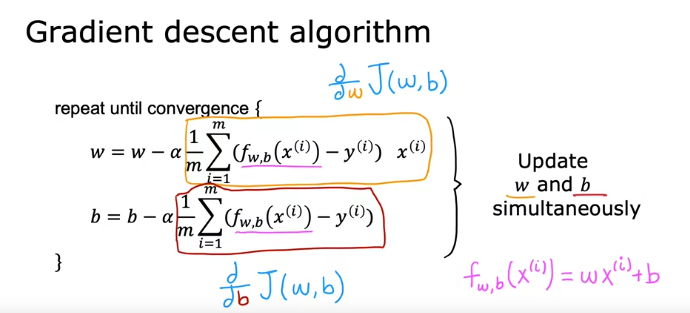

综上，我们可以通过梯度下降获得损失函数中的一个极小值

但是损失函数可能有若干极小值

但是对于线性回归中应用平方误差成本函数时，只有唯一的极小值作为最小值 *凸函数*

我们上述的梯度下降被称为**批量梯度下降**，**其意指在梯度下降的每一步中，我们投入了所有的训练示例** `batch`

此外还有一些其他类型的梯度下降在每一个更新步骤中查看训练数据的较小子集
