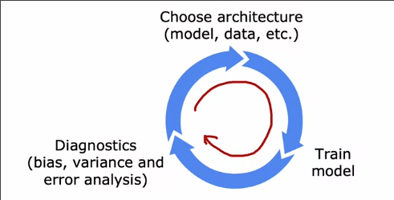
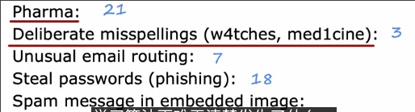
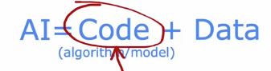
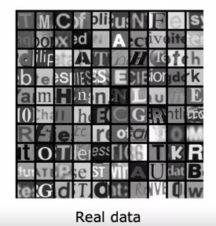
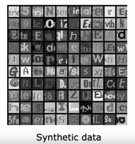
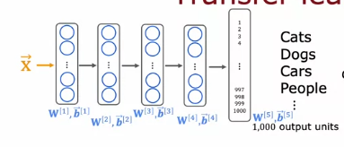
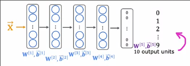
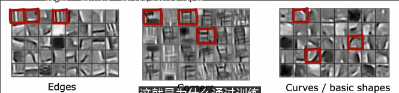
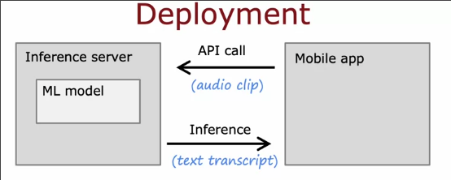

# 机器学习开发流程
 
* [机器学习中的迭代](#机器学习中的迭代)
  * [实例_垃圾邮件分类](#实例_垃圾邮件分类)
* [误差分析](#误差分析)
* [添加数据](#添加数据)
  * [数据增强](#数据增强)
  * [数据合成](#数据合成)
* [迁移学习](#迁移学习)
* [机器学习的整个周期](#机器学习的整个周期)
  * [部署环境](#部署环境)
* [伦理_偏见_道德](#伦理_偏见_道德)

## 机器学习中的迭代

1. 首先我们选择机器学习的整体架构：

* 选择模型
* 决定使用那些数据等等

2. 训练模型

3. 实现或者查看一些诊断 **偏差** **方差** 等等

4. 是否要更改模型或数据 跳转1

### 实例_垃圾邮件分类

左边是一封垃圾邮件，其中发送者故意拼错一些单词，以蒙混识别程序

构建模型

选择输入 

* 样本输入x 为 `email`的特征 
    * 可以取字典中的前10000个单词，作为10000个特征，每个特征值为0、1，表示**是否**在文中出现
    * 另一种是也是取字典中前10000个单词，值为其在文中出现**次数**
* 输出y 为 `email`是否为垃圾邮件

当模型训练好后，如果效果差强人意，那么可以

* 收集更多数据
* 收集更多特征 比如email是如何传播来到用户手中的
* 想出算法解决故意拼写错误等

## 误差分析

假如交叉验证500个样本中100个出现错误，那么我们手动查看这100个样本来了解出现什么问题

可以将其归类，详细了解被错误分类的样本是否有什么共同特征？

比如垃圾邮件分类中，药品类总是被错误分类

其中占比较大的是我们最先要解决的问题

在这里则是

* 药品类 或许我们要找更多的药品类的垃圾邮件
* 网络钓鱼 识别url特征？

误差分析更适合人类擅于处理的任务，比如查看邮件

## 添加数据

获取更多所有类型的数据可能缓慢，代价又高

那么我们查看错误预测的例子，并**针对性改进，比如只增加这种样本**

另一种方式是**数据增强**，往往用于图像或音频数据

或许将时间花在以数据为中心的方法上，更有成效

### 数据增强

对于文字识别的例子

我们可以稍微改变对比度、旋转、放缩、镜像图像得到一个新例子

更高级一点的是将**原图像划分为若干网格**，通过网格的随机变形，使得图像变化，创建更丰富的样例

对于语音识别

* 可以增加背景的噪声
* 自然背景声，车内背景声...
* 模拟手机连接不佳时的语音

**对数据集对出的变换，应是测试集中应有的变换，比如环境声**

对于**纯粹随机的、毫无意义的数据噪声通常没什么用**

### 数据合成

从头开始编造新的样本，通常用于计算机视觉

对于OCR，即读取图片中的文字信息

这是OCR的真实数据

我们可以在电脑的文本编辑器中，旋转不同的字体，使用不同的颜色、对比度进行截图

## 迁移学习

来自其他任务的模型投入到我们的应用中 需要两个任务有相同类型的数据，比如都是图像识别任务

我们想要识别0-9的手写数字，但是数据集很小

我们找到一个很大的数据集，里面有猫、狗、汽车、人等的1000类图片

我们手写可以训练一个输入这些图片，输出类别的神经网络

而之后，我们仅仅将输出层更改为10个神经元的输出层，以匹配我们的分类类别

* 在这个有着已经训练好的神经网络的大多参数的新神经网络上，我们重新用自己小的0-9数据集来训练
* 另一种方式是为前面的参数不变，只训练输出层的参数 这种方式在我们的训练集非常小的时候效果可能好一些

这种方法的原理在于训练好的神经网络学到在早期层中处理图片输入的参数，新的神经网络早期也用这些同样的图片处理模式 **监督式预训练**

* 第一层可能在检测一些图片的边缘
* 第二层可能将边缘组合检测角落
* 第三层可能检测一些复杂的形状

## 机器学习的整个周期

1. 确定项目的范围 **项目是什么** **想做什么**
2. 收集数据 
3. 训练模型 误差、偏差方差分析 改进 重复
4. 部署系统 继续监控系统性能 维护系统 有权访问的数据可以继续投入2 中以改进

### 部署环境

通常是在**部署服务器**上实现我们经过训练后的模型

在一些应用比如app上，调用api来完成向服务器上模型的输入，和获取输出

* 软件工程

## 伦理_偏见_道德

有一些被广泛传播的机器学习系统表现出一些偏见

* 人脸识别系统对肤色较深的人和犯罪大头照进行匹配

一些机器学习算法被用到不良途径

* 未经同意 伪造知名人物讲话
* 生成虚假评论

**一般性建议**

* 建立一只多元的队伍 集思广益 避免可能的伤害 *性别 种族 文化*
* 对于我们的应用领域搜索标准或指导方针
  * 金融中 对于欺诈有系统的定义
* 训练完毕，部署前，系统测试是否有歧视或偏见问题
* 缓解计划 能回滚早期相对公平的版本
