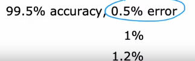
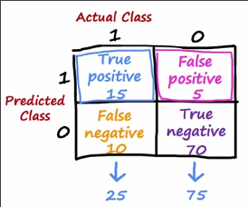
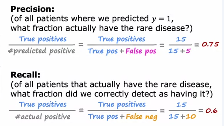
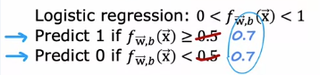
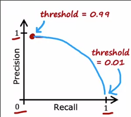
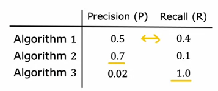

# 倾斜数据集
 
* [倾斜数据集的衡量问题](#倾斜数据集的衡量问题)
* [精准率和召回率](#精准率和召回率)
* [精准率和召回率的权衡](#精准率和召回率的权衡)

## 倾斜数据集的衡量问题

假设我们在训练一个二分类，来识别一种罕见疾病

1 患病 0 无病

我们在测试集上检验，发现只有1%的误差，模型似乎还不错？

但是如果这是一种罕见的疾病，其为1的情况非常少

* 比如只有0.5%的患病率，那机器学习如果是`print('y=0')`，那么这种愚蠢的机器学习算法也只有0.5%的误差

在这种情况，很难判断这三种算法哪一个好点

对于这种倾斜数据集，通常使用不同的误差指标来衡量算法的表现

* **精准率和召回率**

## 精准率和召回率

构造一个**混淆矩阵**

其每一行是预测的一种结果，每一列是实际的一种结果，每一个单元即使预测的这种结果并且实际是那种结果的**样本个数**

* 这里有25个正例样本 75个负例样本
* 预测为正 实际为正 这个单元格的样本称为**真正例**
* 预测为负 实际为负 样本称为**真负例**
* 预测为正 实际为负 样本称为**假正例**
* 预测为负 实际为正 样本为**假负例**

 **精准率** 是 **真正例** 在 **预测正例** 中的占比

* 其中**预测正例**为真正例+假正例
* 意义是当预测患者有病时，患者是否真正有病

**召回率**是 **真正例** 在 **实际正例** 中的占比

* **实际正例**是真正例+假负例
* 意义对于真正有病的患者，能被成功预测的有多少

当出现`print('y=0')`时，**精准率**和**召回率**都为0

## 精准率和召回率的权衡

在理想情况，我们希望算法具有**高精准率**和**高召回率**

但是在实际中的算法中，我们通常要在二者中权衡

在逻辑回归中，模型会输出0-1间的数，我们通常取阈值0.5

但是如果我们想要**只有在非常有把握的情况下,才预测y=1**，这个时候我们**提高阈值**
* 假如我们设置阈值为`0.7`，表示模型在大于70%把握确定结果为1时，才将结果设为1，否则则预测为0
* 此时**精确率**上升，因为被错误预测为正的例子减少
* 但也会导致**召回率**下降，真正为正的例子有一些由于得到结果在0.5-0.7间被预测为0

如果我们想**避免错过一些病例**，那么在没有太多把握的时候，就预测这个人可能患病，我们**降低阈值**

* 此时**精确率下降**，被预测为有病的患者，有一些实际无病
* **召回率上升**，大多有病的患者即便结果低于0.5也被成功预测为有病

我们绘制这两者随着阈值变化的曲线

中间或许是个不错的选择

和交叉验证不同，我们往往要手动选择阈值

而如果要自动选择，有一种指标是`F1 score`

这几个算法看上去难以取舍

F1-score关注更低的分数

也等于

除去常数项也称为**P和R的谐波均值**
