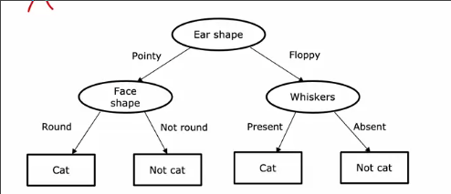
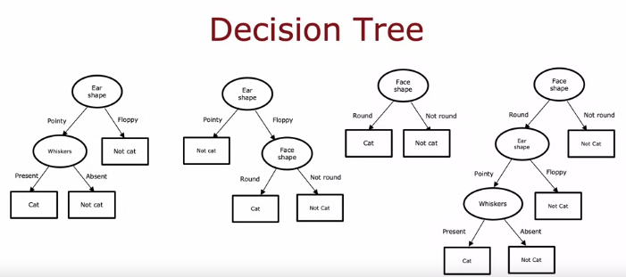
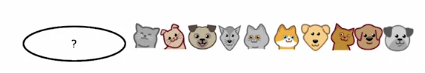
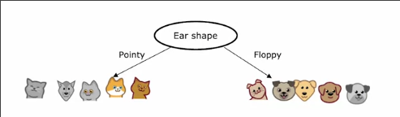
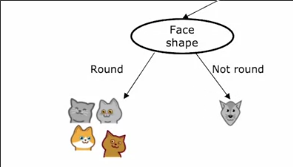
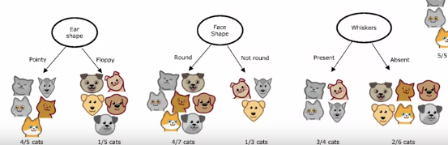

# 决策树模型

强大的机器学习算法

## 决策树形式

分类问题-动物是否为猫

每种动物有3个特征

在这个任务中，每个特征是一些离散的值

我们将其转换为树的形式

这就是决策树的决策过程，**从根节点依据输出的相应特征一直走到叶节点**

这是这个任务一些不同决策树模型，有一些在训练集或交叉验证集上更好，有些更差

## 决策树的学习

首先我们有一些训练样例，以及一个没有确定判断特征的根节点

1. 选定根节点要判断的特征
2. 将数据按照特征分为两类

我们只关注移动到的左边部分

1. 继续选择此时使用特征
2. 分割为两类

我们注意到新的左边全部是猫，则不会再对新的左边选择特征，这个节点成为叶节点

此时我们关注其父节点的右子节点

全部是狗，同样成为叶节点

转到最初的右边

重复上述过程

### 如何选择在每个节点上选择什么特征？

决策树会最大限度地提高纯度

*分割后子集尽可能接近全猫全狗*

### 什么时候停止拆分？

我们刚刚选择100%是一个类别时结束

我们还可以选择当分割不会导致树超过最大深度时

* 保证树不变的太大
* 防止过拟合

可以在假如拆分受益太小时

可以在一个节点的样本数量低于阈值时
