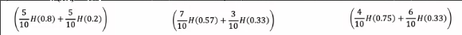
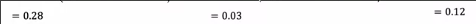
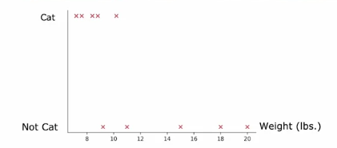

# 决策树学习
 
* [纯度和熵](#纯度和熵)
* [选择当前节点的拆分特征](#选择当前节点的拆分特征)
* [构建决策树总体过程](#构建决策树总体过程)
* [独热编码](#独热编码)
* [连续特征值](#连续特征值)
* [回归树](#回归树)

## 纯度和熵

如何衡量一组数据的纯度？

**熵**是衡量一组数据的指标

对于这样一组数据

* `p_1` cat的占比 1 表示 猫 `=1/3`

我们用这样一个**关于占比的函数来表示熵** `H(p_1)`

* 当占比为`0.5`时，熵函数达到最大值1
* 而占比为`0`或`1`时，熵函数最小为0

熵函数的实际方程如下实际

* `p_0` 指的是0样本 即例子中的狗 占比
* 当`p_0`或`p_1`为0时，会出现`0log(0)`，我们将其定义为0

## 选择当前节点的拆分特征

**取决于哪种特征的选择最能减少熵**

熵的减少称为**信息增益**

这是按照不同的特征分类计算的一些熵值

对于每一个分割，我们有两个熵值，我们将其**加权平均**组合为一个数字 *加权的意义在于熵值的重要性还和样例个数有关*

按照惯例，我们计算**和没有拆分对比熵（或熵的加权平均值）的减少量**

得到

第一种选择对熵的减少最多

**信息增益的计算公式**

* `p_1^left` 是某种分割下左侧正样例占比
* `w^left`  是进入到左侧的所有样例占分割前比例
* `p_1^root` 是分割前正样例占比

## 构建决策树总体过程

1. 从所有训练样本开始
2. 计算所有可能特征的信息增益，选择要拆分的特征
3. 将训练集拆分两个子集，创建左右分支，将训练示例发送到左侧或右侧分支
4. 回到2
5. 结束拆分的信号为
    * 节点已经完全是一个类别 *熵值为0*
    * 进一步拆分节点时，会导致树超过最大深度
    * 从额外拆分中获取到信息增益小于阈值
    * 节点中样本小于阈值
    * 满足其它停止条件

## 独热编码

目前我们构建的决策树，每个特征只有两种可能值（有、无）

但是有时特征是两个以上的离散值，这种情况会用到**独热编码** *one-hot*

样本中 耳朵形状有3种可能值

在按照这种特征分割时，我们会分出三个子集

而另一种处理办法是独热编码

我们将这个特征分为三个特征，分别可分类为**有或没有**

对于每个样本，这三个特征中**有且只有一个**为1，余下为0

独热编码也可以用于逻辑回归或者神经网络等其它机器学习算法

## 连续特征值

如果需要分割的特征值是连续的，怎么办？

这是连续特征的可视化

我们根据**连续特征是否小于等于某个值来分割**

我们尝试阈值为0.8，计算信息增益

而再尝试阈值为0.9

更好一些

一种惯例是对所有样本的次特征值排序，尝试所有“线段上非端点的值”来分割，比如10个样本，尝试9个阈值

## 回归树

我们想决策树输出的值不是离散的怎么办

我们想根据动物的三个特征来预测动物的体重

这是回归树的推理过程

最终根据**叶节点具有的样本，其输出的平均值来确定叶节点的输出**

那么我们如何构建？也就是如何完成节点的划分？

我们依旧尝试所有特征，来进行划分，得到左右样本，每一个具有一个重量

我们尝试减少左右样例输出的**方差**

用方差替代**决策树中熵的位置**，并加权平均，算减少值

第一个**方差减小值**最大，因此选择第一个特征来分割
