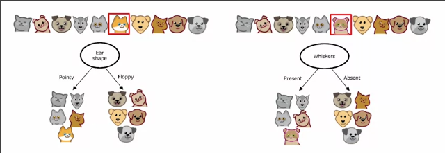
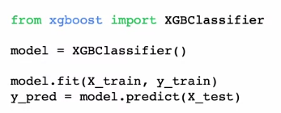

# 多个决策树
 
* [决策树集合的使用](#决策树集合的使用)
* [构建树集合_替换采样](#构建树集合_替换采样)
  * [替换采样的数学原理](#替换采样的数学原理)
  * [替换采样构建随机训练集](#替换采样构建随机训练集)
* [随机森林算法](#随机森林算法)
* [XGBoost](#XGBoost)
  * [工作过程](#工作过程)
  * [开源库](#开源库)
* [何时使用决策树](#何时使用决策树)

## 决策树集合的使用

单一决策树的缺点是可能**对数据的微小变化高度敏感**

当我们把构建决策树所用的10个样本的某一个替换为另外的样本，构建的决策树可能完全不同

这意味着我们的树对数据高度敏感

而构建一堆树往往可以使得算法更具普遍性，称为**树聚合**

如果我们有三个树，而其中每一个都是对猫分类的合理决策树

我们将待预测样本投入到这三个树，分别预测单独的结果，以**多数预测为最终分类**

## 构建树集合_替换采样

### 替换采样的数学原理

我们有四个样本ABCD，放入一个黑盒中

我们抽取4次，每次放回

* 第一次 A
* 第二次 B
* 第三次 C
* 第四次 C

重新抽取可能得到以下结果

### 替换采样构建随机训练集

每次我们都替换采样，以构建随机训练集

这是一个构建的随机训练集，其中有一些重复，有一些在原始训练集中的样本未出现在随机训练集

## 随机森林算法

如果我们有一个大小为M的训练集，那么我们循环B次

* 每一次构建一个大小为`M`的随机训练集
* 在这个随机训练集上训练单独的决策树

最终得到B个决策树，我们在预测时对他们进行投票，B=100是通常的值，更大的树不会更遭，但是收益没有那么明显，B=1000只会拖慢预测时间

这个构建过程也叫袋装决策树 B代表`bag`

而我们对其加以改进得到**随机森林算法**

我们希望这种算法在根节点或附近的分割依据相同特征的情况不再发生

* 在每一个节点，当选择一个特征进行分割时，如果n个特征可用，将其减少为随机的k个特征（k小于n），只允许分割从这k个特征里选择
* k通常取值为n的平方根

增加了随机性

## XGBoost

### 工作过程

另一种生成决策树集合的有效方法

对大小为M的训练集循环B次

* 每次使用大小为M的替代训练集
    * 我们改变等概率选择样本的策略，而是选择在以前训练过的数木中表现不佳的原始训练集中错误分类示例 **刻意练习**
* 在替代训练集上训练单独的决策树

XGBoost 

* 运行快，效果好
* 内置了正则化
* 内置了停止拆分节点的依据
* 不需要大量选择选择的训练集

### 开源库

同样可以回归

## 何时使用决策树

决策树和神经网络的取舍？

决策树

* 决策树和树集合可以很好处理**结构化数据** *如电子表格中的数据*
* 决策树不推荐处理**非结构化数据如图像，音频，文字**
* 决策树**训练得更快**
* 比较小的决策树是人类可读的
* 决策树中XGBoost可用于大多应用程序

神经网络

* 神经网络可以处理**结构化数据和非结构数据或二者混合**
* 训练更慢
* 可以和**迁移学习**配合使用
* 如果像将多个机器学习系统串联，训练多个神经网络可能比训练多个决策树更容易 （可以梯度下降将它们一并训练）
